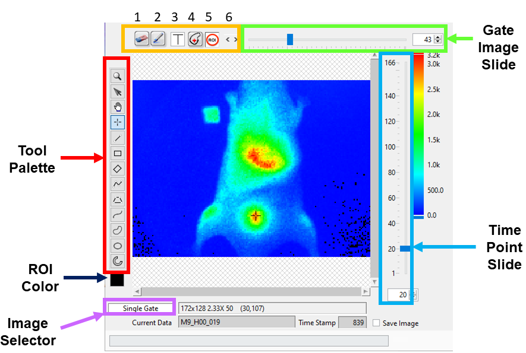
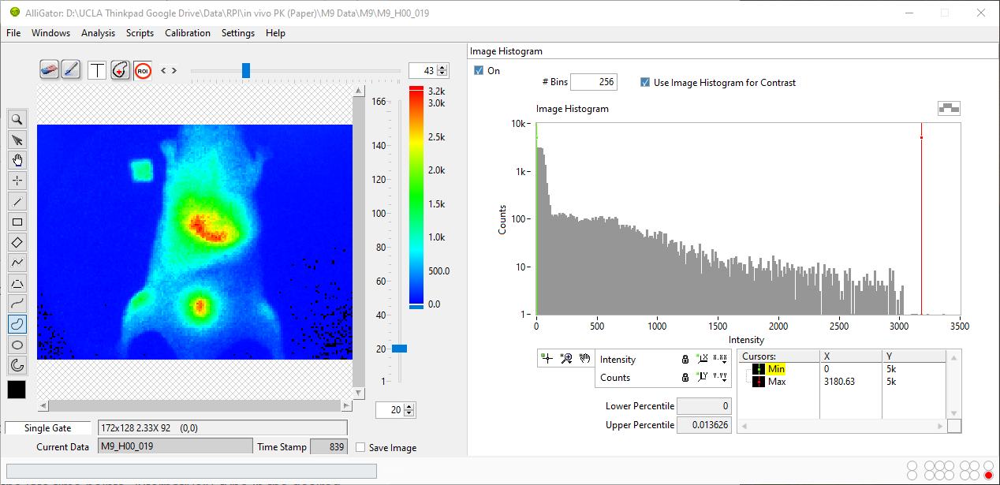
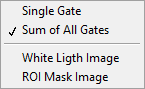
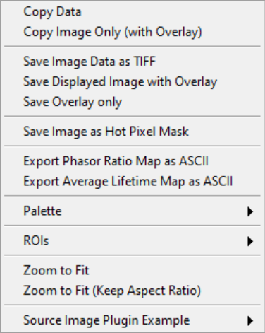

.. _source-image-panel:

Source Image Panel
==================

The Source Image is located on the left hand side of AlliGator's main window.

Some of the associated tools are highlighted in the snapshot shown above. Their description can be found in the following sections.

The Source Image displays different data depending on the position of the **Gate Slider**, on the position of the 
**Time Point Slider** (if it is shown) and the **Displayed Image** selector.

Gate Slider
-----------

Note: The **Time Gate Slider** is not shown when ``Sum of All Gates`` is selected in the *Displayed Image* selector.

Located above the image area, the **Gate Slider** allows browsing the individual images comprising the time gated (or binned) dataset. The numeric control on the right shows the number of gates in the dataset. Moving the slider to the left will show early gates, while late gates can be seen by moving the slider to the right. Alternatively, type in the desired Gate number in the numeric control on the right.

When moving the slider, the displayed image's contrast might be inappropriate (overly dark or bright image). In this case, switch to the ``Image Histogram`` panel and make sure of the following:

- The Use Image Histogram for Contrast checkbox is checked.
- The Min and Max cursors are visible and encompass most of the histogram bins, as shown below:

Alternatively, uncheck the *Use Image Histogram for Contrast* checkbox. This will automatically adjust the contrast of each gate.

Time Point Slider
-----------------

Note: The *Time Point Slider* is only visible when a Dataset Series is opened.

Located to the right of the image area, this slider allows navigating through the different time points in a time series. Move the slider to the bottom to access the early time points, or to the top to access the late time points. Alternatively, type in the desired **Time Point** number in the numeric control at the bottom.

The name of the current dataset folder is indicated in the *Current Data* text box at the bottom of the panel (in the example shown above, the folder name is ``M9_H00_19``). If a corresponding .set file is present, the time stamp information for this dataset will be displayed next to its name (``839 s`` in the example shown above).

While the slider is moved, the image is not updated. Image update only occurs when the slider is released, in order to reduce CPU load.

Displayed Image Selector
------------------------

The **Displayed Image** selector allows switching from a mode where individual gates are shown (``Single Gate``) or only their sum (``Sum of All Gates``). The latter mode is the default mode. If a ``White Light Image`` or a ``ROI Mask Image`` have been loaded, they can also be displayed using the selector.

Image Color Ramp
----------------

The color ramp located to the right of the source image indicates the color scale as well as the Min and Max values set in the **Image Histogram**.

The ``Min value`` (shown at the bottom of the scale) and ``Max value`` (shown at the top of the scale) define the range of pixel values which are mapped to the color scale. Pixels with value outside this range will be displayed with the ``Low Color`` or ``High Color`` shown at the bottom and top of the color scale, respectively [*]_.

The color scale can be changed using the ``Image Source Palette`` context menu. For more information on how to use and change color palettes, see the :ref:`source-image-context-menu` section below and the :ref:`image-color-palette` page of this manual.

Image & Phasor Overlay Tools
----------------------------

The cluster of objects on the top-left corner of the image are used to:

+---+---------------------------+------------------------------------------------------------+
+===+===========================+============================================================+
| 1 | .. image:: images/IB0.png |Delete source image overlay.                                |
+---+---------------------------+------------------------------------------------------------+ 
| 2 | .. image:: images/IB1.png |Paint ROI points in the Phasor Plot.                        |
+---+---------------------------+------------------------------------------------------------+
| 3 | .. image:: images/IB2.png |Set the color of the painted area in the Phasor Plot.       |
+---+---------------------------+------------------------------------------------------------+
| 4 | .. image:: images/IB3.png |Use ROI as search area.                                     |
+---+---------------------------+------------------------------------------------------------+
| 5 | .. image:: images/IB4.png |Overlay mode used for the Source Image.                     |
|   | .. image:: images/IB4b.png|                                                            |
+---+---------------------------+------------------------------------------------------------+ 
| 6 | .. image:: images/IB5.png |Cycle through Image ROIs.                                   | 
+---+---------------------------+------------------------------------------------------------+

- Delete source image overlay: Right-click the button to specify the button's action when pressed
 + All Overlays: delete all Image Source overlays
 + Source Image ROIs: delete the image ROI contours resulting from highlighting those ROIs in the Phasor Plot
 + Phasor Plot ROIs Overlay: delete the overlay pixels highlighted from the Phasor Plot
 + Phasor Ratio Map Overlay: delete the Phasor Ratio Map Overlay
 + Phasor Plot Color Map Overlay: delete the Phasor Plot Color Map Overlay
 + Decay Fit Parameter Color Map Overlay: delete the Decay Fit Parameter Color Map Overlay
- Paint ROI points in the Phasor Plot: highlight phasors in the Phasor Plot corresponding to the selected ROI, using the selected ``Highlighted ROI Color``
- Highlighted ROI color: color box used to select the color used to highlight phasors in the Phasor Plot as discussed above. choosing a Transparent color (``T``) will result in no overlay being added.
- Use ROI as search area: see description in the next section
- Overlay mode used for the Source Image: the ``Overlay Mode`` selector allows choosing between 3 different modes of overlay from the Phasor Plot: ROI, Phasor Ratio Color Map and Phasor Color Map
 + ROI: ROIs defined in the Phasor Plot are highlighted in the Source Image.
 + Phasor Ratio Map: pixels whose phasor is located in the vicinity of the segment connecting the two phasor references defined in the Phasor Plot are highlighted in the Source Image with a color reflecting their phasor ratio. See the :ref:`phasor-ratio-map` page of the manual for details.
 + Phasor Color Map: pixels are colored according to their location in the Phasor Plot with respect to multiple vertices defined in the Phasor Map Color Picker window. See the :ref:`phasor-color-map` page of the manual for details.

Use ROI as Search Area
----------------------

The button with a red cross in it (``Use ROI as Search Area``) is used to toggle a special ROI definition mode, described next.
When selected (green background), the ROI defined by the user is not the one used to compute the Fluorescence Decay and Phasor Data point of the Phasor Graph, but instead is used as a search area to define this ROI. The final ROI is a disk centered on the *brightest* pixel (in the sum image) within that search area, and ``ROI Diameter`` defined in the **Source Image** panel of the **Settings** window. If there are more than one pixel with the same maximum brightness, the first found from the top-left corner of the image is used.

Note that each time the Search Area ROI is moved, the button toggles back to its off position.

Image Tool Palette
------------------

The cluster of tools shown on the left side of the image are used to zoom, grab or move the image, or to draw regions of interest (ROIs).

Special combinations:

- Pressing and holding down the ``Alt`` key while drawing a rectangle ROI will zoom on the circumscribed area (and keep a 1:1 aspect ratio)
- Holding the ``Shift`` key while resizing or dragging a selected ROI will modify the definition of that ROI.

Save Image
----------

The ``Save Image`` checkbox at the bottom right corner of the Source Image is used to automatically save the displayed image (including overlay) each time the overlay is updated. The file is saved in the folder containing the current dataset folder, and the file name used is identical to that of the dataset folder, with an extension corresponding to the ``Saved image File Format`` option selected in the **Miscellaneous** panel of the **Settings** window.

If the displayed image is the sum of all gates, the file name with be followed by " Total Intensity".

If the displayed image is a single gate, the file name with be followed by " Gate ``n``", where ``n`` is the gate number.

If a file with an identical name already exists, it will be overwritten.

This option is convenient for time series analysis, since it allows saving all source images in a time series (with their overlay and the palette chosen for display) in the same folder. The same function can be performed using the ``Save Displayed Image with Overlay`` context menu item (see below), which will open a File Dialog window to define the file name and location.

.. _source-image-context-menu:

Context Menu
------------

The Source Image context menu is shown below:

- ``Copy Data``: copies the whole Source Image object bitmap image to the Clipboard for reuse in other software (or in the **Notebook**).
- ``Copy Image Only (with Overlay)``: copies the visible part of the image (with overlay) to the Clipboard for reuse in other software (or in the Notebook).
- ``Save Image Data as TIFF``: saves the data displayed in the Source Image as a 8- or 16-bit image, following the selected options offered to the user at the beginning of the process. The resulting file can be used for external analysis. Note that if the Sum of All Gates is shown, that sum is saved, while if a Single Gate is shown, that single gate is saved. To save a complete dataset, check the File>>Save>>Dataset submenu.
- ``Save Displayed Image with Overlay``: saves the same image as copied by Copy Image Only (with Overlay)
- ``Save Overlay only``: saves the current image overlay as an 8-bit image in which any non-black pixel is assigned the value 255, resulting in an effective mask image.
- ``Export Phasor Ratio Map as ASCII``: when a phasor ratio analysis has been performed, exports the phasor ratio values at each pixel as a 2-dimensional matrix in an ASCII file (with File Dialog).
- ``Export Phase Lifetime Map as ASCII``: when a phasor ratio analysis has been performed, exports the average lifetime computed from the phasor ratio at each pixel as a 2-dimensional matrix in an ASCII file (with File Dialog).
- ``Palette``: this submenu is described in detail in the :ref:`image-color-palette` manual page.
- ``ROIs``: this submenu is described in the :ref:`regions-of-interest` manual page.
- ``Zoom to Fit``: stretches the image so that it fits in the 400 x 400 pixel image display are. If the source image is not square, this will result in artificial deformations.
- ``Zoom to Fit (Keep Aspect Ratio)``: as above, but ensuring that the longest dimension of the source image is stretched to 400 pixels.

Notes
-----

.. [*] The ``Low Color`` box is visible as a narrow blue rectangle at the bottom of the color scale. The ``High Color`` box is at the top of the color scale, hidden by the green box overlay in the figure at the top of this section. When these colors are chosen differnt than the low and high colors of the color scale, pixels in the image whose values are lower or higher than the displayed range will be highlighted with the ``Low Color`` and ``High Color`` respectively. This can be useful to highlight under-exposed or over-exposed pixels, for instance.
No newline at end of file
