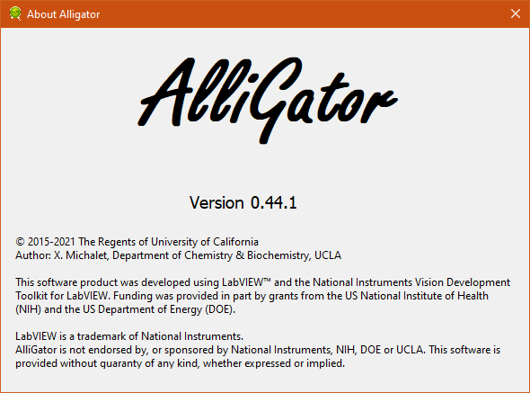

.. _alligator-about:

About AlliGator
===============

The **About AlliGator** window can be opened using the ``Help:About`` menu:

It provides basic information (including the version number).

Since this is a modal window, no further action can be performed as long as it is open.

Click on the close button (``X`` at the top right) or anywhere in the window to close it.