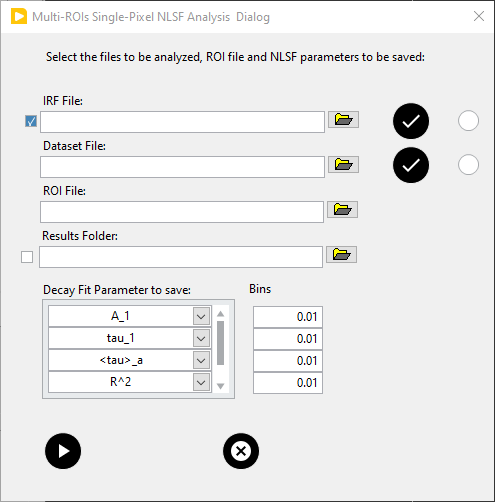
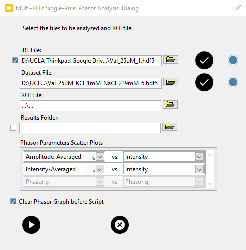

.. _alligator-all-rois-single-pixel-analysis:

All ROIs Single-Pixel Analysis
==============================

The multi-ROIs single-pixel analysis scripts accomplish a series of steps that 
can speed up the single-pixel level analysis of a FLI datasets. A number of 
options are available and are defined in a Multi-ROIs, which provide some 
flexibility in the actual series of steps, settings or outputs of the analyses, 
as described below.

The general idea is, for NLSF analysis,  to start from a list of pre-defined ROIs, 
convert them to single-pixel ROIs and perform NLSF for this 
new list of single-pixel ROIs. Optionally, a preliminary step of IRF extraction 
(NLSF), can be included at the beginning, and ASCII Files of some of the 
parameters saved as well as custom histograms build at the end of the analysis.

For phasor analysis, the steps are similar, with the difference tha each ROI is 
processed individually, converted to single-pixel ROIS, and a single phasor plot 
output for each ROI.

.. _all-rois-single-pixel-nlsf:

NLSF Analysis
+++++++++++++

The dialog window used to specify the NLSF analysis steps looks as follows:

- Step 1: The first parameter, *IRF File* is optional and not visible unless 
  the top left *Use IRF Dataset* checkbox is checked off. The corresponding IRF 
  file can be selected using the *Browse File* button on the right side of the 
  box. It is used to extract single-pixel IRFs for the subsequent single-pixel 
  NLSF analysis.

  If a single, common IRF is to be used instead, or if the single-pixel IRFs 
  have already been defined and are still in memory, this checkbox should be left 
  unchecked.

- Step 2: When and if an IRF file has been selected, the next step consists in 
  specifying all the options to be used to process these IRFs. This includes 
  file loading options (**Data Information** panel of the **Settings** window), 
  pixel rejection options (**Source Image** panel) and decay preprocessing 
  options (**Settings:Fluorescence Decay:Decay Pre-Processing** panel). In 
  particular, decays from the IRF file might need to be extrapolated, which 
  would require defining the relevant parameters in the **Decay Pre-Processing** 
  panel.
  
  To store these options, click on the *Set IRF Parameters* button to the right. 
  The *IRF Settings Saved* LED next to the button lights up to indicate that 
  the options have been saved. It is always possible to modify them later, but 
  do not forget to press the *Set IRF Parameters* button to store the new options.

- Step 3: The dataset to be analyzed is selected with the *Browse File* button 
  to the right of the *Dataset File* box (alternatively drag and drop the file 
  into the *Dataset File* box).

- Step 4: When done, change the settings to those to be applied to the actual 
  datasets and save them using the *Set Dataset Parameters* button to the right. 
  The *Dataset Settings* LED turns on to indicate that the parameters to be used 
  for the dataset have been stored.
  
- Step 5: ROIs to be used in the analysis can be predefined before the analysis 
  or loaded from a file. In that case, the file is specified in the   *ROI File* 
  box.
  
- Step 6: To save some of the fitted (or derived) fit parameters as ASCII files 
  and generate histograms, check the *Save Results* checkbox and define a 
  *Results Folder*, as well as the list of *Decay Fit Parameters to save*, as 
  well as the histogram bin size for each parameter in the list at the bottom. 
  The parameter ASCII files will be named ``Dataset-File-Name_parameter.txt``, 
  where parameter is the name of the parameter. The histograms will be generated 
  but not saved.

- Step 7: To clear the *Phasor Graph* (in which all the individual ROI 
  single-pixel phasor plots will be displayed) before analysis, check this box.

To run the script, click on the *Run Script* button. The data corresponding the 
computed *Decay Fit Parameter Map* will be saved automatically in a HDF5 file 
named ``Dataset-File-Name IRFs & Fit Data.hdf5``, where ``Dataset-File-Name`` 
is the file name (without extension) of the analyzed dataset.

.. _all-rois-single-pixel-phasor:

Phasor Analysis
+++++++++++++++

The dialog window used to specify the phasor analysis steps looks as follows:

- Step 1: The first parameter, *IRF File* is optional and not visible unless 
  the top left *Use IRF Dataset* checkbox is checked off. The corresponding IRF 
  file can be selected using the *Browse File* button on the right side of the 
  box. It is used to extract single-pixel IRFs, compute their phasor and create 
  a phasor plot in the *Phasor Graph*.

  If the calibration to be used for the dataset analysis has already been 
  defined and is stored, this setp can be ignored and the *Use IRF Dataset* 
  checkbox should be unchecked.

- Step 2: When and if an IRF file has been selected, the next step consists in 
  specifying all the options to be used to process these IRFs. This includes 
  file loading options (**Data Information** panel of the **Settings** window), 
  pixel rejection options (**Source Image** panel), decay preprocessing 
  options (**Settings:Fluorescence Decay:Decay Pre-Processing** panel) and 
  calibration options (**Phasor Calibration** panel). In general, no calibration 
  should be applied, and the calibration lifetime shold be set to the one 
  associated with the IRF dataset (generally zero),
  
  To store these options, click on the *Set IRF Parameters* button to the right. 
  The *IRF Settings Saved* LED next to the button lights up to indicate that 
  the options have been saved. It is always possible to modify them later, but 
  do not forget to press the *Set IRF Parameters* button to store the new options.
  
  The script, will load the file, compute the individual pixel phasors and use 
  the resulting phasor plot as a phasor calibration map.

- Step 3: The dataset to be analyzed is selected with the *Browse File* button 
  to the right of the *Dataset File* box (alternatively drag and drop the file 
  into the *Dataset File* box).

- Step 4: When done, change the settings to those to be applied to the actual 
  datasets and save them using the *Set Dataset Parameters* button to the right. 
  The *Dataset Settings* LED turns on to indicate that the parameters to be used 
  for the dataset have been stored.
  
- Step 5: ROIs to be used in the analysis **need** to be loaded from a file, 
  specified in the *ROI File* box.
  
- Step 6: To save scatterplots of pairs of some of the computed (or derived) 
  parameters as ASCII files, check the *Save Results* checkbox and define a 
  *Results Folder*, as well as the list of *Phasor Parameters Scatter Plots*.
  The parameter ASCII files will be named ``Dataset-File-Name (ROI n, f = XXX 
  MHz)_parameter 2 vs parametr 1.txt``, where *n* is the ROU number, *XXX* is 
  the phasor frequency and *parameter 1* & *parameter 2* are the names of the 
  selected parameter. The phasor plots will not be saved, but this can be easily 
  done at the end of the script using the *Phasor Graph* ``Save Phasor Plots 
  (.phplot):Save All Phasor Plots`` menu option.

To run the script, click on the *Run Script* button.