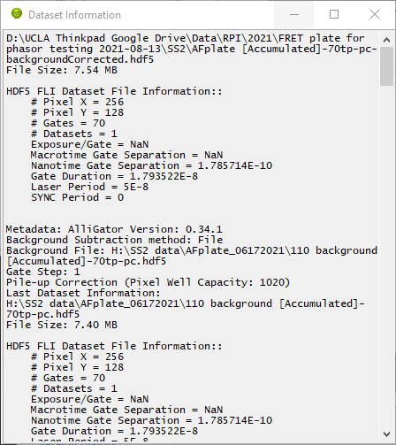

.. _alligator-dataset-information:

Dataset Information
===================

The **Dataset Information** window can be opened with the ``Windows:Dataset Information`` menu item (:kbd:`Ctrl+I` shortcut).

It displays metadata corresponding to the current dataset shown in the *Source Image* display.

It is a floating window (it is always on top of the other windows) and can be resized, minimized or closed.

Its content can be selected and copied, in order to paste it into another document, or the ``Copy Data`` shortcut can be used to save a picture of the currently displayed content.