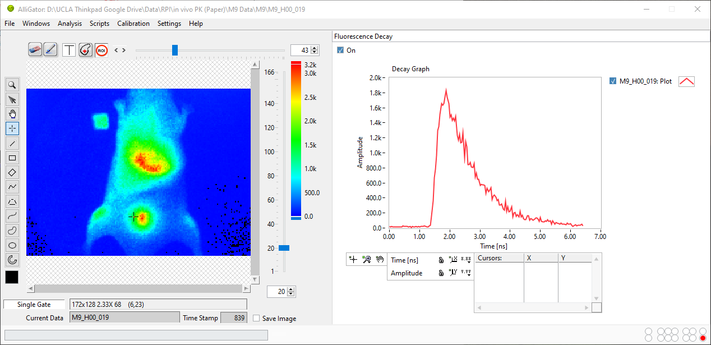
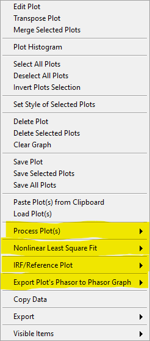
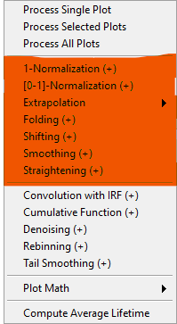
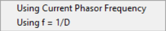

.. _alligator-fluorescence-decay-panel:

Fluorescence Decay Panel
========================

The **Fluorescence Decay** panel can be displayed using the pull-down list at 
the top-right of the main AlliGator window.

In the example shown below, a point ROI was selected in the *Tool Palette* on 
the lefthand side of the *Source Image*, and a ROI decay analysis performed 
using the ``Analysis:Current ROI Analysis`` menu item (:kbd:`Ctrl+A`). While a 
Single Gate image is shown in the *Source Image*, the analysis encompasses all 
gate images, whose intensities at that selected pixels are represented as a 
decay curve (named ``M9_H00_019: Plot`` [#f1]_).

The *Decay Graph* is a feature-rich object which is comprised of different 
parts, some of which are common to all graph objects and are described in the 
:ref:`Graph Object Anatomy <graph-object-anatomy>` page.

In particular, different types of contextual menus are accessible, depending on 
which area of the graph the user right-clicks:

+ :ref:`Plot Menu <plot-menu>`
+ :ref:`Decay Graph Custom Menu <decay-graph-custom-menu>`
+ :ref:`Cursor Legend Menu <cursor-legend>`

The first and last ones are similar for all graph objects and are described in 
detail in the :ref:`Graph Object Anatomy <graph-object-anatomy>` page.

An overview of the *Decay Graph* custom menu is presented below, specific 
functionalities being described in other pages of the manual (linked to in the 
section below).

.. _decay-graph-custom-menu:

Decay Graph Custom Menu
-----------------------

All items *not* highlighted in the image below are standard graph object 
contextual menu items and are described in the :ref:`Graph Object Anatomy 
<graph-object-anatomy>` page (:ref:`Custom Graph Menu <custom-graph-menu>` 
section).

This section will briefly discuss the highlighted submenus, whose functions are 
described in specific pages.

Process Plot(s)
+++++++++++++++

This menu, shown below, allows various types of plot transformations to be 
performed. The highlighted operations are also available as *pre-processing* 
operations applied to each decay (before plotting in the *Decay Graph*, or 
other computations involving decays such as phasor calculation) and are 
discussed in the :ref:`Decay Preprocessing <alligator-decay-preprocessing>` 
page.

- ``Process Single Plot``: This option does not do anything on a plot, but is 
  used to instruct AlliGator to operate on a single plot. The checkmark in 
  front of it indicates that this is the current mode of operation for all 
  the functions in the menu followed by the *(+)* suffix.

- ``Process Selected Plot``: This option does not do anything on any plot, 
  but is used to instruct AlliGator to operate on all selected plots. The 
  checkmark in front of it indicates that this is the current mode of 
  operation for all the functions in the menu followed by the *(+)* suffix.

- ``Process All Plots``: This option does not do anything on any plot, but 
  is used to instruct AlliGator to operate on all plots. The checkmark in 
  front of it indicates that this is the current mode of operation for all 
  the functions in the menu followed by the *(+)* suffix.

- ``1-Normalization``: applies the 1-Normalization operation discussed in the 
  :ref:`Decay Preprocessing <alligator-decay-preprocessing>` page.

- ``[0-1]-Normaliztion``: applies the [0-1]-Normalization operation 
  discussed in the :ref:`Decay Preprocessing <alligator-decay-preprocessing>` 
  page.

- ``Extrapolation:Extrapolate Plot``: extrapolates the selected plot(s) as 
  discussed in the :ref:`Decay Preprocessing <alligator-decay-preprocessing>` 
  page.

- ``Folding``: folds the selected plot(s) as discussed in the :ref:`Decay 
  Preprocessing <alligator-decay-preprocessing>` page.

- ``Shifting``: shifts the selected plot(s) as discussed in the :ref:`Decay 
  Preprocessing <alligator-decay-preprocessing>` page.

- ``Smoothing``: smoothes the selected plot(s) using cubic splines as 
  discussed in the :ref:`Decay Preprocessing <alligator-decay-preprocessing>` 
  page.

- ``Straightening``: straightens the selected plot(s) as discussed in the 
  :ref:`Decay Preprocessing <alligator-decay-preprocessing>` page.

- ``Convolution with IRF``: convolves the selected plot(s) with the stored 
  reference decay.

- ``Cumulative Function``: computes the cumulative function of the selected 
  plot(s).

- ``Denoising``: processes the selected plot(s) with the Wavelet Analysis 
  Denoise algorithm (see https://www.ni.com/docs/en-US/bundle/labview-advanced-signal-processing-toolkit-api-ref/page/lvwavelettk/wa_de_noise.html for details) using the *Wavelength Analysis Options* 
  defined in the **Settings:Fluorescence Decay:Advanced Analysis** panel.

- ``Rebinning``: changes the bin size of the selected plot(s). A dialog 
  window opens up to define the new (larger) bin size.

- ``Tail Smoothing``: smoothes the tail (part of the decay past the maximum) 
  of the selected plot(s) using cubic splines as described above.

Plot Math
^^^^^^^^^

This sub-menu comprises the following functions:

  * ``y -> f(y) Transform``: selecting this item opens up a dialog window 
    to enter an algebraic formula:

    .. image:: images/Simple-Plot-Formula-Dialog.png
       :align: center

    The corresponding amplitude values of the plot (y) will be modified and 
    replaced by y' as defined by the formula (assuming that the syntax is 
    correct. For a list of supported functions, please refer to this LabVIEW 
    help page).

  * ``(x, y) >> (f, g)(x, y) Transform``: selecting this item  opens up a 
    dialog window to enter an algebraic formula:

    .. image:: images/Complex-Plot-Formula-Dialog.png
       :align: center

    The corresponding time (x) and amplitude (y) values of the plot will be 
    modified and replaced by (x', y') as defined by the formulas (assuming 
    that the syntax is correct. For a list of supported functions, please 
    refer to this LabVIEW help page).

  * ``Two-Plot Algebra``: selecting this item  opens up a dialog window to 
    enter an algebraic formula:

    .. image:: images/Multiplot-Math-Dialog.png
       :align: center

    The two plots to be processed can be selected in the *Plot 1* and 
    *Plot 2* pull-down lists. Only plots with identical abscissa (time axis) 
    can be processed. The *Same abcissa array* LED turns green when this is 
    the case.

    The first plot is referred to as ``y1`` and the second plot as ``y2`` in 
    the *Plot Formula* box below, in which the desired formula can be 
    entered.

    Example of valid Plot formula (where y1 represents the value of plot 1 
    at a given abscissa  and y2 the value of the second plot at the same 
    abscissa):

                   2*y1 - 3*y2/((1.5e(-3))+y2)

    he list of supported functions can be found at https://www.ni.com/docs/en-US/bundle/labview/page/lvhowto/formula_node_and_express.html

    The list of supported operators can be found at: https://www.ni.com/docs/en-US/bundle/labview/page/lvhowto/precedence_of_operators_in.html

    Note that the exponentiation operator is '**', *i.e.* the square of y is 
    noted ``y**2``.

  * ``Average Selected Plots``: This function does what it says and creates an 
    additional plot.

- ``Compute Average Lifetime``: computes the average lifetime of the 
  selected decay using *Average Lifetime Options* defined in the 
  **Fluorescence Decay:Advanced Analysis** panel of the **Settings** 
  window.

  .. image:: images/AlliGator-Average-Lifetime-Options.png
     :align: center

Nonlinear Least Square Fit
++++++++++++++++++++++++++

This menu currently contains a single item, whose functionality is described in 
the :ref:`Decay Fitting <alligator-decay-fitting>` page.

.. image:: images/Decay-Graph-Fit-Menu.png
   :align: center

.. _irf-reference-plot:

IRF/Reference Plot
++++++++++++++++++

This menu allows defining the reference decay used either for temporal shifting 
(see :ref:`alligator-decay-shifting` in the Decay (Pre-)Processing page of the 
manual)  or reconvolution of fit models when using the NLSF analysis features 
of AlliGator. More details on the functions of this menu can be found in the 
:ref:`Decay Fitting <alligator-decay-fitting>` page.

.. image:: images/Decay-Graph-IRF-Reference-Decay-Menu.png
   :align: center

Export Decay to Phasor Graph
++++++++++++++++++++++++++++

This menu allows computing the phasor of a pre-computed decay and export the 
resulting phasor to the *Phasor Graph*. This is for instance useful to export a 
computed or recorded IRF to the *Phasor Graph* in order to subsequently use it 
as a calibration phasor.

Python Plugins
++++++++++++++

Python plugins menu items and submenus will appear at the bottom of the *Decay 
Graph* contextual menu. Their names and content will depend on each 
installation, but typically will contain some examples or default 
functionalities.

.. rubric:: Notes

.. [#f1] When the user-selected ROI has a name (that is, when it has been stored 
   in the :ref:`alligator-source-image-roi-manager-window`), this name is 
   appended to the image name, instead of the generic ``Plot`` suffix. A number 
   is autimatically added to the decay name if the same ROI is used several 
   times, or unnamed ROIs are used.