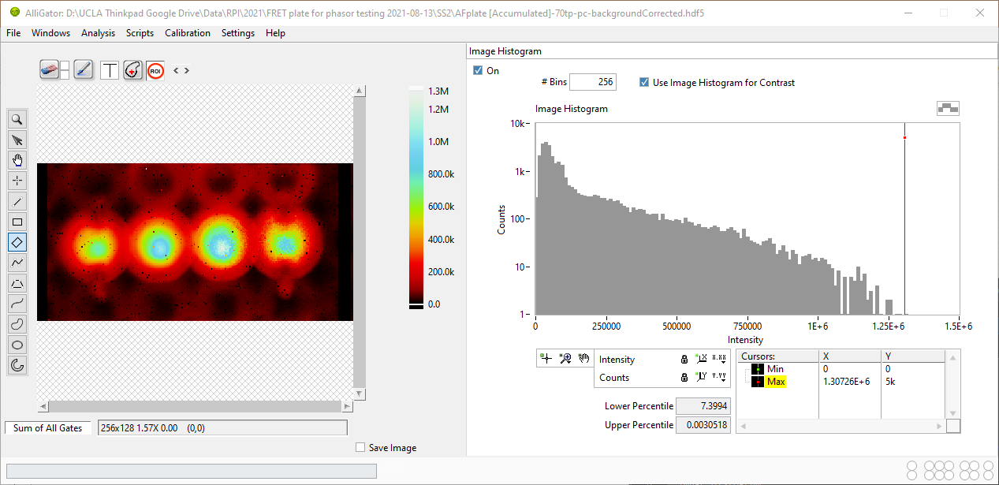

.. _alligator-main:

AlliGator Window
==================

AlliGator's main window (figure below) shows the source dataset
 *intensity image* on the left-hand side, and one of many different
 *analysis panels* on the right-hand side (the **Image Histogram** 
 panel is shown in the figure). The pull-down list on the top right
 (aka panel selector) allows selecting which analysis panel is displayed.

   
AlliGator Panels
----------------

The following panels are available:

- :ref:`alligator-source-image-panel`
- :ref:`alligator-image-histogram-panel`
- :ref:`alligator-fluorescence-decay-panel`
- :ref:`alligator-fluorescence-decay-statistics-panel`
- :ref:`alligator-intensity-time-trace-panel`
- :ref:`alligator-phasor-plot-panel`
- :ref:`alligator-phasor-graph-panel`
- :ref:`alligator-phasor-ratio-analysis-panel`
- :ref:`alligator-lifetime-analysis-panel`
- :ref:`alligator-decay-fit-parameter-map-panel`

Each panel's function is discussed in a separate manual page (see the table of 
content on the left).

A standard *menu bar* on the top left gives access to different functions, 
which are sometimes associated with a :ref:`alligator-shortcuts`. The different
 menus are discussed in separate sections of the manual.

Analysis Status Indicator LEDs
------------------------------

LEDs located on the bottom right of the panel indicate at a glance which 
parameters or options have been defined, or some user action is required. 
To see which option they correspond to, hover over each of them and wait for a
 tip strip to show up.

From left to right, they are:

- Top row

  + Reference/IRF Defined
  + Phasor Calibration Defined
  + Phasor Calibration Series Defined
  + Phasor Calibration Map Defined
  + Phasor Ratio Reference 1 Defined
  + Phasor Ratio Reference 2 Defined
  + Datase Update Needed
  
- Bottom row

  + Individual IRFs Defined
  + Phasor Calibration Used
  + Phasor Calibration Series Used
  + Phasor Calibration Map Used
  + Phasor Ratio Lifetime Reference 1 Defined
  + Phasor Ratio Lifetime Reference 2 Defined
  + Phasor Plot Update Needed

Other buttons and indicators
----------------------------

Depending on the task being processed, some controls or indicators can appear
 in the main window. For instance, for some time-consuming tasks, a progress
 bar is displayed at the bottom of the window. More generally, a 
 spinning-row-of-dots animated icon is displayed while a taks is in progress, 
 and is sometimes associated with an *Abort* button to allow interrupting these
 processes.

Finally, audible feedback is provided in the form of chimes to inform the user 
of the completion of scripts, or the occurence of an error.

More information about the functions and use of the software can be found in 
the manual pages.