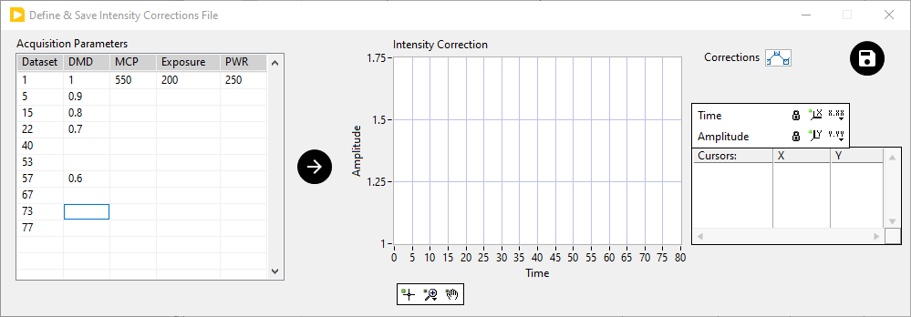

.. _intensity-corrections-definition:

Intensity Corrections Definition
================================

As discussed in the :ref:`alligator-intensity-time-trace-panel` manual page, it 
is sometimes useful to apply corrections to the measured intensity of a region 
of interest, if known acquisition parameter modifications have been applied at 
different time points. This is done by providing a correction file, which can 
be created using a simple user interface accessed with the 
``Analysis:FLI Dataset Series:Define Intensity Corrections`` menu item. This 
opens up the following window:

The window is comprised of:

  * a table of acquisition parameters (left-hand side)
  * a graph representing the resulting correction factors to apply to a given 
    intensity time trace (right-hand side)

The parameters which can be provided for different time points at which some 
parameter modification occurs are:

  * Dataset: the dataset number at which the change happens
  * DMD: the attenuation factor applied to the incident illumination. In 
    experiments using a digital mirror device (DMD), this can be the actual 
    gray value sent to the DMD, or the fraction of the maximum value sent to 
    the DMD.
  * MCP: the MCP voltage (in V). This value is used to apply an interpolated 
    gain factor for a specific device and will probably result in erroneous 
    corrections for other devices. Please post a feature request in the 
    `AlliGator Support Google Group <https://groups.google.com/u/1/g/alligator-software-support>`_ 
    if better control over this parameter would be useful for your application.
  * Exposure: the duration of exposure for each gate (arbitrary unit)
  * PWR: incident excitation power (arbitrary unit)

Only the first row needs to be filled completely (as shown above). The last row 
needs to contain at least the dataset number, and is used to specify the number 
of entries in the correction file.

If a single parameter is modified at a given time point (dataset), only that 
single parameter value needs to be entered. It is implicitly assumed that if 
the other parameters are not entered, this means that they have not been 
modified.

Once the different parameters have been entered, press the *Arrow* button in 
the middle to graphically check the resulting correction factor which will be 
applied to the intensity time trace in AlliGator.

When done, save the file using the *Save* button next to the *Intensity 
Correction* graph legend. The file is an ASCII file and can also be edited 
manually (be aware that some text editors add hidden characters and formatting 
information to files, rendering these illegible by software expecting an ASCII 
file - such as AlliGator).

In general, different correction files may be needed for different regions of 
interest in the image, if the illumination scheme is sophisticated enough 
(*e.g.* if a DMD has been used).