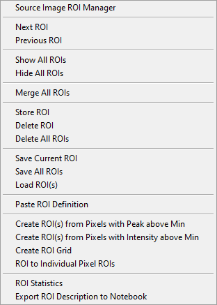
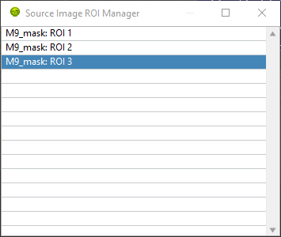
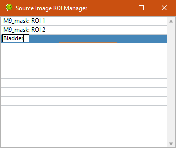
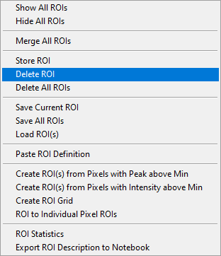
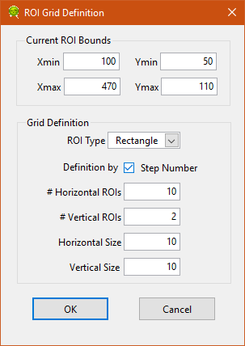
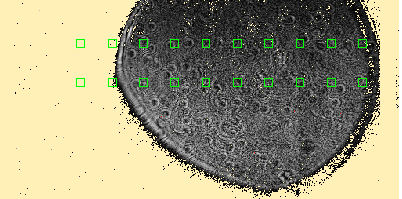
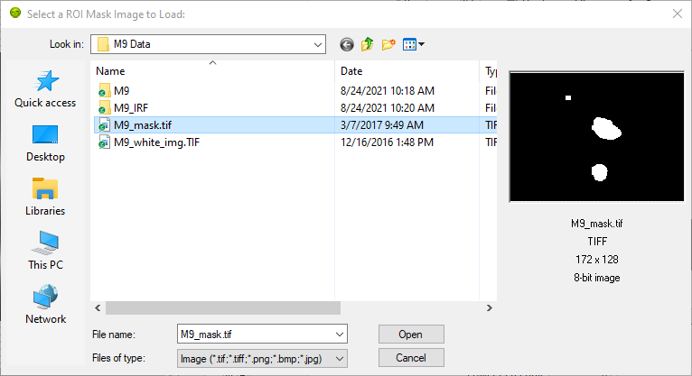
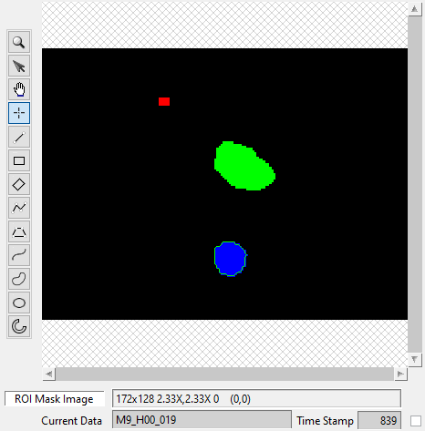

.. _regions-of-interest:

Regions of Interest
===================

Regions of interest (ROIs) are defined by a closed contour and can be created in
different ways:

- by drawing them using the drawing tools (to the left of the image)
- by loading a ROI Mask image (this only works for the Source Image)
- by pasting a text ROI description
- using the Define ROI(s) above Min Peak context menu of the Image Source

These approaches are described below.

Drawing a ROI
-------------

There are a few default shape categories available on the left hand side of the
image to draw ROIs:

- Rectangle
- Tilted Rectangle
- Polygon (double-click the last point to finish and close the shape)
- Free Form
- Oval
- Annulus

To draw a ROI comprising several shapes, hold the ``Ctrl`` key down while 
drawing the successive shapes.

ROIs are represented as a special kind of overlay on top of the image and can be
manipulated using the ``Selection`` tool:

This tool acts as either a resizing tool or as a moving tool.

Managing ROIs
-------------

ROIs can be managed using the ROIs context menu functions:

Source ROI Manager
++++++++++++++++++

The ROI manager is a floating window used to select stored ROIs by name:

ROI names can be modified by clicking on an already selected ROI name, making it
editable (when the background turns black):

If the modified name is already used by another ROI in the list, a number is 
automatically appended to the name.

It is also possible to delete or save ROIs from within the ROI manager using the
right-click menu (see ROI Saving/Loading below).

It is also possible to navigate through the different stored ROIs using the 
navigation buttons described next.

ROI Navigation
++++++++++++++

In addition to the ROI Manager window, it is possible to cycle through the 
stored ROIs using the two little arrow heads/navigation buttons located to the 
right of the ``Overlay Mode`` button above the **Source Image**:

Alternatively, use ``Next ROI`` or ``Previous ROI`` in the right-click menu of 
the **Source Image ROI Manager** to the same effect.

ROI Display
+++++++++++

To hide the visible ROI(s), select ``Hide All ROIs``. Contrary to the 
``Delete All ROIs`` function discussed next, this does not destroy the stored 
ROI(s).

ROI(s) can be displayed again by either using the ROI Navigation buttons or by 
selecting a ROI in the ROI Manager window.

To show all stored ROIs, select ``Show All ROIs``. Note that this does not 
select any new or different ROI.

ROI Storage
-----------

ROI Storage
+++++++++++

A ROI can be used right after it has been defined, but any click elsewhere in 
the image with a ROI-modifying tool (selection or drawing tool) will erase it.

To avoid this, you can store the ROI after it has been defined by using the 
``Store ROI`` right-click menu item.

To remove a ROI from memory, cycle through the ROIs to show it and use 
``Delete ROI``.

To remove all ROIs from memory, use ``Delete All ROIs``.

Saving and Loading ROIs
+++++++++++++++++++++++

To save a ROI for future use, it is possible to save it as a file using 
``ROIs->Save Current ROI``. Use a self-explanatory name to simplify the task of
finding the appropriate ROI next time you need it. The file extension is 
automatically set to ``.roi``.

It is also possible to save all ROIs in a single file, using ``Save All ROIs``.
The corresponding file extension is automatically set to ``.roiN``.

To load a saved ROI (or multiple ROIs saved together), use ``Load ROI``.

It is also possible to define ROIs using a binary image as described in a later
section.

Note: Prior to version 0.17, a XML file format was used, which turned out to be
a bit verbose and slow to load. From 0.17 onward, the file format was changed 
to JSON to mitigate these issues. Older XML files can still be loaded, but it 
is recommended to save them (e.g. overwriting the older version) in the new 
format.

Importing ROI description
+++++++++++++++++++++++++

Another method to create a ROI is to copy/paste a text description of a ROI 
generated by AlliGator and output to the **Notebook** during analysis. This is
particularly convenient if a user has saved the Notebook after data analysis, 
but either failed to store and save the different ROIs used, or the 
corresponding files are not available.

To recreate a ROI from its description, simply select it in and copy it from the
Notebook (or another text editor), and moving to the **ROI Manager**, 
right-click and select ``Paste ROI Definition``. If the definition is valid, 
this will create a new ROI and add it to the ROI Manager's list.

For instance, here is a ROI definition representing an ellipse::

  Number of pixels: 2728
  Global Rectangle (LT, BR): (234, 211), (278, 273)
  Number of Contours: 1
  Contour 1: Oval
  Points: (234, 211), (278, 273)

ROI Definition
--------------

Defining ROI(s) by a decay peak threshold
+++++++++++++++++++++++++++++++++++++++++

The **Source Image** panel of the **Settings** window has a parameter named 
``Peak Threshold``. This parameter relates to the maximum value of the single 
pixel decay (peak value).

It is possible to define ROI(s) based on pixels whose peak value is larger than
this ``Peak Threshold`` by using the right-click menu ``Create ROI(s) from 
Pixels with Peak above Min``.

[The appropriate value to use can be estimated by an analysis of the 
**Fluorescence Decay Statistics** histograms computed in the corresponding panel
(see the corresponding manual page: 
:ref:`alligator-fluorescence-decay-statistics-panel`)].

The result of this operation is one or more ROIs meeting this criterion. The 
ROIs are stored and added to the pool of existing ROIs.

Defining ROI(s) by a image intensity threshold
++++++++++++++++++++++++++++++++++++++++++++++

The **Source Image** panel of the **Settings** window has a parameter named 
``Intensity Threshold``.

It is possible to define ROI(s) based on pixels whose total intensity is larger 
than this ``Intensity Threshold`` by using the right-click menu 
``Create ROI(s) from Pixels with Intensity above Min``.

[The appropriate value to use can be estimated by an analysis of the 
**Image Histogram** computed in the corresponding panel.

The result of this operation is one or more ROIs meeting this criterion. The 
ROIs are stored and added to the pool of existing ROIs.

ROI Grid
++++++++

This menu item opens up a dialog allowing the definition of a series of 
rectangular ROIs arranged in a grid pattern:

If a ROI is displayed in the **Source Image**, its bounding box definition will
be used as ``Current ROI Bounds`` parameters. Otherwise, define the bounding 
rectangle for the grid:

(Xmin, Ymin) = coordinate of top-left corner
(Xmax, Ymax) = coordinates of bottom-right corner

The ``Grid Definition`` cluster of parameters is used to define the type, 
number and size of the individual ROIs arranged on the grid. The grid can be 
defined either in terms of ``Step Size`` or ``Step Number``, depending on the 
``Definition by`` checkbox.

Using the definition shown above results in the following set of ROIs:

The corresponding ROIs are added to the ROI list (visible in the **ROI Manager**
window), with names of the kind: ``Type ROI (X,Y)+(W,H)``, where ``Type`` is 
the ROI type (Point, Rectangle or Oval), ``(X,Y)`` are the coordinates of the 
top-left corner of the ROI and ``(W,H)`` are the width and height of the ROI.

Note: To see all ROIs as in the figure above, use ``Show All ROIs`` in the 
**Source Image** context menu.

Convert ROI to Individual Pixel ROIs
++++++++++++++++++++++++++++++++++++

To obtain all individual pixel decays within a ROI, it is possible to create 
"single pixel" ROIs for all pixels within that ROI with the 
``ROI to Individual Pixel ROIs`` function.

The individual pixel ROIs are added to the ROI list (visible in the 
**ROI Manager** window), with names of the kind: ``Source ROI (X,Y)``, where 
``Source ROI`` is the name of the original ROI (or ``Temp ROI`` if the original 
ROI was not stored) and ``(X,Y)`` are the pixel coordinates.

Note: To see all ROIs as in the figure above, use ``Show All ROIs`` in the 
Source Image context menu:

+-------------------------------------------+--------------------------------------------------+
+===========================================+==================================================+
| Original ROI                              | Individual Pixel ROIs                            | 
+-------------------------------------------+--------------------------------------------------+
| .. image:: images/Image-with-Temp-ROI.png | .. image:: images/Image-with-Temp-ROI-Pixels.png |
+-------------------------------------------+--------------------------------------------------+

Warning: Depending on the PC used, it might be recommended to use this feature 
only with ROIs of moderate size, due to the potential time and memory 
consumption of this operation. In particular, it is not recommended to select 
the whole image and create individual pixel ROIs for all pixels for large 
images.

ROI Information
---------------

ROI Statistics
++++++++++++++

This menu item computes basic image statistics for the pixels of the displayed 
image contained in the ROI::

  Area (pixels)
  % of Image
  Total Intensity
  Mean Value
  Standard Variation
  Min Value
  Max Value

The quantities are self-explanatory, except maybe for the ``% of Image`` 
quantity, which is simply the area of the ROI divided by the total image area.

Export ROI Description to Notebook
++++++++++++++++++++++++++++++++++

While exporting a ROI description as a file is the best way to preserve 
information about a ROI definition for later re-use within AlliGator, it is 
also possible to export a more readable description of it to the Notebook using
the ``Export ROI Description to Notebook`` menu item.

Using a ROI Mask Image
----------------------

Using ROIs defined externally is possible by providing an 8-bit ROI Mask Image 
in which background pixels have a value of 0 and pixels to include in the ROI(s)
have a value of 255. Such an image needs to be loaded using the 
``File:Load:Other Files:Open ROI Mask`` menu item, as discussed in the 
:ref:`alligator-file-menu` section of the manual:

ROIs are extracted from this image using a "particle" detection algorithm which
groups contiguous pixels with similar grayscale values into separate domains 
(or particles). In the example shown above, the mask image is comprised of two
types of pixel values: 0 (black) or 255 (white). The algorithm will identify 3 
groups (in the above example) and associate a ROI for each one of them. It will
also "paint" each region with a different grayscale value (starting with 1 for 
the first particle, 2 for the second, etc.).

To invert the image before processing it, check the ``Invert Binary Mask`` 
checkbox in the **Source Image** panel of the **Settings** window.

The resulting processed image will be displayed in the **Source Image** control
using a binary color scale, which associates a very different vivid color with 
each consecutive pixel value.

Notice how the **Displayed Image** pull-down list reads ``ROI Mask Image``. It 
is possible to visualize this image at any time by selecting this value.

When loading the mask image, AlliGator will identify the different ROIs and 
provide them with default name constructed from the file name and the ROI order.

These names can later be modified using the **ROI Manager** window.

Internally, AlliGator stores one definition (the whole contour of each ROI) per
ROI, even when these ROIs are loaded from a single ``.roiN`` fle. These 
definitions can be cycled through using the ``ROI Navigation`` buttons 
described above or the **ROI Manager** window.