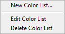

.. _selected-plot-style-window:

Selected Plot Style Window
==========================

The ``Set Style of Selected Plots`` custom graph menu item opens up the following **Plot Style Dialog** window:

The *Preview* panel on the right will illustrate what plot style has been defined using the list of controls on the left.

These controls try to reproduce the options normally available for *individual* plots using the right-click menu associated with each plot's icon in the *Graph*, with some modifications. Importantly, the selected style(s) will be applied to *all selected plots*.

Notice that most of the selected style options are ``unchanged`` in the above snapshot. This means that the corresponding component of the plots' styles will not be changed. However, the ``Histogram Type`` parameter has been chosen to be ``Left Bound``. The result of pressing ``OK`` will be that all selected plots which are "histograms" will be left-justified, while other plots will remain unchanged.

Most of the options are self-explanatory, but the two ``Color`` options (``Line Color`` and ``Point Color``) offer the flexibility needed for series of plots:

The ``Color Box`` option will show a color box next to the option, allowing to apply the selected color to all plots (either the line color or the point color, or both).

Selecting the ``Color List`` option will show a pull-down list next to the option. If it contains some color list names, one of them can be selected. Otherwise, right-clicking on the list will show the following menu:

``Edit Color List`` and ``Delete Color List`` are self-explanatory.

Selecting ``New Color List...`` opens the following dialog window:

Clicking on individual *Color Boxes* in the linear array visible in the center, allows defining a series of colors. This series will be repeatedly applied to the selected plots when leaving the *Plot Style Editor*. It is recommended to give each user-defined color list a distinctive name for future use (these lists are saved with AlliGator Settings, therefore they are available from one run to the next).

To store the edited list, click ``OK`` and then ``OK`` in the *Plot Style Editor* window to apply the selected styles.

To leave the selected plots untouched, simple click on ``Cancel`` or close the *Plot Style Editor* window.