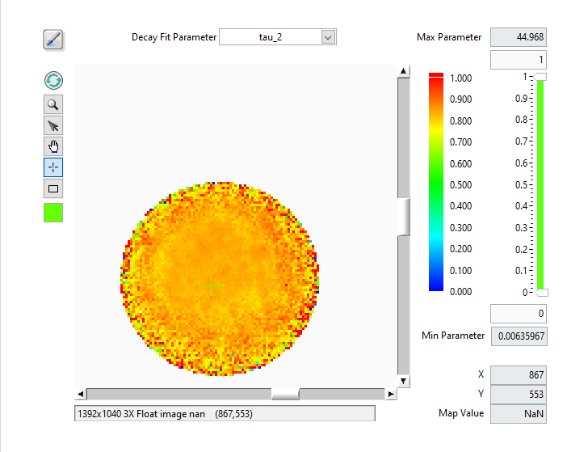
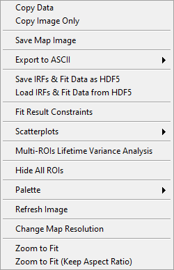
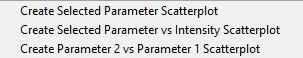
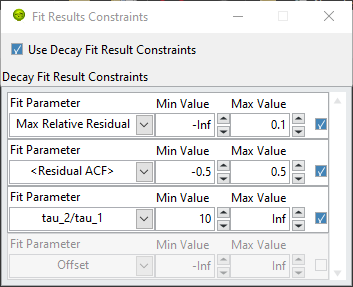
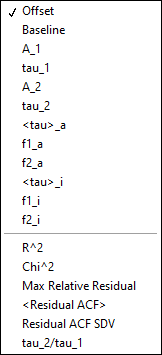

.. _alligator-decay-fit-parameter-map-panel:

Decay Fit Parameter Map Panel
=============================

The *Decay Fit Parameter Map* panel is used to display and further process 
multi-ROIs NLSF results (and can be used to display results from a Python plugin 
if needed).

The panel consists of different controls and indicators as illustrated below and 
discussed next.

The main object is the map itself, which represents a color-coded image of the 
selected parameter (*Decay Fit Parameter* pull-down list at the top right), 
based on the selected *Decay Fit Parameter Map Color Scale* (next to the map) 
and the values of the *Decay Fit Parameter Map Display Range* (to the right of 
the color scale).

The *Max Parameter* and *Min Parameter* indicators provide the actual total 
range of the computed parameters, while the controls immediately above and 
below the slide represent the position of the sliders, which themselves 
specify what are the selected Min and Max of the displayed parameters.

Any parameter above or below these two limits are color-coded with the unique 
color boxes located at the top and bottom of the color scale (by default, the 
bottom color is white, and is therefore not visible in the snapshot above). 
Left-click above or below the color scale to reveal the color picker window and 
select the color highlighting parameters respectively above or below the display 
range minimum).

The *X*,*Y* and *Map Value* indicators at the bottom right provide the location 
of the cursor (also visible in the image information bar below the map), as well 
as the actual map value at that location. if that latter indicator appears 
unresponsive, briefly move the mouse out of the window and back to reactuivate 
mouse tracking (that trick also work to reactivate the 
:ref:`alligator-local-decay-graph-window` mentioned below).

The square Tools buttons on the top left of the *Decay Fit Parameter Map* 
allow zooming, selecting, moving or clicking the image or a ROI. Note that the 
*Rectangle* tool is only used to zoom in on a specific region of the map in 
combination with the ``Alt`` key.

The *Refresh Parameter Map* button forces redrawing the map, while the square 
color selector at the bottom allows defining the color of the ROIs drawn over 
the map.

Finally, the *Overlay Decay Fit Parameter Map* button at the top left (brush 
tool) enables overlaying the current *Decay Fit Parameter Map* on the *Source 
Image*.

Decay Fit Parameter Map Menu
----------------------------

The *Decay Fit Parameter Map* context menu is shown below and discussed next.
 

.

+ *Copy Data*: This copies the LabVIEW image object bitmap, including tool 
  palette, scroll bars, and image information.
+ *Copy Image Only*: Only copies the visible image.
+ *Save Map Image*: Saves the whole image as a PNG file (with dialog).
+ *Export to ASCII*:

  + *Export Map Data as ASCII*: This will export the current map image as an 
    ASCII matrix of parameter values. If only a few of the image pixels have 
    actual parameters associated with them, this will result in a mostly 
    ``NaN``-filled file, with a few isolated actual values.
  + *Export All Maps Data as ASCII*: This will export all parameter map images 
    as separate ASCII matrices of parameter values.
  + *Export ROI Data as ASCII*: This function exports all parameters for the 
    selected ROI. Note however that there are 3 different use cases:
    
    + If the the ROIs used to compute the map are all single-pixels and the 
      selected ROI is a single-pixel ROI, this will export a single row of 
      parameters, preceded by the ROI index and pixel coordinates.
    + If the the ROIs used to compute the map are not all single-pixels and 
      the selected ROI is one of the original ROIs used for computing the 
      map, this will export a single row of parameters, preceded by the ROI 
      index and pixel coordinates.
    + Possibly more interesting, if the the ROIs used to compute the map 
      are all single-pixels but the selected ROI is not, this will export 
      multiple rows of parameters corresponding to the different pixels in 
      that ROI, preceded by the ROI index and pixel coordinates.
  + *Export All ROIs Data as ASCII*: Similarly to the previous one, this 
    function exports all parameters for all the ROIs. Again, there are 3 
    different use cases:

    + If the the ROIs used to compute the map are all single-pixels and the 
      ROIs are also single-pixel ROIs, this will export multiple rows of 
      parameters, preceded by the ROI index and pixel coordinates.
    + If the the ROIs used to compute the map are not all single-pixels and 
      the ROIs are the original ROIs used for computing the map, this will 
      export multiple rows of parameters, preceded by the ROI index and 
      pixel coordinates.
    + Possibly more interesting, if the the ROIs used to compute the map 
      are all single-pixels but the ROIs used are not, this will export
      multiple rows of parameters corresponding to the different pixels in 
      these ROI, preceded by the ROI index and pixel coordinates.
+ *Save IRFs & Fit Data as HDF5*: This saves all the data generated during the 
  fit, as well as the IRFs in a HDF5 file. It is the recommended quick way to 
  save the outcome of an analysis and allows revisiting the results with the 
  help of the next function.
+ *Load IRFs & Fit Data from HDF5*: This allows reloading the output of an 
  analysis and work with it (see next) together with the loaded dataset (the 
  dataset is not loaded, neither are the ROIs, which needs to be done 
  separately, if needed).
+ *Fit Result Constraints*: opens a windows allowing to specify constraints to 
  obey when computing scatterplots (see next menu item). The **Fit Result 
  Constraints** window is described in the :ref:`alligator-fit-result-constraints` 
  section below.
+ *Scatterplots*: submenu to select the type of scatterplot to export to the 
  *Lifetime & Other Parameters* Graph. These scatterplots can be limited to 
  pixels verifying a set of constraints on fit parameters and derived quantities 
  

.

  + *Create Selected Parameter Scatterplot*: Sends all parameter values *P_i* 
    in the image as a *(i, P_i)* scatterplot, where *i* is the index of the 
    ROI.
  + *Create Selected Parameter vs Intensity Scatterplot*: Sends all parameter 
    values *P_i*  in the image as a *(I_i, P_i)* scatterplot, where *I_i* is 
    the total ROI decay intensity. This requires the ROIs used during NLSF 
    analysis to be present in order to be able to compute each ROI's total 
    intensity.
  + *Create Parameter 2 vs Parameter 1 Scatterplot*: Opens a dialog window to 
    select the two parameters (P1, P2) to export as pairs.

+ *Multi-ROIs Lifetime Variance Analysis*: computes various lifetime variance 
  maps. The results are sent to the **Parameter Map** panel described in its 
  :ref:`dedicated page: <alligator-parameter-map-panel>`. 
  See the :ref:`alligator-lifetime-variance-analysis` section for details.

+ *Change Map Resolution*: when loading a Decay Fit Parameter Map file, the 
  default size of the map is set to that of the loaded dataset. If that dataset 
  does not correspond to the loaded map data (or no dataset is loaded), it is 
  necessary to manually set the map's resolution (*i.e.* image size), which 
  this function allows doing.

The other functions are self-explanatory.

Note that when a series of parameter maps has been calculated, it is possible 
to visualize the outcome of the fits in a given ROI by opening the 
:ref:`alligator-local-decay-graph-window`. This will display the local decay, 
fit, residuals, IRF and residuals autocorrelation function, as well as output 
the fit parameters and derived quantities in the lower panel of the window.

.. _alligator-fit-result-constraints:

Fit Result Constraints Window
-----------------------------

.

The **Fit Result Constraints** window (opened via the *Decay Fit Parameter Map* 
*Fit Result Constraints* right-click menu item) allows defining *Min Value* and 
*Max Value* for all fit parameters and derived quantities (all quantities 
available in the *Decay Fit Parameter* pull-down menu at the top of the panel, 
plus a few other ones visible in the *Fit Parameter* pull-down list below).

.

The additional quantities are described next:

+ *Max Relative Residual*: maximum of the absolute ratio of the residual over 
  the decay value.
+ *<Residual ACF>*: mean value of the residuals autocorrelation function.
+ *Residual ACF SDV*: standard deviation of the residuals autocorrelation 
  function.
+ *tau_2/tau_1*: ratio of the two lifetimes in a bi-exponential fit (this value 
  is zero for a single-exponential fit).

.. note::
   The ACF is plotted with the zero-point value, but the *<Residual ACF>* and 
   *Residual ACF SDV* are computed with this value excluded.

Each constraint line ends with a checkbox indicating whether it should be used 
or not. Finally, the *Use Decay Fit Results Cosntraints* checkbox at the top of 
the list indicates whether or not the selected constraints should be applied. 
All selected constraints need to be satisfied in order for a pixel to be 
retained in the analysis.

These constraints may take some time to be computed (especially if max 
relative residual or residuals ACF are selected), but are only computed once.

.. _alligator-lifetime-variance-analysis:

Lifetime Variance Analysis Maps
-------------------------------

This analysis involves external calibration data establishing the *expected* 
lifetime coefficient of variation (:math:`CV_\tau`) dependency on intensity 
(*I*) for an ideal sample. The analysis requires providing the power law 
parameters describing this dependency, which are user-provided via the 
following dialog:

.. image:: images/AlliGator-Power-Law-Parameters-Dialog.png
   :align: center

.

The analysis also requires providing parameters defining the intensity slices 
to be used in each ROI defined in the image (see the ``Compute Sliced Mean, SDV 
& CV Plots`` menu of the :ref:`alligator-lifetime-and-other-parameters-panel` 
for details). This analysis establishes the *observed* :math:`CV_\tau(I)` 
dependency.

The following maps are computed:

+ *Delta SDV Map*: the map represents the difference between the observed and 
  expected lifetime standard deviation of the selected lifetime map 
  (:math:`\tau_1, \tau_2, \tau_a` or :math:`\tau_i`), where :math:`SDV_\tau = 
  CV_\tau*\tau`.

+ *Delta CV Map*: the map represents the difference between the observed and 
  expected lifetimecoefficient of variation of the selected lifetime map 
  (:math:`\tau_1, \tau_2, \tau_a` or :math:`\tau_i`).

+ *Lifetime Variance F-Test Significance Map*: the map represents the 
  significance level of the observed lifetime variance ratio using the F-test.
  
+ *Lifetime Variance* :math:`\chi^2`-*Test Significance Map*: the map represents 
  the significance level of the observed lifetime variance ratio using the 
  :math:`\chi^2`-test.

(last updated: 2026-01-29)

