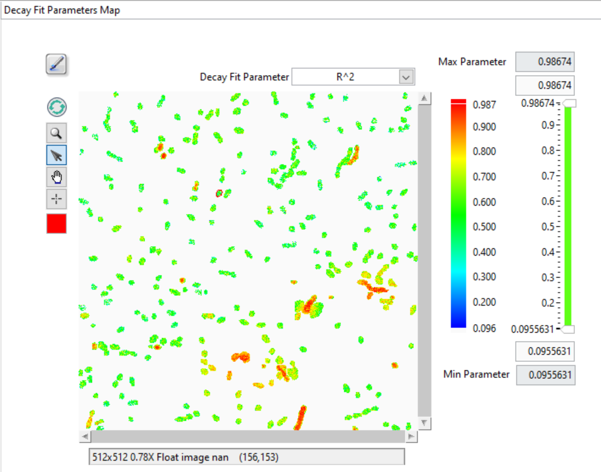
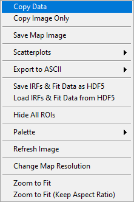

.. _alligator-decay-fit-parameters-map-panel:

Decay Fit Parameters Map Panel
==============================

The *Decay Fit Parameters Map* panel is used to display and further process 
multi-ROI NLSF results (and can be used to display results from a Python plugin 
if needed).

The panel consist of different controls and indicators as illustrated below and 
discussed next.

The main object is the map itself, which represents a color-coded image of the 
selected parameter (*Decay Fit Parameter* pull-down list at the top right), 
based on the selected *Decay Fit Parameter Map Color Scale* (next to the map) 
and the values of the *Decay Fit Parameter Map Display Range* (to the right of 
the color scale).

The *Max Parameter* and *Min Parameter* indicators provide the actual total 
range of the computed parameters, while the controls immediately above and 
below the slide represent the position of the sliders, which themselves 
specify what are the selected Min and Max of the displayed parameters.

Any parameter above or below these two limits are color-coded with the unique 
color boxes located at the top and bottom of the color scale (by default, the 
bottom color is white, and is therefore not readily localized. Left-click right 
below the color scale to reveal the color picker window and select the color 
highlighting parameters below the display range minimum).

The square Tools buttons on the top left of the *Decay Fit Parameters Map* 
allow zooming, selecting, moving or clicking the image or a ROI.
 
The *Refresh Parameter Map* forces redrawing the map, while the square color 
selector at the bottom allows defining the color of the ROIs drawn over the map.

Finally, the *Overlay Parameter Map* button at the top left (brush tool) enables 
overlaying the current *Decay Fit Parameters Map* on the *Source Image*.

Decay Fit Parameter Map Menu
----------------------------

The *Decay Fit Parameters Map* context menu is shown below and discussed next.
 

+ *Copy Data*: This copies the LabVIEW image object bitmap, including tool 
  palette, scroll bars, and image information.
+ *Copy Image Only*: Only copies the visible image.
+ *Save Map Image*: Saves the whole image as a PNG file (with dialog).
+ *Scatterplots*: exports scatterplots to the *Lifetime & Other Parameters 
  Graph*
  
  - *Create Selected Parameter Scatterplot*: Sends all parameter values *P_i* 
    in the image as a *(i, P_i)* scatterplot, where *i* is the index of the 
    ROI.
  - *Create Selected Parameter vs Intensity Scatterplot*: Sends all parameter 
    values *P_i*  in the image as a *(I_i, P_i)* scatterplot, where *I_i* is 
    the total ROI decay intensity. This requires the ROIs used during NLSF 
    analysis to be present in order to be able to compute each ROI's total 
    intensity.
  - *Create Parameter 2 vs Parameter 1 Scatterplot*: Opens a dialog window to 
    select the two parameters (P1, P2) to export as pairs.
    
+ *Export to ASCII*:

  - *Export Map Data as ASCII*: This will export the current map image as an 
    ASCII matrix of parameter values. If only a few of the image pixels have 
    actual parameters associated with them, this will result in a mostly 
    ``NaN``-filled file, with a few isolated actual values.
  - *Export All Maps Data as ASCII*: This will export all parameter map images 
    as separate ASCII matrices of parameter values.
  - *Export ROI Data as ASCII*: This function exports all parameters for the 
    selected ROI. Note however that there are 3 different use cases
    
    a. If the the ROIs used to compute the map are all single-pixels and the 
       selected ROI is a single-pixel ROI, this will export a single row of 
       parameters, preceded by the ROI index and pixel coordinates.
    b. If the the ROIs used to compute the map are not all single-pixels and 
       the selected ROI is one of the original ROIs used for computing the 
       map, this will export a single row of parameters, preceded by the ROI 
       index and pixel coordinates.
    c. Possibly more interesting, if the the ROIs used to compute the map 
       are all single-pixels but the selected ROI is not, this will export 
       multiple rows of parameters corresponding to the different pixels in 
       that ROI, preceded by the ROI index and pixel coordinates.
       
  - *Export All ROIs Data as ASCII*: Similarly to the previous one, this 
     function exports all parameters for all the ROIs. Again, there are 3 
     different use cases:
    
    a. If the the ROIs used to compute the map are all single-pixels and the 
       ROIs are also single-pixel ROIs, this will export multiple rows of 
       parameters, preceded by the ROI index and pixel coordinates.
    b. If the the ROIs used to compute the map are not all single-pixels and 
       the ROIs are the original ROIs used for computing the map, this will 
       export multiple rows of parameters, preceded by the ROI index and 
       pixel coordinates.
    c. Possibly more interesting, if the the ROIs used to compute the map 
       are all single-pixels but the ROIs used are not, this will export
       multiple rows of parameters corresponding to the different pixels in 
       these ROI, preceded by the ROI index and pixel coordinates.
       
+ *Save IRFs & Fit Data as HDF5*: This saves all the data generated during the 
  fit, as well as the IRFs in a HDF5 file. It is the recommended quick way to 
  save the outcome of an analysis and allows revisiting the results with the 
  help of the next function.
+ *Load IRFs & Fit Data from HDF5*: This allows reloading the output of an 
  analysis and work with it (see next) together with the loaded dataset (the 
  dataset is not loaded, neither are the ROIs, which needs to be done 
  separately, if needed).

The other functions are self-explanatory.

Note that when a series of parameters maps has been calculated, it is possible 
to visualize the outcome of the fits in a given ROI by opening the **Local 
Decay Graph** window. This will display the local decay, fit, residuals and 
IRF, as well as output the fit parameters in the lower panel of the window.
