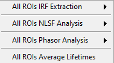
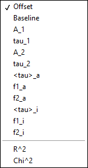

.. _alligator-decay-fitting:

Fluorescence Decay Fitting
==========================

AlliGator offers basic capabilities to analyze data using standard techniques 
of fluorescence decay fitting:

* Individual decays can be fitted with a single or double-exponential decay 
  model convolved with or without an experimental instrument response function 
  (IRF).
* Multiple ROIs in the image source can be fitted, the resulting parameters 
  being output as maps (see :ref:`alligator-decay-fit-parameters-map-panel`)
* Series analysis of a ROI in the image source can be done one ROI at a 
  time (the same ROI is used throughout the series), or a list of ROIs can be 
  used, one dataset in the series using one of the ROI in the list (in the order 
  they appear in the list). In both cases, selected parameters are output as 
  individual plots (one plot per parameter, one point per dataset).

These different capabilities are described next.

Instrument Response Function (IRF)
++++++++++++++++++++++++++++++++++

As discussed in the :ref:`IRF/Reference Plot <irf-reference-plot>` section of 
the :ref:`alligator-fluorescence-decay-panel` manual page, any decay in the 
*Decay Graph* of the **Fluorescence Decay Panel** can be used as IRF. However,
it is best to have an IRF that covers the full laser period.

This can be artifically obtained starting with a *truncated* decay (*i.e.* a 
decay only partially covering the laser period) using single-exponential 
extrapolation (see :ref:`Decay Extrapolation <alligator-decay-extrapolation>` 
section in the :ref:`alligator-decay-preprocessing` manual page). This of course 
only makes sense if the IRF is narrow and characterized by a tail. In all the 
other cases, it is possible to manually add points to the IRF using the 
:ref:`alligator-plot-editor-window`. Otherwise, missing data points will be 
replaced with zeroes when computing the convolution product, which may result 
distorted fits.

The fit model convolution with the IRF is compared with an interpolation of the 
decay at the time points over which the IRF is defined. This means that a 
fitted decay does not need to cover the whole laser period, or even defined at 
the same time points or with the same resolution.

In the case of multiple ROIs fits, this single IRF decay can be replaced by 
multiple ROIs IRFs as discussed below in the corresponding section on multiple 
ROIs fit.

Finally, it is worth mentioning that an IRF *is not needed* for NLSF analysis. 
If none is defined (or if none is desired, use the ``IRF/Reference Plot:Clear 
IRF/Reference Plot`` menu item of the *Decay Graph* to clear it), the 
convolution step is skipped during fitting.

.. _alligator-single-decay-fitting:

Single decay fit
++++++++++++++++

Overview
--------

A single plot can be fitted by a model function convolved with the selected IRF 
by right-clicking on its legend (or close to it in the graph) and selecting 
``NLSF:IRF o N-Exp``. The options specifying the type of fit and the constraints 
used are defined in the :ref:`alligator-settings-fluorescence-decay-fit-options` 
and :ref:`alligator-settings-fluorescence-decay-fit-parameters` panels 
respectively.

Several fit options, discussed below, are available in the 
:ref:`alligator-settings-fluorescence-decay-fit-options` panel:

- Model
- Fitting Algorithm
- Fitting Method
- Weights
- Show Fit Residuals
- Residuals
- Max & Min Decay Percentile
- Show Full Decay
- Parameter Uncertainties
- Periodic Boundaries
- Period
- Use Data Information Laser Period
- Termination Criteria
- Use Local IRF
- Offset Resolution

Parameter constraints, guess parameters and whether or not to display the 
output as plots are managed in the 
:ref:`alligator-settings-fluorescence-decay-fit-parameters` panel

- Fit with constraints applied on individual parameters is handled by an array 
  of *Fit Parameter Constraints* specifying the:

  + Parameter
  + Min & Max Value
  + whether or not it is a Global parameter (currently unused)
  + whether or not the constraint is used

- *Guess Parameters* can be provided in the corresponding array by selecting the 
  parameter name and providing the guess value. Additionally, the way these 
  parameter guesses are used (or not) can be defined via the *Options* pull-down 
  list:

  + Numerically Estimated
  + User-provided
  + User-provided (normalized)
  + Last valid fitted parameters

- The *Displayed Fit Parameters* array only applies to series analysis and 
  will be discussed in that context in a later section.

.. _alligator-fit-options:

Fit Options
-----------

- *Model*: Two models are currently available.

  + A single exponential (1-Exponential) model defined by:

    :math:`f\left( t \right) = {A_1}\exp \left( { - \frac{t}{{{\tau _1}}}} 
    \right) + b`

    where b is the baseline and the IRF is offset by an amount (i.e. centered 
    at) :math:`t_0`.

  + A double exponential (2-Exponentials) model defined by:

    :math:`f\left( t \right) = {A_1}\exp \left( { - \frac{t}{{{\tau _1}}}} 
    \right) + {A_2}\exp \left( { - \frac{t}{{{\tau _2}}}} \right) + b`

- *Fitting Algorithm*: currently, the Levenberg-Marquardt algorithm in the only 
  one implemented.

- *Fitting Method*: 4 methods are available:

  + Least Square
  + Least Absolute Residuals
  + Bisquare
  + MLE

- *Weights*: Two types of fits can be performed:

  + ``Unweighted`` fit where all data points are equally weighted in the 
    minimization function (sum of difference squared)
  + ``1/Variance``, where each data point i is weighted by :math:`1/{f_i}` 
    (or 1 if :math:`f_i = 0`), where :math:`f_i` is the function value.

.. Note::
   The choice of weights is sometimes a difficult one. Unweighted fits treat 
   departure from the model equally at all points, and thus the residuals with 
   respect to large values (around the decay peak) are those that tend to be 
   minimized best, while the model fit to the tail might not necessarily be 
   good. Inversely, a 
   weighted fit will tend to minimize the residuals of the function's tail, 
   allowing for relatively large residuals at the peak. If both fits are 
   visually *bad* (which is not always adequatelly reflected in the 
   :math:`\chi^2`), something is wrong with the model, or the assumption that 
   decay variance is approximately Poissonian is invalid.

- *Residuals*: The fit residuals (difference between the original decay and its 
  fit) can be optionally plotted in addition to the fit itself. Several 
  options can be chosen:

  The standard residual is the mere difference between the original decay and 
  its fit, while the normalized residual is the difference divided by the 
  function value. The reduced residual is the difference divided by the square 
  root of the absolute value of the function value.

- *Min & Max Decay Percentile*: The fit can be performed over the whole decay or 
  limited to the "tail" part of the decay. The latter is defined as the part of 
  the decay located between XX% of the decay maximum (max percentile) and YY% 
  (:math:`0  \le  YY  <  XX  \le  100`) of the decay maximum (min percentile).

- *Show Full Decay*: When only part of the decay is fitted, it is possible to 
  show the fitted curve (and residuals, optionally) calculated over the full 
  decay range by checking this checkbox. The default (unchecked) is to only 
  show the decay over the selected range.

- *Parameter Uncertainties*: Because parameter uncertainty calculation involves 
  computing the covariance matrix of all parameters, this can be very memory 
  consuming in the case of global fit of large data sets. In that case, it 
  might be desirable to skip calculation of parameter uncertainties by leaving 
  this checkbox unchecked.

- *Periodic Boundaries*: This option enforces periodic boundary conditions. The 
  laser repetition period can be entered in the Period box below or the Use 
  Data Information Laser Period can be checked.

  This is mostly useful for large gates (e.g. SwissSPAD data) for which the 
  resulting decay does not look anymore as a sharp rise followed by a tail 
  decaying to background level, but instead as a continuous "wave". In these 
  conditions, it is advantageous to treat the decay as periodic. Note that the 
  recorded decay needs to be no longer than the provided period for the fit to 
  be any good (it can be shorter, i.e. truncated).

- *Model Calculation*: Currently only a Convolution approach is available. It is 
  based on FFT and works best with an IRF covering the whole laser period.

- *Termination Criteria*: These parameters provide some control on the way 
  convergence of the Levenberg-Marquardt (LM) algorithm is aasessed.

  + Max Iterations: This controls the number of iterations of the LM 
    algorithm to perform before stopping optimizing the cost function for a 
    given offset parameter.
  + Max Function Calls: controls the number of calls to the code computing 
    the model values and/or its derivatives. This number is generally close 
    to twice the previous one.
  + Max Time: sets the maximum time spent iterating the LM algorithm.
  + Function Tolerance: Minimum relative change in cost function to achieve 
    in order to stop the LM algorithm.
  + Parameter Tolerance: Minimum relative change in any of the model 
    parameters to stop the LM algorithm.
  + Gradient Tolerance: Minimum relative change in the RMS of the models 
    function's gradient.
  + Min & Max Lambda: Min & Max value of the LM algorithm's scale parameter.

- *Use Local IRF*: When a set of local IRFs has been defined, instructs the 
  software to use it (rather than a common IRF defined by the user in the 
  *Decay Graph*)

- *Offset Resolution*: The (IRF time) offset parameter is treated separately from 
  the other model parameters. All values in the specified constraint range are 
  tried by stepping through in increment of Offset Resolution, in order to 
  obtain the value for which the fit of the other parameters results in the 
  minimal value for the cost function. A small value of this parameter may 
  increase the precision of that parameter but will result in a longer fit 
  duration.

.. _alligator-fit-parameters:

Fit Parameters
--------------

- *Fit Parameter Constraints*: Fit parameters can be constrained within a 
  specified range defined by the min (-Inf if unconstrained) and max value 
  (Inf if unconstrained).

The list of actual parameters that can be constrained depends on the chosen 
model:

For instance, choosing :math:`tau_2` as a constrained parameter in a 
1-Exponential model will have no effect.

If a parameter is unconstrained, it is possible to remove it from the array of 
constrained parameters by right-clicking on it and choosing ``Delete Element``. 
If no parameter is constrained, it is possible to delete all elements of the 
array by right-clicking on the scrollbar and choosing ``Empty Array``. 
Alternatively, checking off the ``Used`` checkbox will ignore this constraint.

.. Note::
   If the ``Offset`` parameter is fitted, an additional control will be 
   displayed at the top: *Optimal Offset Selection Criterion* allows defining 
   whether the maximum :math:`R^2` or the minimum :math:`\chi^2` are used to 
   find the optimal offset parameter. The offset parameter is treated separately 
   from the other parameters: a fit of all the other parameters is performed for 
   a series of Offset values covering the selected constraint range and 
   separated by *Offset Resolution*.

- *Guess Parameters*: Convergence of the LM algorithm can sometimes be sped up 
  by providing guesses 
  for one or more parameters of the model. Note that bad guesses can also throw 
  the algorithm off track and prevent obtaining a good fit. Regardless, the 
  algorithm requires starting values for all parameters. There are a few 
  options to provide those:

    + Numerically estimated: simple guesses based on the decay curve are 
      computed for all parameters
    + User-provided: user-provided values are used for parameters that have 
      them, numerically estimated ones for the others.
    + User-provided (normalized): parameters are provided for the normalized 
      decay (for which the maximum value is 1). This allows providing relative 
      amplitude values rather than absolute ones. This is useful when performing 
      multi-ROI NLSF analysis, where the amplitude may vary from ROI to ROI, but 
      the relative amplitude is expected to be fairly constant.
    + Last valid fitted parameters: uses the last successful fit parameters.
    
- *Displayed Fit Parameters*: When performing a Series fit, this array 
  determines which fit parameters are output as a plot in the *Lifetime & Other 
  Parameters* graph. Leave the array empty for all parameters to be output.

Fit Results
-----------

In addition to the plot output(s) in case of a successful fit, the fit results 
are output to the Notebook. A typical output will read:
::

    1-Exponential weighted fit of XXXXX

    Model Calculation: Convolution
    Use Local IRF: TRUE 

    Periodic with (SYNC) period: 12.5 ns
    CPU: 0.417112 s
    Fit range: 0%-100%
    Fitting Algorithm: Levenberg-Marquardt
    Fitting Methods: Least Square
    Number of offset fits: 0
    Statistics on all offset fits:
    Total number of iterations: 1074
    Max number of iterations: 1074 [<2000 per fit]
    Total number of function calls: 1115
    Max number of function calls: 1115 [<10000 per fit]

    Gradient: 0 [1E-9]
    |Delta Chi2|: 117.359512
    |Delta Chi2|/Chi2: 0.953912 [1E-9]
    Max |Delta a/a|: 1.356458 [1E-9]
    Lambda: 10.48576 [1E-9, 1E+9]
    Termination criterion: Scale Range Exceeded
    Residual Sum of Squares (RSS): 20647.455685
    Akaike Information Criterion (AIC): 1471.322445
    Bayesian Information Criterion (BIC): 1440.236246
    IRF Normalization Factor: 616.8
    Decay Normalization Factor: 912.4
    Guess Fit Parameters:
    Type: Numerically estimated
    Offset: -0.2
    Baseline: 5
    A_1: 621
    tau_1: 1.269572

    Fitted Parameters:
    Offset: 0.11 ± NaN [-0.2, 0.2] (step: 0.01)
    Baseline: 1.518746 ± 0.745548 ]-Inf, +Inf[
    A_1: 993.625501 ± 24.222779 [0, Inf]
    tau_1: 0.926133 ± 0.010069 ]-Inf, +Inf[

    R^2: 0.99798
    Weighted Chi^2: 123.029749
    Degrees of freedom: 97
    Reduced Weighted Chi^2: 1.268348
    Unweighted Chi^2: 20647.455685
    Reduced Unweighted Chi^2: 212.860368
    Standard residuals 
    Plot(s) added to Decay Graph: 1-Exp Fit of XXXXX, 1-Exp Fit of XXXXX Residuals

The first line indicates the fit model (*1-Exponential* or *2-Exponential*) and 
whether the cost function was *weighted* or *unweighted*. XXXXX is the decay 
name.

*Model Calculation* indicates how the fitted function is evaluated (currently, 
the only supported method is by *Convolution* of the model function with the 
IRF (when provided). This convolution is done with a normalized IRF (normalized 
to an integral of 1) such that pre-scaling (e.g. normalizing) the IRF has no 
effect on the results. Cyclic convolution is done using fast fourier transform.

*Use Local IRF* indicates the option selected in the **Settings** window.

If the *Offset* parameter is fitted, *Number of offset fits* indicates how many 
values have been tested. The following lines indicated the cumulated number of 
iterations and functions calls used during these different minimizations.

The next section returns minimization parameters for the optimal offset found 
and what caused the end of iterative minimization. Statistical criteria useful 
to compare models are provided next (RSS, AIC and BIC).

The *IRF Normalization Factor* is the integral of the IRF used internally.

*Decay Normalization Factor* is the corresponding integral of the decay, used 
to normalize the decay internally before computation.

:math:`R^2` as well 
as the 68% confidence intervals (errors) are defined according to `this page <https://www.ni.com/en/shop/labview/overview-of-curve-fitting-models-and-methods-in-labview.html>`_.
The *weighted* :math:`\chi ^2` is defined as the *Sum of Squares Error (SSE)* 
defined on that page, with weights equal to :math:`1/y_i`, where :math:`1/y_i` 
is the local funcion value, while the *unweighted* :math:`\chi ^2` is defined 
similarly but with uniform weights equal to 1. The appropriate :math:`\chi ^2` 
to consider depends on the type of fit (for instance, the *weighted* :math:`\chi 
^2` is the one relevant in this example). The alternative :math:`\chi ^2` is 
provided for comparison.
Reduced :math:`\chi ^2` are obtained by dividing the previous quantities by the 
number of *Degrees of freedom*.
A reasonable fit with Poisson uncertainties on the decay values will have a 
*reduced weighted* :math:`\chi ^2` close to 1.

If the fit fails, an error message will be displayed instead (and not plot will 
be added to the *Decay Graph*).

.. _multiple-rois-decay-fit:

Multiple ROIs decay fit
+++++++++++++++++++++++

It is possible to fit multiple ROI decays in a single action, using one of the 
options of the ``Analysis:FLI Dataset:Multiple ROIs Analysis`` menu.
The analysis applies to all ROIs currently defined in the *Source Image*.

There are two possible options:

- Use a common IRF for all ROIs: the IRF needs to be defined using the 
  ``IRF/Reference Plot:Use as IRF/Reference Plot`` menu item of the *Decay 
  Graph*.
- Use one IRF per ROI: this option is recommended when the IRF is known to 
  depend on the location in the field of view, as is for instance often the 
  case with wide-field detectors.
  
Additionally, there are two types of outputs depending on the chosen *mode* 
(verbose or silent, or equivalently slow or fast), which are described next.

- ``Slow`` mode: In this case, each ROI decay is output to the *Decay Graph*, as 
  well as the corresponding fit and residuals curves. The fit results are sent 
  to the Notebook, as would happen in an   interactive approach. While this 
  provides visual feedback to the user, it is memory and time consuming, and is 
  not the recommended approach in general.

- ``Fast`` mode: In that case, no decay, fit or residuals curve is output in the 
  *Decay Graph*, and instead the results are stored internally and optionally 
  exported as an ASCII file if the *Export Tabulated Results* checkbox in the 
  **Settings:Fluorescence Decay:Fit Parameters** panel is checked off. The 
  fit results can be examined using the **Decay Fit Parameter Map** panel, as 
  discussed in the :ref:`corresponding manual page 
  <alligator-decay-fit-parameters-map-panel>`.

In order to define individual IRFs, use the ``Analysis:FLI Dataset:Multiple ROIS 
Analysis:All ROIs IRF Extraction`` menu. An IRF dataset file is needed for that 
purpose, which is usually obtained with a solution of quenched fluorescent dye, 
laser reflection off of a piece of paper or mirror, or any other method resulting 
in data reporting on the temporal profile of the setup's response.

There are again two options (slow and fast) to extract these IRFs, the first 
one outputting the different IRFs to the *Decay Graph*, while the latter stores 
data internally. One of AlliGator's status LEDs at the bottom right of the 
window turns on when local IRFs have been defined.

In order to take advantage of these stored IRFs, it is necessary to check off 
the *Use Local IRF* checkbox in the **Settings:Fluorescence Decay:Fit Options**
panel.

The *Local IRFs* computed in this manner can be saved to (HDF5) file using the 
``Analysis:FLI Dataset:Multiple ROIS Analysis:All ROIs IRF Extraction:Save Local 
IRFs`` menu item. They can later be reloaded using the corresponding 
``Analysis:FLI Dataset:Multiple ROIS Analysis:All ROIs IRF Extraction:Load Local 
IRFs`` menu item.

To clear these IRFs from memory, use the ``Analysis:FLI Dataset:Multiple ROIS 
Analysis:All ROIs IRF Extraction:Clear Local IRFs`` menu item.

Series decay fit
++++++++++++++++

In the case of a series analysis, decay fits can be performed by choosing 
``FLI Dataset Series:Series NLSF Analysis:Current ROI`` or ``Sequential ROIs`` 
in the ``Analysis:FLI Dataset Series`` menu. The two options work as follows:

- ``Current ROI``: the current 

Each time point decay is fitted separately, following the protocol described 
previously for single decays. In addition, it is possible to generate one or 
more plots of the evolution of selected fit parameters across the series, using 
the *Displayed Fit Parameters* array. These plots will be output in the 
*Lifetime Graph* of the **Lifetime Analysis** panel (see corresponding manual 
page). Parameters that can be displayed can be chosen from the following list:

This list includes the fit parameters and derived quantities, such as the mean 
lifetimes <tau>_a and <tau>_i or fractions f1_a and f1_i (for the 
2-Exponentials model, defined below), or the :math:`R^2` and :math:`\chi ^2` 
outputs.

=========================================================================   =========================================================================
amplitude-averaged lifetime                                                 intensity-averaged lifetime
=========================================================================   =========================================================================
:math:`\left\langle \tau \right\rangle_a = f_{1a}\tau _1 + f_{2a}\tau _2`   :math:`\left\langle \tau \right\rangle_i = f_{1i}\tau _1 + f_{2i}\tau _2`

:math:`f_{1a} = \frac{A_1}{A_1 + A_2}`                                      :math:`f_{1i} = \frac{{{A_1}{\tau _1}}}{{{A_1}{\tau_1} + {A_2}{\tau_2}}}`

:math:`f_{2a} = 1 - f_{1a}`                                                 :math:`f_{2i} = 1 - f_{1i}`
=========================================================================   =========================================================================

Note that the above definitions are only valid in the approximation of large laser period (compared to the respective lifetimes).
The exact formulas are:

===========================================================================================   =====================================================================================
amplitude-averaged lifetime                                                                   intensity-averaged lifetime
===========================================================================================   =====================================================================================
:math:`\left\langle \tau \right\rangle_a = f_{1a}\tau _1 + f_{2a}\tau _2`                     :math:`\left\langle \tau \right\rangle_i = f_{1i}\tau _1 + f_{2i}\tau _2`

:math:`f_{1a} = \frac{A'_1}{A'_1 + A'_2}`                                                     :math:`f_{1i} = \frac{{{A'_1}{\tau _1}}}{{{A'_1}{\tau_1} + {A'_2}{\tau_2}}}`

:math:`A'_i = A_i \left(1 - \exp{(-T/\tau_i)} \right)`, i = 1 or 2                            :math:`A'_i = A_i \left(1 - \exp{(-T/\tau_i)} \right)`, i = 1 or 2

:math:`f_{2a} = 1 - f_{1a}`                                                                   :math:`f_{2i} = 1 - f_{1i}`
===========================================================================================   =====================================================================================

