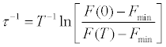

.. _alligator-decay-preprocessing:

Decay (Pre-) Processing
=======================

A number of operations and processing options can be applied to ROI decays, 
either as they are being extracted from a dataset (in that case, the decay is 
"pre-processed"), or after they have been displayed in the *Decay Graph* (in 
which case, the decay is merely "processed").

There are more functions applicable to decays plotted in the *Decay Graph* than 
available to decays calculated from the raw data (which happens, for instance, 
when using the ``Analysis:FLI Dataset:Current ROI Analysis`` menu item). These 
functions are described in the :ref:`alligator-fluorescence-decay-panel` page 
of the manual.

Available operations and associated options are set in the **Fluorescence 
Decay:Decay Pre-Processing** panel of the **Settings** window.

.. image:: images/AlliGator-Settings-Decay-Preprocessing.png
   :align: center

These options are applied to newly computed decays only if the top left 
*Use Decay Pre-Processing* checkbox is checked. These pre-processing operations 
can also be applied one at a time to existing decays using the right-click menu 
(``Process Plot(s)``) in the *Decay Graph*. In that case, the *Use Decay 
Pre-Processing* checkbox does not need to be checked off.

The order of the decay pre-processing operations applied to newly computed 
decays is user-selectable. For instance, in the case of photobleaching or 
photobrightening, this allows correcting for that effect before attempting a 
square-gated single-exponential background subtraction.

To change the order of operations, right-click on the Operations Order list and 
select Reorder Operations: this will open a window showing the current list 
order:

Selecting any of the items, use the buttons at the bottom to change the 
order of that item in the list. When done, click the OK button (rightmost 
button) to accept and close the window, or the Cancel button (leftmost button) 
to cancel any modifications to the original list. Closing the window is 
equivalent to cancelling and accepting that choice.

The following is a description of the different operations in the order they 
appear in the **Settings:Fluorescence Decay:Decay Pre-Processing** panel.

Background Subtraction
++++++++++++++++++++++

There are 4 different methods (not including background file subtraction) to 
define the value to subtract from each decay point. They are listed in the 
*Baseline Subtraction Method* pull-down list as: ``Mean``, ``Min``, ``Square 
Gated Single Explonential`` and ``Constant``.

1. Mean or Min Baseline
-----------------------

It is customary in time-gated imaging experiments to offset the decay on the 
time axis in such a way that a flat (background) zone precedes the actual rise 
and decay. This trailing" part of the decay can therefore be used to estimate 
the background for each ROI (and by extension, for each pixel). The user needs 
to define the *Min Gate* and *Max Gate* locations to be used for background 
estimation. The  actual value retained as background is the minimum (Min) or 
average (Mean) value recorded in this gate interval. 

2. Square Gated Single-Exponential method
-----------------------------------------

In this approach (Square Gated Single-Exponential), the recorded decay is 
assumed to be the result of a single-exponential decay integrated over a square 
gate of duration W (See description in ref. 2 in the Bibliography page). The 
user needs to provide the gate positions where the known minimum (*Min Gate*) 
and maximum (*Max Gate*) of the decay are observed (best obtained by looking 
them up on a reference decay with high SNR). The analysis computes the Baseline 
value (which will be used for background subtraction), Amplitude and Lifetime 
associated with the decay and displays them on the top right of the 
**Fluorescence Decay** panel. These parameters as well as the total integrated 
intensity are associated with the decay and the corresponding phasor plot data 
point (**Phasor Graph** panel).

3. Constant Background
----------------------

It is possible to provide a user-specified background value to subtract from 
decays using the ``Constant`` option of the *Baseline Subtraction Method* and 
entering the desired background value in the *Constant Background* control.

Decay Normalization
+++++++++++++++++++

Decays can be normalized to a maximum value of 1 (by dividing by the maximum 
value), or mapped to the [0, 1] interval (by subtracting the minimum and 
dividing by the decay range), by checking the *1-Normalize Decay* checkbox or 
the *[0, 1] Normalize Decay* one.

Alternatively, the decay can be divided by the number of pixels comprising the 
source ROI by checking the *Pixel Normalize Decay*.

Decay Straightening
+++++++++++++++++++

Occasionally, samples can photobleach (or photobrighten) during the course of a 
series of gate acquisition. This phenomenon is identifiable by the fact that 
the recorded gate value at the end of a complete laser period is different 
(generally smaller but sometimes larger) than at the beginning of the period. 
The straighten function assumes that this is due to an exponential decay (or 
increase) of the signal due to some underlying phenomenon, and attempts to 
calculate the time scale of this variation as well as its amplitude, and 
finally, correct for it accordingly throughout the gate sequence.
Up until version 0.18.1, this correction was applied as follows:

where :math:`F_{min}` is the minimum decay value, *T* is the period, :math:`\tau` 
is the photobleaching/photobrightening time constant obtained from:

The sign of :math:`\tau` obtained from the above equation handles both cases.
After version 0.18.2, the correction does not consider that the decay consists 
of a constant background :math:`F_{min }` added to a photobleaching/photobrightening 
component, as this background component should be taken care of by the 
background subtraction step, which usually precedes (*) all other pre-processing 
steps. As a consequence, the formula becomes:

where :math:`\tau` is given by:

This equation requires that *F(0)* and *F(T)* be non-zero and if no 
photobleaching/photobrightening occured, identical. In other words, the decay 
needs to be shifted such that the maximum of the decay is the first gate, and 
the last gate corresponds to the same location in the decay (it will therefore 
not work with a truncated decay, and in fact will require an extra gate beyond 
the laser period).

(*) Note that since version 0.19, it is possible to change the order of the 
different decay pre-processing operations (except pile-up correction, which 
remains the first operation). This means that if background correction follows 
decay straightening, the assumption of the straightening algorithm may be 
incorrect (i.e. the algorithm will assume that both decay and background 
exponentially increase or decrease with the same time constant).

Decay Folding
+++++++++++++

Decay folding consists in  dividing the decay in an integer number *n* of equal 
segments and summing them up to form a decay *n* times shorter. The segments' 
length should obviously be equal to a multiple of the laser period for this to 
have a physical sense.

Gate Reversing
++++++++++++++

When selected it, changes the direction of the plotted decay.

Decay Smoothing
+++++++++++++++

Occasionally, a decay may be affected by undesirable "spikes". It is sometimes 
possible to remove those spikes using cubic basic spline smoothing (details can 
be found at http://zone.ni.com/reference/en-XX/help/371361P-01/gmath/cubic_spline_fit/). 
The Cubic Spline Fit implementation of LabVIEW is used without weights, and 
smoothness parameters identically equal to 1 for all points, and balance 
parameter equal to 1 -10^(-x), where x is the Smoothing Parameter defined in 
the **Settings:Fluorescence Decay:Decay Pre-Processing** panel. From the Cubic 
Spline Fit description page linked to above:

   - If x = 0, the cubic spline fit is equivalent to a linear fit. If x = Inf, 
     the cubic spline fit interpolates between the data points.
   - If x < 0, an appropriate value is automatically calculated according to the 
     time axis values.

To use this algorithm as part of the decay pre-processing, check the *Smoothen 
Decay* checkbox. The only exposed parameter for this algorithm is *Smoothing 
Parameter*.
Alternatively, an existing decay can be post-processed (creating a new plot) 
using the ``Process Plot(s):Smoothing`` Decay Graph right-click menu (see below).

.. _alligator-decay-shifting:

Decay Shifting
++++++++++++++

Decays can occasionally "shift" along the time axis due to several possible 
causes (in general, setup instabilities). While this is normally not causing 
problems if data is properly calibrated, it is possible to force alignment of 
all decays along the time axis by checking the *Shift Decay* checkbox. 
There are several options associated with this functionality.

   - *Type*: this drop-down list gives access to 4 modes described below:
   - *Rotate*: this checkbox specifies whether the shift results in a 
     rotation of the decay (considered periodic) or whether to pad the decay 
     with zeros and discard points corresponding to negative abscissa.
   - *Shift*: this parameter has different interpretation depending on the 
     type of shift selected (see below for details) and is not always visible.
   - *Threshold*: this parameter is used in the Threshold mode only (see below 
     for details).

Decay shift types details

   - ``Default``: in this case, a constant shift is applied to all decays. This 
     can for instance be useful to align the peak of a given sample to the zero 
     point, or align decays acquired with different setups, etc.
   - ``CFD``: the constant fraction discrimination mode applies a constant 
     shift to each decay before inverting it (multiplying it by -1) and adding 
     it to the original decay. The effect of this operation, provided the shift 
     is of the order of the IRF width or smaller, is to create a curve looking 
     like a "chirp", with a positive bump followed by a negative one, with a 
     zero point in between. This point is generally stable if the shape of the 
     decay is relatively constant (the amplitude can vary). The position of the 
     zero-crossing point is then compared to that of the stored Reference Decay 
     and the difference between these two positions is defined as the decay 
     shift.
   - ``Threshold``: in this mode, the provided *Threshold* parameter is used to 
     find the first location in the decay where this threshold is crossed (from 
     below). This location is compared to that obtained for the store Reference 
     Decay and the difference between these two positions is defined as the 
     decay shift.
   - ``Cross-Correlation``: in this mode, the cross-corelation of the decay and 
     the stored Reference Decay is computed and the position of its maximum 
     determined and returned as the decay shift.

At the end of a series of decay analysis, it is possible to plot the calculated 
shifts in the *Lifetime & Other Parameters* Graph of the **Lifetime & Other 
Parameters** panel, using the ``Plot Decay Shifts`` context menu item in that 
graph.

.. _alligator-decay-extrapolation:

Decay Extrapolation
+++++++++++++++++++

In case the decay tail doesn't reach the background level, the resulting phasor 
will be offset by an amount that will depend on the final value reached by the 
decay. It is possible to compensate artificially for this truncation by 
extrapolating the decay with an exponential tail.

Likewise, if the IRF used for NLSF analysis for reconvolution with the decay 
model is truncated, the computed convolution product may differ significantly 
from the true convolution product. IRF extrapolation may help improve the 
results.

The parameters defining the range of the extrapolation are defined in 
**Settings:Fluorescence Decay:Decay Pre-Processing** under the *Extrapolate 
Decay* checkbox.

  - *Use Cursors*: this checkbox allows choosing between using cursor locations 
    or fractional values to define the Tail and Head start and 
    end locations. Two cursors need to be created in the Decay Graph using the 
    ``Process Plot(s):Extrapolation:Create Head & Tail Bounding Cursors`` menu 
    item. Their locations can be stored in the two *Head Fraction* and *Tail 
    Fraction* controls in the **Settings:Fluorescence Decay:Decay Pre-processing**
    panel by using the ``Process Plot(s):Extrapolation:Store Cusor-define Head 
    & Tail Fractions`` meun item of the Decay Graph.

  - *Head Fraction*: defines what fraction of the decay (starting from the 
    beginning) is used to perform a fit to a single exponential decay. This 
    part of the decay will be shifted to the end (either past the requestd 
    additional points or past the laser period, see below).

  - *Tail Fraction*:specifies what fraction of the decay (starting from the end) 
    is used to perform a fit to a single exponential decay.

  - *Additional Points* parameter specifies how many points (spaced as in the 
    original decay) to add to the decay.

  - *Use Periodicity*: instead of requesting a number of points to be added to 
    the decay, one can ask for enough points to be added to reach the end of 
    laser period by checking this box.