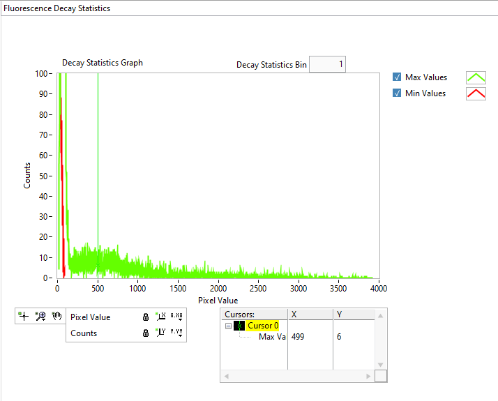

.. _alligator-fluorescence-decay-statistics-panel:

Fluorescence Decay Statistics Panel
===================================

The **Fluorescence Decay Statistics** panel contains a *Decay Statistics Graph* 
and a few controls described below.

The *Decay Statistics Graph* shows pairs of histograms (Max Values and Min 
Values) computed when the ``Analysis:Fluorescence Decay Statistics`` menu item 
(``Ctrl+D``) is activated.
These histograms are respectively the histogram of min values in each pixel's 
fluorescence decay and the histogram of max values in each pixel's fluorescence 
decay.

Computation of these histograms takes time (and can be aborted by pressing the 
*Abort* button appearing during computation) since it involves extracting the 
fluorescence decay in each pixel of the dataset and determining its min and max 
value.
An example of such a pair of histograms is shown below.

Notice that the Log-Log representation used in the above figure is optional, 
but is convenient due to the generally large spread of values.
The same histograms as above, built using a linear representation (and using a 
*Decay Statistics Bin* value of 10) is shown below for comparison:

These histograms can be used to define ROIs based on the *Peak Threshold* value 
defined in the *Image ROI* section of the **Settings:Source Image** panel, 
using the ``Define ROI(s) above Mean Peak`` *Source Image* menu item described 
in the Using ROIs manual page.

The *Min Values* histogram indicates the baseline (minimum of the decay) values 
within the dataset, while the Max Values histogram indicates how many pixels 
have values above the *Peak Threshold* criterion. For instance, in the example 
shown above, the minimum decay peak value enforced (499, green cursor) is above 
the main peak of the *Max Value* histogram, ensuring that only the brightest 
pixels will be retained and background pixels rejected.