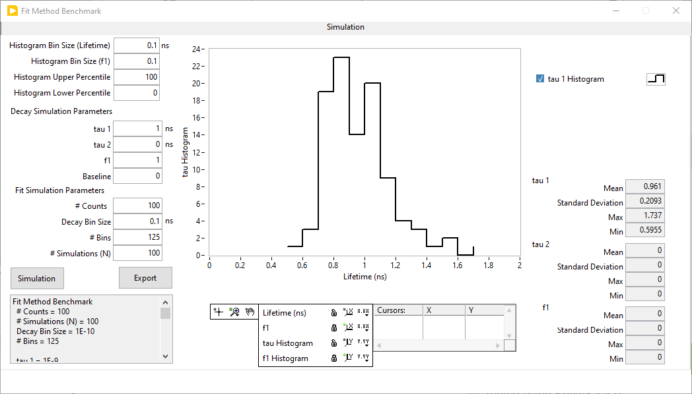
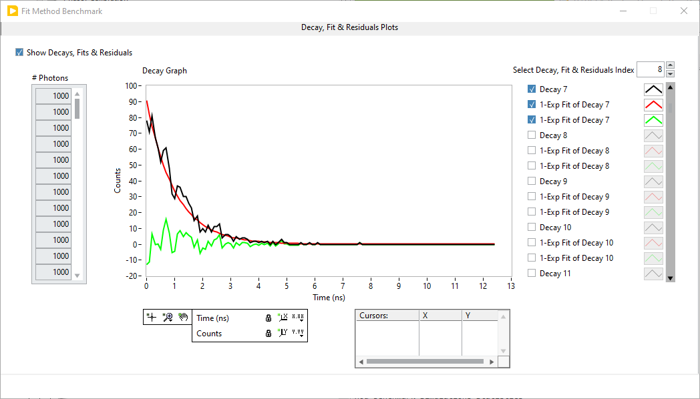
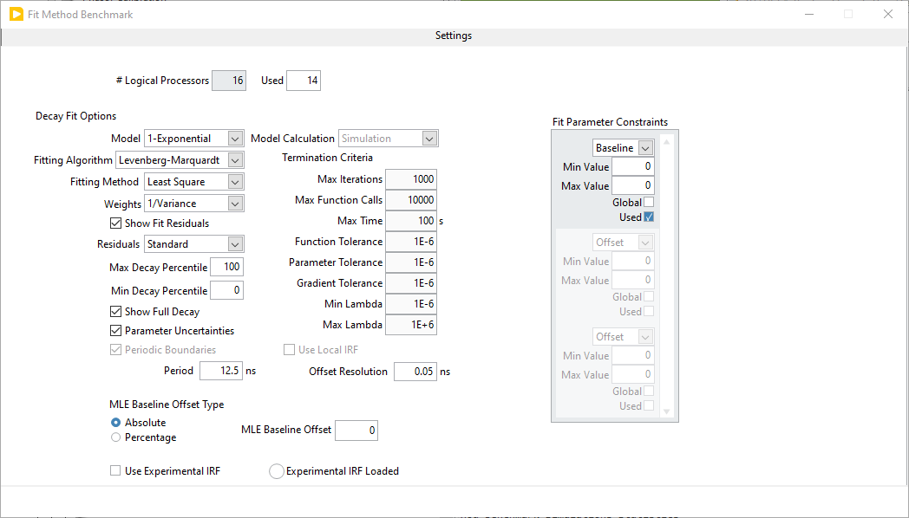

.. _alligator-fit-method-benchmark:

Fit Method Benchmark
====================

The **Fit Method Benchmark** window can be opened using the ``Analysis:Tools:Fit 
Method Benchmark`` menu item. This tool allows computing the effect on fitted 
decay parameters uncertainty of a finite signal (total number of collected 
photons) using simulations.

The window is comprised of 3 panels:

- Simulations
- Decay, Fit & Residuals Plots
- Settings

Simulations panel
+++++++++++++++++

The first panel is where the main parameters of the simulation are defined and 
the simulation's results are displayed.

The top four controls on the left are used to adjust the histograms in the 
center graph, which summarize the simulation's outcomes.

The next four (*Decay Simulation Parameters*) specify what kind of decay to 
simulate (single or double exponential, baseline or none).

Finally, the *Fit Simulation Parameters* control how many photons per decay 
(*# Counts*) need to be simulated, how these photons are binned into a decay 
(*Decay Bin Size* and *# Bins*), and how many times to repeat the simulation 
(*# Simulations (N)*). It is important to make sure that the product *Decay Bin 
Size* x *# Bins* remains smaller than the laser period (defined in the 
**Settings** panel, *Period* parameter).

The *Simulation* button starts the simulation, whose progress is shown with a 
progress bar at the bottom. Upon completion, one or more histograms are 
displayed, together with some summary statistics for one of the three possible 
parameters (1 for single exponential decays, 3 for bi-exponential decays).

This information is also available as text in the text box below the 
*Simulation* button, and is exported to the AlliGator Notebook.

The full parameter output of the N simulations can be exported as an ASCII file 
by clicking on the *Export* button. This will create a file with one header 
line followed by N rows, each containing the following information:

Offset, Offset SDV, Baseline, Baseline SDV, A_1, A_1 SDV, tau_1, tau_1 SDV, R2, 
Chi2

Returning to the top left control parameters, they can be used to improve the 
appearance of the histograms generated after a simulation (they are ineffective 
on previous histograms):

- Histogram Bin Size (Lifetime): use this parameter to adjust the granularity 
  of the lifetime histogram(s). There is only one histogram when the decay is 
  mono-exponential, but two lifetime histograms (tau 1 and tau 2) when it is 
  bi-exponential.
- Histogram Bin Size (f1): use this parameter to adjust the granularity 
  of the fraction f1 histogram.
- Histogram Lower/Upper Percentile: use these parameters to adjust the range of 
  parameter values retained to build each histogram. Histograms can have no more 
  than 10^5 bins. When a parameter is highly dispersed (with very large or very 
  small outliers), choosing to small a bin size can result in an overflow. No 
  histogram is actually displayed and an error output in AlliGator's Notebook. 
  To alleviate this problem, either change the bin size or eliminate ouliers by 
  gradually reducing the *Histogram Upper Percentile* (the *Lower Percentile* is 
  generally left equal to zero).

Note that the graph has 4 scales: *Lifetime (ns)*, *tau Histogram*, one one hand 
and *f1*, *f1 Histogram*, on the other. To show or hide ne of the scales listed 
below the graph, left-click on the ``X.XX`` or ``Y.YY`` button in the *Scale 
Legend* and select ``Visible Scale``.

Decay, Fit & Residuals Plots Panel
++++++++++++++++++++++++++++++++++

The second panel is used to display the simulated decays, their fits and the 
corresponding residuals.

For a number of simulations N > 1000, this can require some additional memory
resources. It is therefore recommended to use this display option (active when 
the *Show Decays, Fits & Residuals* is checked off) only as a way to verify 
that simulations and fits work as expected, using a small N (e.g. N = 100).
By default, none of the plots are visible, but they can all be shown using the 
graph's right-click shortcut menu.

Alternatively, it is possible to scroll through one decay and its fit and 
residuals plot at a time using the *Select Decay, Fit & Residuals Index* control 
above the plot legend.

This panel is also used to load and visualize the IRF, if an IRF is used in the 
simulations (see the **Settings Panel** description below). To load an IRF, use 
the ``Load Experimental IRF`` right-click menu item. If an IRF is loaded, it can 
be visualized in the *Decay Graph* by using the ``Show Experimental IRF`` 
right-click menu.

.. note::
   The IRF should cover the duration of the laser period, defined in the 
   **Settings** panel (*Period* parameter).

Settings Panel
++++++++++++++

The last panel is used to define fitting options and is similar to the 
corresponding AlliGator **Settings** panel (**Settings:Fluorescence Decay:Fit 
Options**), with some elements of the **Settings:Fluorescence Decay:Fit 
Parameters** panel.

The new elements are:

- *# Logical Processors Used*: define the number of cores to be used for 
  simulations
- *MLE Baseline Offset Type*: the two options are ``Absolute`` and 
  ``Percentage``. In the first case, the *MLE Baseline Offset* parameter is used 
  to add a constant baseline offset to the data before the fit, that constant 
  being subtracted from the fitted baseline after the fit (see discussion below).
  In the second case, the added baseline offset is defined as a percentage of 
  the decay peak value.
- ``Use Experimental IRF``: if an experimental (or theoretical!) IRF has been 
  loaded, it will be used to convolve the simulated decays prior to the fitting 
  step (and the IRF will be used during fitting). It is recommended to use the 
  same decay bin size for the simulation as for the IRF. If no IRF is available, 
  this setting is ignored.
- ``Experimental IRF loaded``: this LED will turn on whenever an IRF has been 
  loaded (see Decay, Fit & Residuals Plots Panel section above).

.. note::
   The *MLE Baseline Offset* parameter is useful to avoid failure of the 
   Levenberg-Marquardt algorithm when the actual baseline of the decay is small. 
   Indeed, in that case, the fitted baseline might end up negative, which would 
   result in negative fitted values, which are incompatible with the MLE 
   assumption that values are positive (as photon count values). To avoid this, 
   one can introduce an artificial offset enforcing a postive baseline. This 
   temporary offset is subtracted from the fitted parameter before the results 
   are returned.
