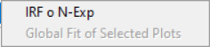

.. _alligator-fluorescence-decay-panel:

Fluorescence Decay Panel
========================

The **Fluorescence Decay** panel can be displayed using the pull-down list at 
the top-right of the main AlliGator window.

In the example shown below, a point ROI was selected in the *Tool Palette* on 
the lefthand side of the *Source Image*, and a ROI decay analysis performed 
using the ``Analysis:Current ROI Analysis`` menu item (:kbd:`Ctrl+A`). While a 
Single Gate image is shown in the *Source Image*, the analysis encompasses all 
gate images, whose intensities at that selected pixels are represented as a 
decay curve (named ``M9_H00_019: Plot`` [#f1]_).

.. image:: images/AlliGator-Fluorescence-Decay-Panel.png
   :align: center
   :width: 100%

The *Decay Graph* is a feature-rich object which is comprised of different 
parts, some of which are common to all graph objects and are described in the 
:ref:`Graph Object Anatomy <graph-object-anatomy>` page.

In particular, different types of contextual menus are accessible, depending on 
which area of the graph the user right-clicks:

+ :ref:`Plot Menu <plot-menu>`
+ :ref:`Decay Graph Custom Menu <decay-graph-custom-menu>`
+ :ref:`Cursor Legend Menu <cursor-legend>`

The first and last ones are similar for all graph objects and are described in 
detail in the :ref:`Graph Object Anatomy <graph-object-anatomy>` page.

An overview of the *Decay Graph* custom menu is presented below, specific 
functionalities being described in other pages of the manual (linked to in the 
section below).

.. _decay-graph-custom-menu:

Decay Graph Custom Menu
-----------------------

.. image:: images/Decay-Graph-Custom-Menu.png
   :align: center
   
All items not highlighted in the image above are standard graph object 
contextual menu items and are described in the :ref:`Graph Object Anatomy 
<graph-object-anatomy>` page (:ref:`Custom Graph Menu <custom-graph-menu>` 
section).

This section will briefly discuss the highlighted submenus, whose functions are 
described in specific pages.

+ ``Process Plot``: this menu, shown below, allows various types of plot
  transformations to be performed. The last category of operations are also
  available as *pre-processing* operations applied to each decay (before plotting
  in the *Decay Graph*, or other computations involving decays such as. phasor
  calculation) and are discussed in the
  :ref:`Decay Preprocessing <alligator-decay-preprocessing>` page.

The remaining ones are:

  * ``Plot Math``
    - ``y -> f(y) Transform``
    - ``(x,y) -> (f,g)(x,y) Transform``
    - ``2-Plot Math``
    - ``Plot Convolution``
  * ``Rebin Plot``
  * ``Interpolate Plot``
  * ``Denoise Plot``
  * ``Average Selected Plots``
  * ``Compute Cumulative Function``
  * ``1-Normalize Plot``
  * ``[0-1]-Normalize Plot
  * ``Straighten Plot``
  * ``Fold Plot``
  * ``Smoothen Plot``
  * ``Shift Plot``
  *  ``Extrapolate Plot``
    - ``Extrapolate Plot``
    - ``Create Head & Tail Bounding Cursors``
    - ``Store Cursor-defined Head & Tail Fractions``

+ ``Fit``:

   
+ ``IRF/Reference Decay``:

 
+ ``Export Decay to Phasor Graph``:

.. rubric:: Notes
-----------------

.. [#f1] When the user-selected ROI has a name (that is, when it has been stored 
in the :ref:`alligator-source-image-roi-manager`), this name is appended to the 
image name, instead of the generic ``Plot`` suffix. A number is autimatically 
added to the decay name if the same ROI is used several times, or unnamed ROIs 
are used.