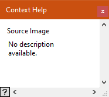
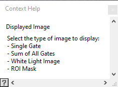

.. _alligator-help-window:

Context Help
============

The **Help** window (or **Context Help** window) can be shown or hidden using the ``Windows:Show Context Help`` menu item (or using the keyboard shortcut :kbd:`Ctrl+H` in any window).

The **Context Help** window will display information (if available) on the last control or indicator over which the mouse cursor was located (the name of that control or indicator will be indicated on the first line).

In many cases, there won't be any information displayed ("No description available."):

while in some others, it may reproduce a short section of the manual:

The **Context Help** window is a floating window and can be resized or closed (but not minimized).
Its content cannot be selected or copied.