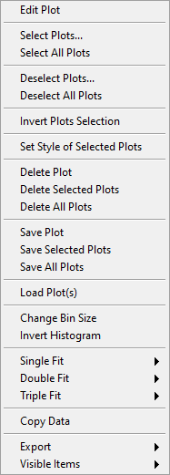

.. _alligator-histogram-window:

Histogram Window
================

The Histogram window is automatically opened when a Plot Histogram right-click menu is selected in one of the Graphs in which it is supported (e.g. Intensity Time Trace and Lifetime Graph).

Note that this histogram creation results in histogram information to be sent to the Notebook.
The following information is output:

Plot Name Histogram (Bin = b) Statistics:
Mean: xxx
Standard Deviation: xxx
Variance: xxx
RMS: xxx
Median: xxx
Mode: xxx
Minimum: xxx
Maximum: xxx
# Samples: xxx

where Plot Name is the source data name, and *b* is the user-defined bin size. The quantities above (whose actual values replace the "xxx" in the Notebook) are self-explanatory.

The plots can be manipulated and analyzed using the right-click menu shown below:

Several histogram-specific manipulation and analysis functions are available, as described below.

1. Rebin Histogram

The initial histogram bin size b is user defined. If this value is too small, the histogram appears "noisy" and it might be desirable to increase this value (choosing a bin value smaller than the original user-selected value will return an histogram with many empty bins, since it is impossible to recover the original dataset from an histogram only).
The rebinned histogram replaces the original histogram in the Graph, but the original histogram is preserved in memory. In other words, it is possible to try out a few bin values until the resulting histogram is satisfactory, without loss of information.

2. Invert Histogram

In some cases, the data to be binned is shown as negative values for display purposes. The resulting bin values are obviously negative, which might no be convenient for comparison with other histograms of positive values. The Invert Histogram function simply negates the bin axis value, resulting in a mirrored image of the original histogram.
As for the Rebin Histogram function, the original histogram is preserved in memory, therefore it is possible to repeat the operation to display the original histogram.

3. Histogram Fit

A number of fit functions are available, grouped in three categories: Single Fit, Double Fit, Triple Fit, referring to the number of functional components of the model.
The fit parameters and statistics (or error message if the fit failed) are sent to the Notebook.
