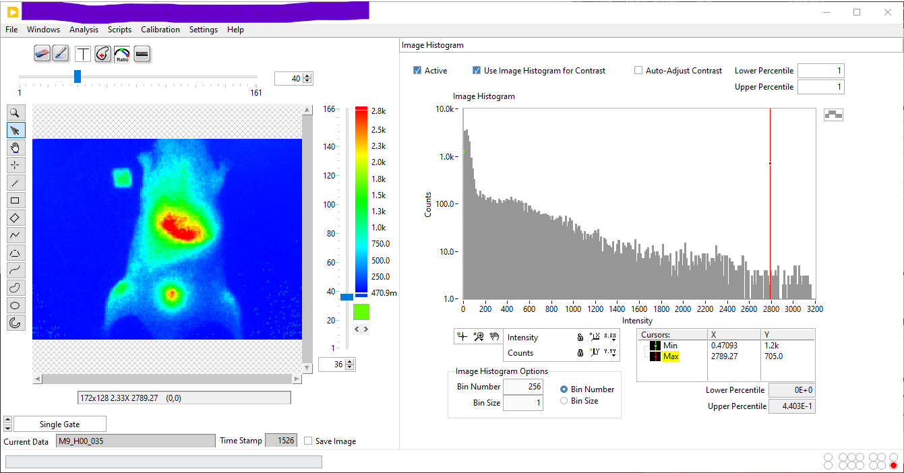
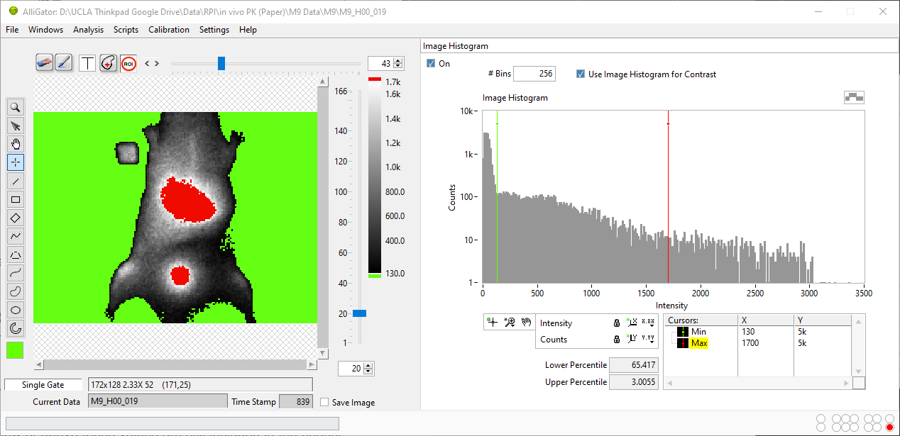
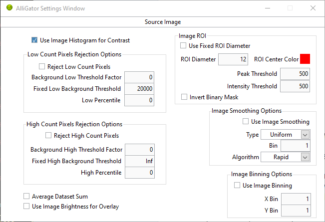

.. _alligator-image-histogram-panel:

Image Histogram Panel
=====================

Time-gated images can contain very different numbers of counts per pixel and therefore it may be desirable to adjust their contrast either automatically or manually. Moreover, inspection of the image histogram allows defining background thresholds in order to remove background contamination from phasor plots, as discussed below.

Note that this type of processing is not necessarily useful during time series analysis and can slow it down somewhat. Therefore, it is possible to skip this step (of histogram calculation) as well as the associated image contrast adjustment step by unchecking the *On* checkbox at the top left corner of the panel.
 
The **Image Histogram panel** represents the pixel values of the selected gate image (when the ``Single Gate`` option is selected in the pull-down *Displayed Image* at the bottom left of the image) or of the sum image (if the ``Sum of All Gates`` option is selected) as a ``n``-bin *Image Histogram*, where `n` is the value of the *# Bins* control located above the histogram:



.. _image-histogram-cursors:

Histogram Min & Max Cursors
---------------------------

Two cursors (*Min* and *Max*), defined in the bottom rightcorner of the histogram, can be used to define the image display range. They will be taken into account only if the *Use Image Histogram for Contrast* checkbox above the histogram is checked.

Any pixel in the original image with value smaller than *Min* (resp. larger than *Max*) will be represented with the color corresponding to the lowest (resp. highest) color, which can be selected individually at the bottom and top of the selected palette. The example illustrated above uses lowest and highest colors that are identical to the min and max value of the color palette, therefore no specific effect is obtained.

In this example, the main histogram peak to the left corresponds to background pixels, which can be set to appear green with the chosen position of the *Min* cursor (green) = ``130`` shown below and setting the ``Lowest Color``` to be green (a different color palette -Grayscale- was selected to illustrate the effect of lowest and highest colors distinct from the palette's min and max colors) [#f1]_.

Likewise, moving the *Max* cursor below the max histogram value and chosing the ``highest `` color to be red, highlights the two brightest regions of the sample [#f2]_. 

Note that this is only a display feature. Pixels below or above these values are still included in the phasor calculation, unless stated otherwise by the *Reject Low count Pixels* or *Reject High Count Pixels* checkboxes of the **Settings:Source Image** panel (see below).



.. _image-histogram-percentiles:

Lower & Higher Percentiles
--------------------------

+ *Lower Percentile*: this indicator located at the bottom of the *Image Histogram*, represents the percentage of pixels whose values are smaller than the *Min* cursor location. In the image above, 65.4 % of all pixels in the image have a value smaller than 130.

+ *Upper Percentile*: this indicator located at the bottom of the *Image Histogram*, represents the percentage of pixels whose values are larger than the *Max* cursor location. In the image above, 3 % of all pixels in the image have a value larger than 1,700.

Intensity Thresholds
--------------------

In order to use the information provided by the image intensity histogram to instruct the software to reject low or high intensity pixels, open up the **Settings:Source Image** panel:


   
Two groups of controls can be used: *Low Count Pixels Rejection Options* and *High Count Pixels Rejection Options*.

1. Low Count Pixels Rejection Options

   + *Reject Low Count Pixels*: if unchecked, no low-count test is performed on any pixel. If checked, the next two controls are used for each pixels.
   + *Background Threshold x Factor*: when different from zero, any pixel in the sum image of a data set, with an intensity smaller than ``A x P``, where ``A`` is the parameter's value and ``P`` is the location of the sum image histogram peak, will be ignored when computing the fluorescence decay and phasor. For instance, a value of ``A = 1`` means that all pixels with value below the image histogram peak position will be ignored, while ``A = 0`` means that all pixels will be retained. A nominal value to exclude background pixels appears to be ``A = 3``, but it is recommended to experiment, as histogram shape can vary from sample to sample. In particular, it may happen that the histogram peak does not correspond to the most likely background value.
   + *Fixed Background Threshold*: complements the previous criterion, which may fail in some particular cases. This parameter ``B`` simply sets the minimum value of a pixel in the sum image for its phasor to be computed and included in the *Phasor Plot* image, *Phasor Graph* and *Fluorescence Decay* calculations.
   + *Low Percentile*: as an alternative to the two previous options, it is possible to define the minimum value of the Sum of All Gates in a pixel using this parameter ``LP``, to be compared to the *Lower Percentile* value. A value ``LP = 0`` means that no constraint is applied.

The rejection criterion uses the maximum of ``A x P``, ``B`` and the value corresponding to the ``LP`` percentile of the histogram.

2. High Count Pixels Rejection Options

   + *Reject HighCount Pixels*: if unchecked, no high-count test is performed on any pixel. If checked, the next two controls are used for each pixels.
   + *Peak Threshold x Factor*: when different from zero, any pixel in the sum image of a data set, with an intensity larger than ``K x M``, where ``K`` is the parameter's value and ``M`` is the location of the sum image maximum, will be ignored when computing the fluorescence decay and phasor. For instance, a value of ``K = 0.7`` means that all pixels with value above 70% of the maximum pixel intensity will be ignored, while ``K = 1`` means that all pixels will be retained.
   + *Fixed Peak Threshold*: complements the previous criterion. This parameter ``C`` simply sets the maximum value of a pixel in the sum image for its phasor to be computed and included in the *Phasor Plot* image, *Phasor Graph* and *Fluorescence Decay* calculations.
   + *High Percentile*: as an alternative to the two previous options, it is possible to define the maximum value of the Sum of All Gates in a pixel using this parameter ``HP``, to be compared to the *Upper Percentile* value indicated at the bottom of the *Image Histogram*. A value ``HP = 0`` means that no constraint is applied.

The rejection criterion uses the minimum of ``K x M``, ``C`` and the value corresponding to the ``HP`` percentile of the histogram.

.. rubric:: Notes
-----------------

.. [#f1] The ``Lowest Color`` box doesn't need to be identical to that of the *Min* cursor (and likewise for the ``Highest Color`` and *Max* cursor).

.. [#f2] The *Source Image* is updated as the user moves the histogram cursors. It is not updated if the cursors' X locations are edited in the *Cursor Legend* box, or when the lowest or highest colors are modified. In those cases, simply click in the color scale to refresh the *Source Image*.