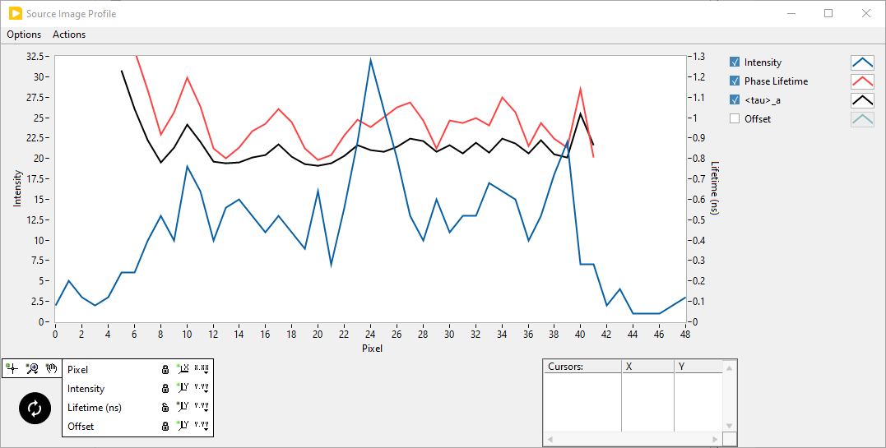
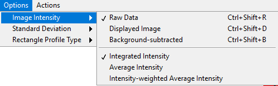
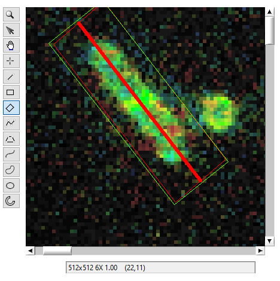
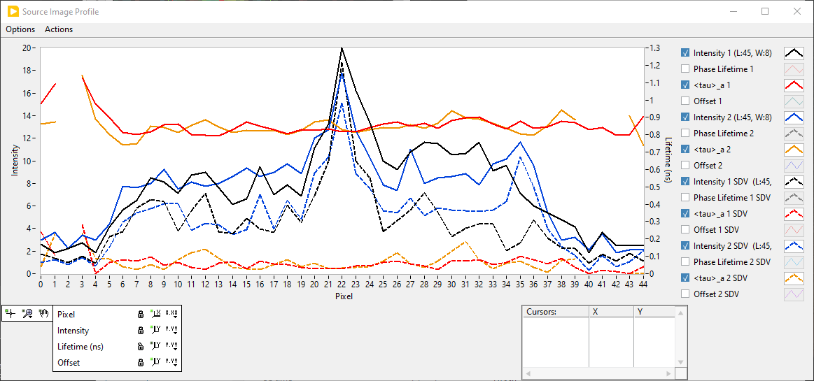

.. _alligator-image-profile-window:

Image Profile
=============

Any of the open contour tool in the *Source Image* can be used to look at the 
image intensity profile and additional information along that contour. 
Additionally, the ``Rectangle`` and ``Rotated Rectangle`` tools can be used to 
analyze *averaged profile* as discussed in the 
:ref:`alligator-averaged-image-profile` section below.

The open contour tools are framed in black in the snapshot below:

For example, using a ``Line`` tool on the following image:

and opening the **Image Profile** window (``Window:Image Profile``) results in 
the following intensity profiles:

Notice that this graph has two visible vertical scales (``Intensity`` on the 
left and ``Lifetime (ns)`` on the right). In fact, the *Scale Legend* at the 
bottom shows an additional (hidden) ``Offset`` scale. This scale is used to 
display one of available decay fit parameters available in the corresponding 
AlliGator tab. Since no NLSF analysis was performed on this dataset, there is 
no fit parameter to display and the scale (as well as the plot) was hidden.

The **Image Profile** window shows the values of other 
parameters along the contour, provided these parameters are available:

+ Intensity
+ Phase Lifetime
+ Phasor (Intemsity/Amplitude) Ratio/(Intensity/Amplitude)-Averaged Lifetime
+ Decay Fit Parameter

If these parameters are not available (for instance because no phasor plot has 
been calculated, or because no phasor ratio references have been defined, or no 
decay fit parameter map has been computed), their value will appear as zero.

The decay fit parameter shown last in the *Plot Legend* is that defined in the 
:ref:`alligator-decay-fit-parameters-map-panel`. Changing it there will update 
the corresponding profile plot in the *Image Profile* graph.

The *Image Profile* graph is updated each time the contour is modified in the 
image. For instance, it is possible to grab one end of the line shown at the 
top and observe the corresponding live update of the graph.

It can also be refreshed  using the ``Actions:Refresh Profiles`` (``Ctrl+R``) 
menu item. Finally, it is updated when one of the display options is modified 
in the ``Options`` menu of the **Image Profile** window.

The ``Intensity`` shown in the graph corresponds to the image selected in the 
*Source Image*. In particular, if ``Single Gate`` is selected as the 
*Displayed Image*, the intensity aling the contour *in that single gate* will 
be represented.

Two alternative options accessible via the ``Options:Image Intensity`` menu of 
the **Image Profile** window are available:

The last three options are only active when using a closed rectangle contour 
and are discussed later in this section.

In general, the ``Raw Data``'s intensity is represented, but it is also 
possible to select the ``Displayed Image`` option in case the displayed image 
has been clipped due the location of the *Min* and *Max* cursors in  the *Image 
Histogram* in the corresponding AlliGator panel.

The ``Background-subtracted`` option displays the raw intensity minus *G* x 
``Constant Background per Gate``, where *G* is the number of gates (or bins) in 
the FLI Dataset and ``Constant Background per Gate`` is defined in the 
**Settings:Fluorescence Decay:Decay Pre-Processing** panel.

.. _alligator-averaged-image-profile:

Averaged Profile
++++++++++++++++

It is possible to average these different quantities using a *rectangle* or 
*rotated rectangle* instead of an open contour. The following schematics 
explains how this works:

The computed profile will contain *L* values, which will each represent the 
average along a perpendicular segment of length *W* (1-pixel wide). The only 
exception is the intensity profile, which will represent the sum of the pixels' 
intensities along the perpendicular segment. Note that the profile will always 
be measureed along the longest axis of the rectangle. The direction of the 
profile can be inferred from the label of the Profile Graph.

As usual, if a pixel has been rejected from analysis, it will be excluded from 
this averaging. If all pixels along a segment are rejected, that average is not 
computed and replaced by *NaN*, which does not appear in the displayed profile.

An example is shown below:

...:align: center

Notice the green and red rectangles and the thick green center line. The green 
(sometimes bizzarely deformed) rectangle is the one drawn by LabVIEW. The red 
rectangle is that overlayed by AlliGator to provide the actual ROI used in the 
analysis. To show it, check off the ``Overlay ROI Median`` checkbox in the
**Settings:Source Image:Omage Cosmetics** window panel. The color of that 
overlayed rectangle (and the associated center line) is the set by the *Median 
ROI Color* box in the same Settings panel.

The  corresponding **Source Image Profile** window is shown below:

The ``Phase Lifetime`` and ``Offset`` plots have been hidden, leaving the 
``Intensity`` and ``<tau>_a`` plots, as well as the ``Intensity SDV`` and 
``<tau>_a SDV`` plot (dashed line). The ``<tau>_a SDV`` standard deviation 
plot shown here is the ``Intensity-weighted`` one, one of two possible choices:

The recommended option is the second one, which calculated the SDV of a quantity 
*f* along each perpendicular segment (containing *W* pixels) according to:

.. math::

   SDV = \left( \frac{\sum_{i=i}^{W} I_i f_i^2}{\sum_{i=i}^{W} I_i} - 
   \left(\frac{\sum_{i=i}^{W} I_i f_i}{\sum_{i=i}^{W} I_i}\right)^2\right)^{1/2}

This gives less weight to pixels with low intensity, providing a more realistic 
estimate of the dispersion of the quantity of interest for the brightest pixels.

The classic SDV uses the stadard formula, and will generally be larger, as it 
could mix background pixels (with a different lifetime) with pixels of interest.

Average Intensity Profile
+++++++++++++++++++++++++

The intensity data is treated differently than the other quantities, in the 
sense that in addition to the standard average and intensity-weighted average, 
the ``Integrated Intensity" can be represented instead. These options can be 
selected in the ``Option:Image Intensity`` menu shown above:

  - ``Integrated Intensity``: shows the sum of pixel intensities along the 
    perpendicular segment (red segment in the schematic above). In that case, 
    the calculated SDV is zero.
  - ``Average Intensity``: the standard average and dSDV are represented.
  - ``Intensity-weighted Average Intensity``: the formula above is used with 
    :math:`f_i = I_i`.

Split Profile
+++++++++++++

When using a rectangle ROI, it is possible to divide each perpendicular segment 
into two equal parts and display the average quantity for each of the two 
halves in the *Image Profile* graph, by selecting the ``Option:Rectange Profile 
Type:Half Width`` option (``Ctrl+2``).

Using the example shown above, the resulting split profiles look as shown here:

Current ROI Definition
++++++++++++++++++++++

In order to keep a record of the ROI whose profile is being displayed, it is 
possible to export its definition to the Notebook using the ``Actions:Export 
ROI Description to Notebook`` (Vtrl+N)menu item:

