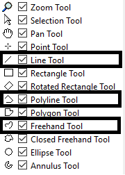
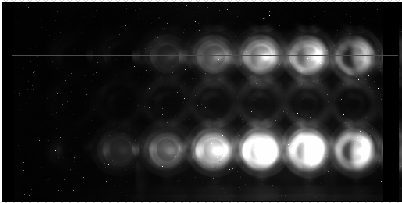
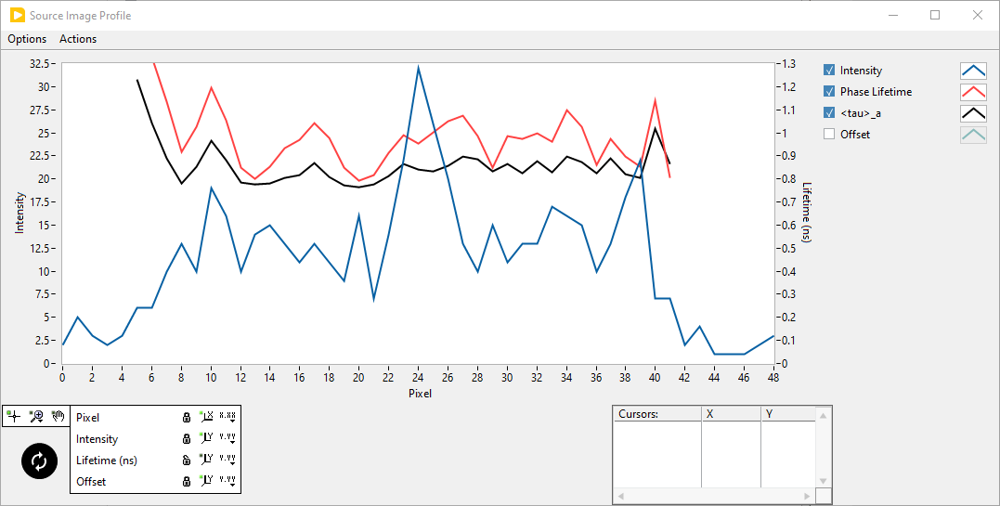
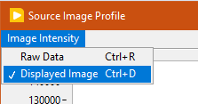

.. _alligator-image-profile:

Image Profile
=============

Any of the open contour tool in the *Source Image* can be used to look at the image intensity profile and additional information along that contour.

The open contour tools are framed in black in the snapshot below:

For example, uing a ``Line`` tool on the following image (the line doesn't need to be horizontal):

and opening the **Image Profile** window (``Window:Image Profile``) results in the following intensity profile:

Notice that this graph has two visible vertical scales (``Intensity`` on the left and ``Phase Lifetime (ns)`` on the right). In fact, the *Scale Legend* at the bottom shows an additional (hidden) ``Phasor Ratio`` scale. Moreover, the *Plot Legend* on the top right shows a (hidden) ``Offset`` plot.

This is because the **Image Profile** window also shows the values of other parameters along the contour, provided these parameters are available:

+ Intensity
+ Phase Lifetime
+ Phasor Ratio
+ Decay Fit Parameter

If these parameters are not available (for instance because no phasor plot has been calculated, or because no phasor ratio references have been defined, or no decay fit parameter map has been computed), their value will appear as zero.

Note that the decay fit parameter shown last in the *Plot Legend* is that defined in the ::ref:`alligator-decay-fit-parameter-map-panel`. Changing it there will update the corresponding profile plot in the *Image Profile* graph.

The *Image Profile* graph is updated each time the contour is modified in the image. For instance, it is possible to grab one end of the line shown at the top and observe the corresponding live update of the graph.

The ``Intensity`` shown in the graph corresponds to the image selected in the *Source Image*. In particular, if ``Single Gate`` is selected as the *Displayed Image*, the intensity aling the contour *in that single gate* will be represented.

Another option accessible via the ``Intensity`` menu of the **Image Profile** window is worth knowing about and is shown below:

In general, the ``Displayed Image``'s intensity is represented, but it is also possible to select the ``Raw Data`` option in case the displayed image has been affected by some processing.