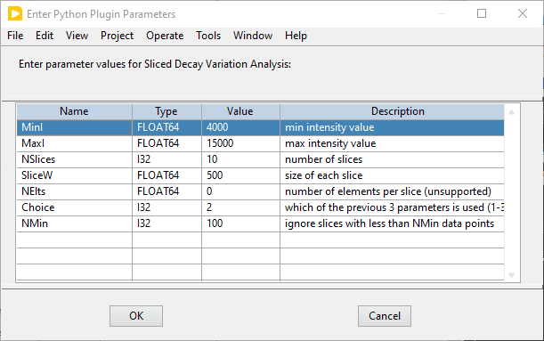

.. _alligator-intensity-slice-decay-variation-analysis:

Intensity-slice Decay Variation Analysis
========================================

This function is provided as a Python plugin and is accessible in the 
``Analysis:FLI Dataset`` menu if Python is installed in a location known to 
AlliGator (for details on the requirements to use Python plugins in AlliGator, 
see the :ref:`alligator-python-plugin` section of the manual).

The purpose of this analysis is to look at decays within a FLI dataset and help 
assess whether they differ from one another more than expected from shot noise 
effects only. This is done by first dividing the dataset into *M intensity-slices* 
of pixels with approximately identical intensities, and next, by computing the 
average decay in each slice, as well as the gate-by-gate standard deviation of 
those decays. The resulting *M* pairs of "decays" (:math:`\langle I(t)\rangle_i`, 
:math:`SDV_I(t)_i)`), i = 1, ..., M are then returned in the *Decay Graph* 
where they can be further processed, for instance by computing the ratios 
:math:`SDV_I(t)_i/\sqrt(\langle I(t)\rangle_i)`. 
In addition, a summary of the analysis is output in the Notebook, with a tabular 
list of slice index, # decays and <I>.

The definition of the intensity slices involves the following parameters, 
requested from the user at the beginning of the analysis:

The minimum and maximum intensities (*MinI* and *MaxI*) considered in the 
analysis can be specified by the user (for instance after examining the *Image 
Histogram*) or set to the true minimum and maximum intensities in the dataset 
using *NaN* as the entered values.

Next, parameters specifying how the slices are defined need to be provided. 
Slices can be defined by their total number (*Nslices*), their width (*SliceW*) 
or the number of their elements (*NElts*). The type of definition is selected 
with the *Choice* parameter (a number between 1 and 3):

+ 1: slices are defined via their number
+ 2: slices are defined by their width
+ 3: slices are defined by their content (number of elements in each slice)

Finally, the minimum number of elements in a slice for it to be included in the 
analysis is provided (*NMin*).

The analysis proceeds, limited to the pixels within the ROIs defined by the 
current *Mask Image*. If no mask image is present, all pixels are included in 
the analysis. Note that this analysis can take some time when the image size 
and/or the number of gates in each decay are large.