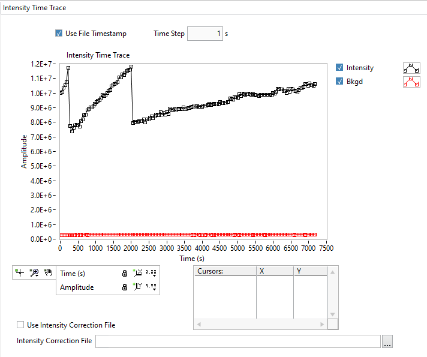
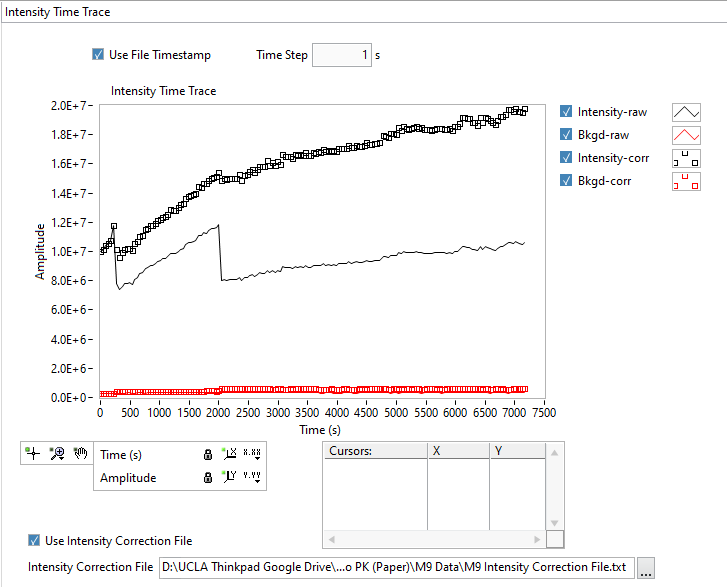

.. _alligator-intensity-time-trace-panel:

Intensity Time Trace Panel
==========================

The **Intensity Time Trace** panel contains an *Intensity Time Trace* chart to 
which each new fluorescence decay integral (corrected for background if 
selected in the **Settings:Fluorescence Decay:Decay Pre-Processing** panel) is 
added as a single point.

The second plot shows the background (integrated over the ROI) subtracted from 
the total intensity.

This graph is useful mostly when studying series, where it allows monitoring 
possible intensity fluctuations throughout the measurement.
Time traces from subsequent analyses are added as new plots to the chart.

The following controls are available:

- *Use File Timestamp*: this checkbox can be used if .set files are provided 
  for each time point in the root folder. If no such files are found, or the 
  checkbox is unchecked, the user-defined *Time Step* is used to represent the 
  time trace.

- *Use Intensity Correction File*: in some cases (as illustrated above), 
  excitation intensity or other acquisition parameters are modified at 
  different time points during the time series. If these changes are known and 
  saved in an *Intensity Correction File* (whose path is provided in the input 
  box at the bottom of the panel), it is possible to compute and represent a 
  corrected intensity time trace:

The ``Analysis:FLI Dataset Series:Define Intensity Corrections`` menu item 
provides a simple user interface to create such an *Intensity Correction File*. 
See the corresponding :ref:`graph-object` manual page for details.

Individual plots can be deleted or the whole graph cleared at once using the 
graph's right-click context menu. Note that the right-click menu changes 
depending from which part of the graph it is invoked (plot area, chart legend, 
plot style, cursor legend, scale legend, etc.), as discussed in the 
:ref:`intensity-corrections-definition` manual reference page.