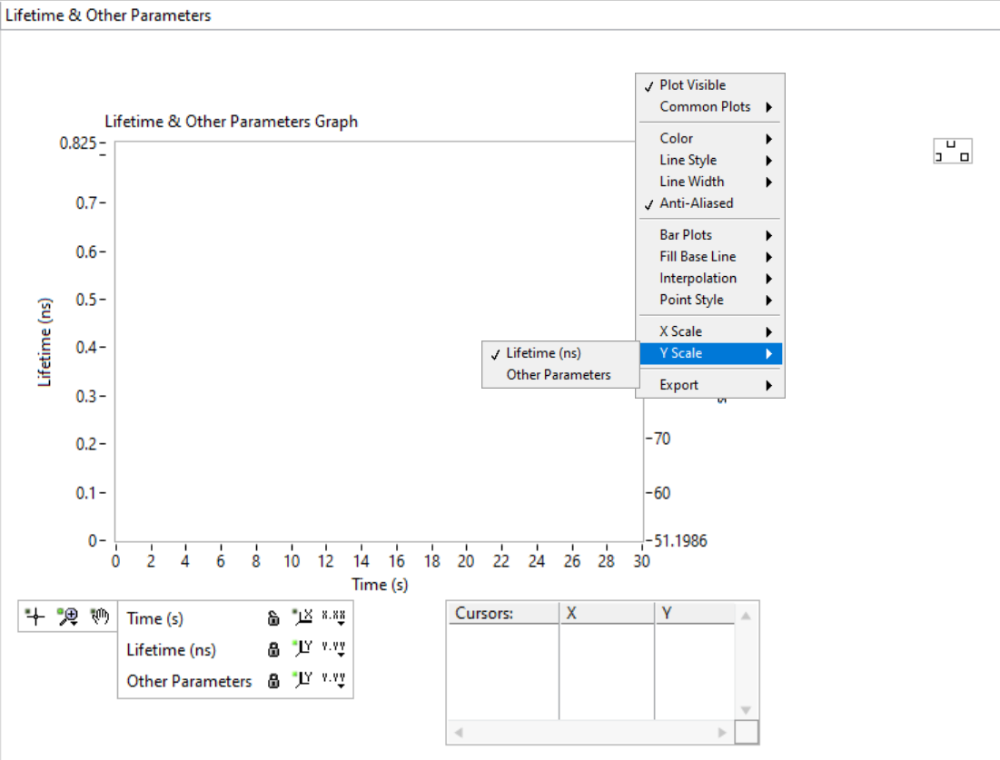
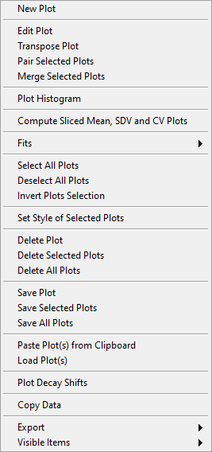
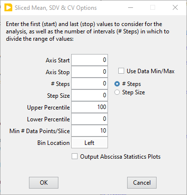

.. _alligator-lifetime-and-other-parameters-panel:

Lifetime & Other Parameters Panel
=================================

Introduction
++++++++++++

This panel contains the *Lifetime & Other Parameters* graph which receives plots 
from several ``Analysis`` main menu functions, *Phasor Graph* right-click menu 
functions as well as plots sent by *Decay Fit Parameters Map* right-click menu 
functions. The plots therefore may have different meaning and sizes.
To account for this diversity, the graph has two vertical axes. The left axis 
(*Lifetime (ns)*) corresponds to lifetime (or in general time) values, while 
the right axis (*Other Parameters*) is typically used to plot NLSF parameters.

The horizontal axis might take on a different name depending on context (for 
instance ``Time (s)`` for a time series analysis, or ``Intensity`` when plotting 
a *Lifetime vs Intensity* plot). Axes labels can be edited in the *Scale Legend* 
box (between the *Graph Palette* and *Cursor Legend* in the figure below) and 
have only a visual aid function.

Each plot can be associated to either one of the two vertical axes by 
right-clicking on the plot icon in the graph legend and navigating down to the 
``Y Scale`` menu:

and selecting the relevant axis. Plots that "don't look right" might just be 
associated with the wrong Y axis.

The following is a list of possible plots that will be sent to this panel.

Average lifetime
----------------

As discussed in the :ref:`Phasor Ratio panel <alligator-phasor-ratio-panel>` 
manual page, computation of a phasor ratio is generally accompanied by the 
calculation of the corresponding average lifetime, based on the formulas in the 
introduction to phasor ratio references in the :ref:`Phasor Graph panel <phasor-ratio-introduction>` manual page.

Decay fit parameters
--------------------

As discussed in the :ref:`Fluorescence Decay Fitting <alligator-decay-fitting>` 
manual page, it is possible to have the different parameters of a series of fits 
output sent as separate plots (one plot per selected parameter). These plots 
are sent to the *Lifetime & Other Parameters* graph.

Decay shifts
+-----------

When decays are aligned with respect to a *Reference Decay* as part of a decay 
preprocessing step, the corresponding computed temporal shifts are stored in 
memory. The corresponding series of shifts can be represented as a plot using 
the ``Plot Decay Shifts`` right-click menu item of the *Lifetime * Other 
Parameters* graph.

Lifetime & Other Parameters graph context menu
+++++++++++++++++++++++++++++++++++++++++++++++

The *Lifetime & Other Parameters* graph has some specific context menu items 
described next:

- ``Transpose Plot``: the ``Plot Histogram`` menu item described later only 
  works on the vertical coordinate. In order to histogram the horizontal 
  coordinate of a scatterplot, it is therefore necessary to transpose that plot 
  using this function.
- ``Pair Selected Plot``: when two plots have the same abscissa array, they can 
  be written :math:`{(x_i, y_i)}_{i = 1,..,n}` and :math:`{(x_i, 
  g_i)}_{i = 1,..,n}`. Pairing these two plots consists in building the 
  following plot: :math:`{(y_i, g_i)}_{i = 1,..,n}`.
- ``Merge Selected Plots``: appends several plots to one another to form a 
  larger plot containing all their data.
- ``Plot Histogram``: builds an histogram (with user-provided bin size) of the 
  selected plot. This opens the **Histogram** window (described in the 
  :ref:`corresponding page <alligator-histogram-window>` of the manual, where a 
  number of further analyses can be carried out.
- ``Compute Sliced Mean & SDV Plots``: this function allows computing the mean 
  and standard deviation (SDV) of a plot by "slice". Slices correspond to 
  subsets of the plot's data defined by fixed ranges of the abscissa values. The 
  function requires input from the user, provided in the **Sliced Mean & SDV 
  Options** window:

The slices are defined by:

   + the first and last values of the abscissa considered (``Axis Start`` and 
     ``Axis Stop``), which can be manually entered or automatically set to the 
     data minimum and maximum values if the ``Use Data Min/Max`` checkbox is 
     checked off.
   + the number of slices or their "width" (``# Steps`` or ``Step Size``) 
     depending on the radio button selection.
   + within the data in each slice, the data ``Lower`` and ``Upper Percentile`` 
     retained in the analysis (allowing to reject outliers).
   + the minimum number of data points in a slice to compute the mean and SDV.