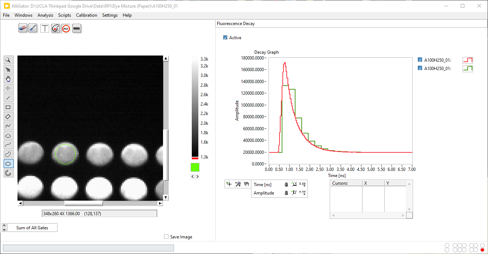
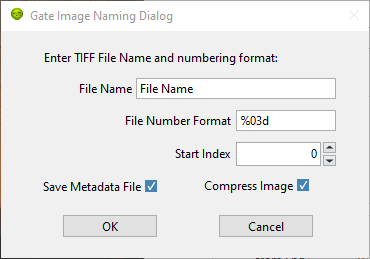
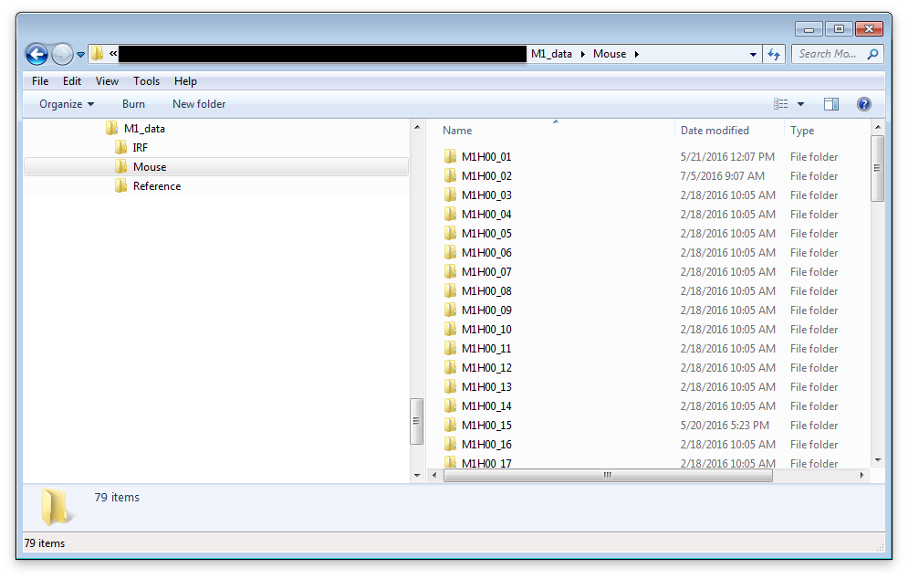
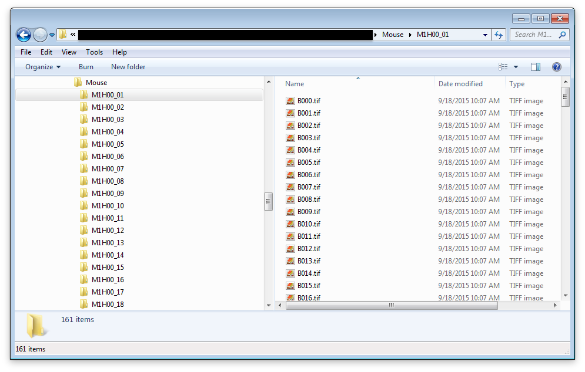

.. _alligator-loading-saving-fli-dataset:

Loading & Saving FLI Datasets
=============================

The following sections detail the different ways fluorescence lifetime imaging 
(FLI) data can be loaded in, or saved from AlliGator.

Loading (as well as saving) functions are accessible via the ``File`` menu as 
shown in the :ref:`alligator-menus` page.

Alternatively, individual files (or file folders for time series) can be 
dragged-and-dropped in the main AlliGator source image panel. 

The ``Load`` sub-menu is divided into three sub-menus: FLI Dataset, FLI Dataset 
Series, and Other Files.

The ``Save`` menu only support saving a single dataset in either of two formats: 
Image series, or HDF5 FLI dataset.

Introduction
++++++++++++

AlliGator was initially developed to analyze data from time-gated ICCD cameras. 
Since this type of data is similar to that of FLI performed with time-correlated 
single-photon counting (TCSPC) hardware, support was added for this kind of data 
as well (both time-stamped and binned data are supported).

Data in time-gated or binned decay analysis generally consists in a sequence of 
*G* images.

Each image in the sequence represents a "gate" image. A gate is an image acquired 
with the image intensifier (or more generally detector) rapidly turned on at a 
specific time after the laser pulse (or gate offset ``t_i``, where ``i`` is the 
gate image index in the sequence) and rapidly turned off after a constant 
duration (gate duration or width ``W``). This processs is repeated over many 
laser periods and the data accumulated in the gate image. Subsequently, the 
delay of the on/off gating process is changed, and a new gate image is acquired. 
In this proces, each gate is separated from the next by a constant step 
(or gate separation ``dt``).

Time-stamped TCSPC data consists by contrast in individual photon information 
(position (``X``, ``Y``) in the image, nanotime ``t`` representing the arrival 
time with respect to the laser (generally an additional macrotime is provided, 
which will not be discussed here for the sake of simplicity). This type of data 
is generally transformed into binned data by collecting all photons in each 
pixels and histogramming their arrival times in a predetermined number ``G`` of 
adjacent bins (of duration ``W`` equal to their separation ``dt``). This data in 
turn can be looked at as a sequence of "binned decay" images, which are similar 
to the gate images discussed previously in the case of gated acquisition.

In the following, we will use the "time-gated" terminology, but everything will 
apply to TCSPC data, replacing "gate" by "bin", "gate width" by "bin width", 
"gate step" by "bin width" and "gate offset" by "bin location".

Although each gate image takes some time to acquire, and a sequence of images 
takes about ``G`` times this amount, we will refer to such a sequence of images 
as a "time point".

AlliGator allows the analysis of individual time points, or a series of such 
time points (*i.e.* a time series). Loading a single time-point or a time-series 
is done differently as described next.

Data Information
++++++++++++++++

While many types of analysis will load the whole time-gated dataset, it can be 
useful to only load part of it. A number of options are available to facilitate 
such a partial loading. They can be found in the **Data Information** panel of 
the **Settings** window:

.. image:: images/AlliGator-Settings-Data-Information.png
   :align: center

Some of these options can be modified after the file has been loaded (for 
instance the *Gate Width* or *Laser Period* parameters can be corrected if 
they look incorrect). Some others will only take effect upon (re)loading the 
file. They are indicated by an asterisk in parenthesis following the parameter 
name.
Note that sthe *Natural Frequency* parameter is not nodifiable and is provided 
as information derived from the other parameters.

Gate Characteristics
--------------------

1. *Gate Width*: the gate width (or duration) parameter is currently only used 
to calculate the Single-Exponential Phasor Loci (SEPL) curve for square-gated 
decays. For TCSPC data it is equal to the bin size.

2. *Gate Separation*: The gate separation specifies the temporal offset 
between gates. For TCSPC data, it is equal to the bin size.

3. *Gate Step* (*): The default calculation mode is to use all gates to build 
the decay plot. However, it is possible to use only one every *n* gates, by 
entering *n* as the value of Gate Step. The effect of choosing to use n = 8 
(rather than the default n = 1) is shown on the figure below.

4. *Gate Image Exposure*: this parameter is not currently used by AlliGator.

5. *Gate Image Integration*: this parameter is not currently used by AlliGator.

Define Gates to Skip or Keep
----------------------------

Two different options are available to reject gates: either by defining which 
gates to *skip* or, on the contrary, which one to *keep*. This is selected via 
the *Skip/Keep* radio buttons.

Accordingly, either one of the following set of parameters will show up to the 
right of the radio buttons:

1. *Gates to Skip* (*): Define how many gates to discard at the beginning 
(*from Start*) and at the end of the gate sequence (*from End*).

For instance, if *from Start* = s,  *from End* = e, and each dataset is 
comprised of n gates, only gates s+1, s+2, ..., n - e-1, n - e will be retained 
in the analysis (where the first gate index is 1 and the last gate index is n. 
This can be useful if decay inspection reveals some unphysical "feature" at the 
beginning or end of the decay.

2. *Gates to Keep* (*): Define the index of the *First* and *Last* gate to keep, 
all other gates being ingored.

For instance, if *First* = f,  *Last* = l, and each dataset is 
comprised of n gates, only gates f, f+1, ..., l -1, l will be retained 
in the analysis (where the first gate index is 1 and the last gate index is n. 
This can be useful if decay inspection reveals some unphysical "feature" at the 
beginning or end of the decay.

Channel Selection
-----------------

In the case of datasets comprised of multiple channels (such as those from a 
dual-gate detector such as SwissSPAD 3), it is necessary to specify which 
channel to *display* (all channels are loaded in memory). This is done by either 
selecting the *Channel Name* (default: ``Gate``) or one of the few available 
*Channel Arithmetic* (default: ``None``).

Note that the former can be modified with immediate effect on the displayed gate 
image shown in the *Source Image* of the main AlliGator window, but the latter 
requires reloading the dataset to take effect.

Laser & SYNC periods
--------------------

This information may not always be available in a file (depending on 
manufacturer) or potentially erroneous (as it often the case when this is not a 
piece of information acquired from the hardware but user-entered). As it is 
used in various places in AlliGator, it is important to make sure it is correct.

The *Natural Frequency* is equal to 1/D, where D is the time span of decays in 
the loaded dataset. This frequency will be larger than 1/T, where T is the 
laser period, if decays don't span the whole laser period. The reason it is 
called *Natural Frequency* is because it is the recommended phasor frequency to 
use to analyze this type of truncated decays (see 
https://doi.org/10.1016/j.bpj.2020.11.1693 for details).

Data Pile-up Correction (*)
---------------------------

When the *Pile-up Correction* checkbox is checked, this option uses the pixel 
well capacity (*Max Value*), which, in SwissSPAD data, corresponds to the 
number of 1-bit frames accumulated for each gate image. The correction applied 
takes into account the possibility of pile-up (missed counts) at high count 
rates, according to:

S = - N log(1 - R/N)

where R is the raw count, N is the pixel well capacity parameter and S the 
corrected count value.

Scaling Factor
--------------

The scaling factor multiplies all gate values by a constant factor (default: 1).

Background File Subtraction (*)
-------------------------------

1. The *Background File Subtraction* checkbox activates subtraction, 
gate-by-gate, the data from a background dataset file, whose path need to be 
specified in the *Background Dataset* control.

2. *Background File Pile-up Correction*: like the dataset from which it is 
subtracted, the background dataset can be coorected for pile-up. This is 
controlled by the *Pile-up Correction* checkbox and the *Max Value* parameter 
beneath the *Background Dataset* control

3. The background *Scaling Factor* parameter (default: 1) can be used to 
adjust the amount of background file correction to apply.

single HDF5 FLI Dataset
+++++++++++++++++++++++

A simple open source file format in which to save a variety of different files 
from different sources was introduced with version 0.16 of AlliGator. It 
simplifies data storage (using a single file instead of a folder of images) and 
loading (for instance, in the case of SwissSPAD 2 data, pre-processing of raw 
data is not necessary anymore, once saved as an AlliGator HDF5 file). In 
addition, this format supports floating point values for gate image pixel 
intensity, which allows saving processed datasets without loss (e.g. 
background-subtracted or pile-up corrected datasets will be comprised of 
non-integer pixel values). Finally, the format includes a lot of metadata which 
helps with traceability and reproducibility.

Details about the format itself can be found in the 
:ref:`alligator-hdf5-file-format` page of this manual.

To load an AlliGator HDF5 file, use ``File:Load:FLI Dataset:HDF5 File`` 
(:kbd:`Ctrl+O`). The path to the dataset will be displayed in the title bar. 
Alternatively, drag and drop the file in the Source Image panel.

To save a dataset (irrespective of its source), use ``File:Save:Dataset:Save as 
HDF5 FLI Dataset`` (:kbd:`Ctrl+Shift+S`).

Folder of Gate Images
+++++++++++++++++++++

To load a single time point (consisting of `G` gate images), use 
``File:Load:FLI Dataset:Gate Image Folder`` (:kbd:`Ctrl+L`). The path to the 
dataset folder will be displayed in the title bar. Alternatively, drag 
and drop the folder in the Source Image panel.

Supported gate image file formats are: BMP, TIFF, JPEG, JPEG2000, PNG. The files 
can be 8 or 16 bits gray scale images.

To save a FLI dataset as a series of gate images, use 
``File:Save:Dataset:Save as TIFF Gate Image Folder``. This will first open a 
**Gate Image Naming Dialog** window where the user can define the name (prefix) 
of individual gate images, as well as define additional parameters:

Next, a file dialog window allows selecting where to save the gate images.

Note that no additional information is saved, therefore is is recommended to 
include additional information needed to reload (or at least make sense of) 
these images in an auxiliary readable file.

Becker & Hickl .sdt FLI Dataset
+++++++++++++++++++++++++++++++

To load an histogrammed .sdt file saved by a Becker & Hickl FLIM electronics, 
use ``File:Load:FLI Dataset:.sdt File``. The path to the dataset will be 
displayed in the title bar.

PicoQuant .ptu Dataset
++++++++++++++++++++++

PicoQuant FLIM electronics can save data as individual photon time stamps with 
spatial information (.ptu files) or as histogrammed data (.bin files).

To load a .ptu file, use ``File:Load:FLI Dataset:.ptu File``. The path to the 
dataset will be displayed in the title bar. Note that the user needs to specify 
how to interpret the photon time stamps by providing a number of bins ``G`` in 
which to sort out the photons via the ``# Gates`` parameter defined in the 
**Settings:Data Information** panel [*]_.

PicoQuant .bin Dataset
++++++++++++++++++++++

To load a .bin file, use ``File:Load:FLI Dataset:.bin File``. The path to the 
dataset will be displayed in the title bar.

Reloading a Dataset
+++++++++++++++++++

To update a dataset after modifying an option requiring reloading the dataset 
to take effect (such as for instance the number of gates), use 
``File:FLI Dataset:Reload Dataset`` (:kbd:`Ctrl+R`)

Loading & Saving FLI Dataset Series
===================================

Folder of HDF5, .sdt or .ptu Datasets
+++++++++++++++++++++++++++++++++++++

In order to load a time series (or any succession of datasets to be analyzed as 
a series) consisting of individual FLI datasets of a single kind (.hdf5, .sdt, 
.bin or .ptu), make sure that they are grouped in a single folder. This folder 
can contain other file types, which will be ignored when loading the series.

In order to load a time series (or any succession of datasets to be analyzed as 
a series) consisting of gate images, use ``File:Load:FLI Dataset Series:xxx 
File Series``, where ``xxx`` stands for .hdf5 or .sdt or .bin or .ptu. The HDF5 
File Series loading option can be invoked with the :kbd:`Ctrl+Shift+O` keyboard 
shortcut.

Folder of Folders of Gate Images
++++++++++++++++++++++++++++++++

In order to load a time series (or any succession of datasets to be analyzed as 
a series) consisting of gate images, use ``File:Load:FLI Dataset Series:Gate 
Image Folder Series`` (:kbd:`Ctrl+Shift+L`). In the case of LaVision ICCD data, 
it is possible to use the time stamp of each dataset saved in the associated 
.set files. To enable this, check the *Use File Timestamp* chekbox in the 
**Time Trace** panel of either the **Settings** or **AlliGator** windows, 
before loading the time series.

After the folder containing the time series has been selected, the first data 
set in the series will be loaded and displayed in the Source Image indicator as 
described earlier.

In addition, a vertical slide (*Time Point Slide*) will be displayed on the 
right-hand side of the image, allowing to explore the time series. The name of 
the data set currently displayed will be indicated in the *Current Data* text 
box below the image.

Note that to avoid slowing down the software, there is no update of the image 
as the vertical slide is moved around: only the name of the *Current Data* is 
updated. As soon as the slide is released, the corresponding data set is loaded. 
Occasionally, the software may lose track of the slide being moved. Click on it 
or enter the desired dataset index in the associated control to force an update.

Each time point is a folder identified by a name specifying its order in the 
time series. In other words, a time series with ``P`` time points will look 
something like this on disk:

   
or, more generally: 

time series/time point 1/image 1
time series/time point 1/image 2
...
time series/time point 1/image N

time series/time point 2/image 1
time series/time point 2/image 2
...
time series/time point 2/image G
...

time series/time point P/image 1
time series/time point P/image 2
...
time series/time point P/image G

time series is the name of the folder (``Mouse`` in the figure above) in which 
all time point subfolders are located (``M1H00_nn`` in the figure above). These 
subfolders should be named using a common root name followed by an increasing 
number suffix.
For instance, folders named TimePoint_001, TimePoint_002.tif, ..., 
TimePoint_100.tif constitute a valid series of names, but TimePoint1 , 
TimePoint2, ..., TimePoint10,... etc. is also an appropriate naming convention 
[*]_.

The naming convention for images in each folder should follow a similar pattern 
[*]_: root name followed by a numeric suffix.The software will assume that the 
files, ordered numerically (using their suffix) are also ordered temporally, 
i.e. correspond to successive gates, starting at offset 0 and incremented by a 
constant step equal to the specified *Gate Separation* parameter (see the 
::ref::`fluorescence-decay-panel` page of the manual).

For instance, files named Image000.tif, Image001.tif, ..., Image100.tif 
constitute a valid series of names, but other naming conventions can be used. 
For instance,  Image1.tif, Image2.tif, ..., Image10.tif,... etc., is also an 
appropriate naming convention.

An example of image folder is shown below:

Notes
+++++

.. [*] It is recommended to check that decays computed with the user-specified 
   ``# Gates`` parameter do not suffer from binning artefacts. If that is the 
   cases, adjust the number of bins (i.e. ``# Gates``) until these artefacts 
   disappear.

.. [*] The LaVision acquisition software seems to name folders in a time series 
   in the following manner:

Folder
Folder_1
Folder_2
etc.

This unfortunately is not compatible with the algorithm used to figure out the 
common root name of all folders as well as their order. Fortunately, the fix is 
simple and consists in renaming the folder corresponding to time point 0 
(Folder in the example above) as Folder_0.

.. [*] The LaVision camera recently (2017) decided to output gate files with 
   names of the kind: root_nameXXXXX_Delay=YYYps.tif, where XXXXX is the gate 
   number and YYY is the gate delay with respect to the laser trigger. Versions 
   of AlliGator above 0.9.13 support this unconventional file name format.