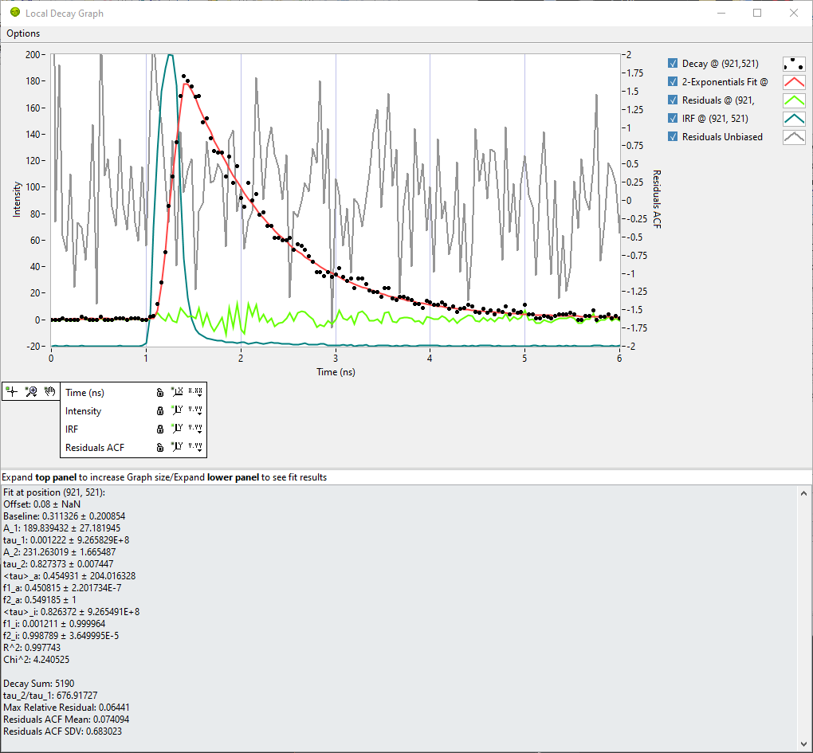

.. _alligator-local-decay-graph-window:

Local Decay Graph Window
========================

The **Local Decay Graph** window (opened using the ``Window:Local Decay Graph`` 
menu item) provides a quick way to explore a loaded dataset at the pixel or 
region of interest (ROI) level.

Once the window is opened, use the *point* or any of the closed ROI tools of 
the *Source Image* and click (or draw a ROI) anywhere in the image to display 
the corresponding intensity decay.

If *no NLSF analysis has been performed*, this is the only information that is 
available. It is similar to using ``Analysis:FLI Dataset:Current ROI Analysis``, 
which displays the corresponding decay in the *Decay Graph*, with the 
difference that the display is temporary but adjustable in size (it is still 
possible to save the plot to a file or copy/paste it in the Notebook). Think of 
it as an exploration tool rather than an analysis tool.

If a NLSF analysis of the dataset has been performed (or a previous analysis 
has been loaded in the **Decay Fit Parameter Map** panel), it is not only 
possible to click in the *Source Image*, but in the **Decay Fit Parameter Map** 
panel as well. Additional curves are plotted, as illustrated in the example 
below.

.

In that example, the decay is represented as black dots, the fitted model in 
red, the residuals in green and the IRF in blue. The IRF in this example is 
*local*. Finally, the *normalized unbiased residuals autocorrelation function* 
(ACF) is represented in grey. The 0-value of the ACF, always large as it is 
equal to: 

.. math::
   ACF(0) = \frac{1}{N} \sum_{k = 0}^{N-1} x_k^2

is not represented. Note that decay, fit and residuals are associated with the 
*Intensity* scale (left), while the IRF is linked to its own vertical scale 
(not displayed), in order to account for different signal intensities for decay 
and IRF.

The residuals autocorrelation function is linked to its own vertical scale 
(shown on the right). A "good" normalized unbiased residuals ACF should indeed 
have an amplitude of the order of a few units range, which is generally much 
smaller than most ("good") recorded decays.

It is recommmended to set the *Intensity* and *IRF* scales to autoscale, while 
the *Residuals ACF* scale is best set to a fixed range (*e.g.* [-2, +2] as 
shown in the example) in order to easily detect when an ACF is problematic.

Decay Fit Information
---------------------

The lower part of the panel can be independently expanded (or collapsed if not 
needed) to reveal the stored fit results for the ROI under study. In addition 
to the fitted parameters and :math:`\chi^2` and :math:`R^2`, the following 
derived quantities are reported (the last 4 can be used as constraints in 
**Decay Fit Parameter Map** analyses):

+ *Decay Sum*: Sum of all gate values in the decay.

+ *tau_2/tau_1*: Ratio of both lifetimes (in case of a 2-Exp fit).

+ *Max Relative Residuals*: Ratio of the max absolute residual value and max 
  absolute decay value.

+ *Residuals ACF Mean*: Average of the ACF (not including the 0-value).

+ *Residuals ACF SDV*: Standard deviation of the ACF (not including the 
  0-value).

.. Note 1:
   The fit, residuals and ACF are computed from the stored fit parameters, IRF 
   and decay. Because the fit are currently performed using a normalized IRF (
   such that its integral over the laser period is equal to 1), old fit 
   parameters that may have been obtained using an unnormalized IRF can result 
   in erroneous fitted curve. To compute the correct fit, it is necessary to 
   deselect the ``Options:Use Normalized IRF Convolution`` in the **Local Decay 
   Graph** window.

.. Note 2:
   Occasionally, the **Local Decay Graph** may become unresponsive. To fix this 
   issue, briefly move the mouse out of the main AlliGator window.
