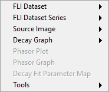
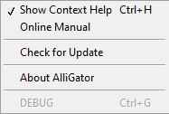

.. _alligator-menus:

AlliGator Menus
===============

Some of AlliGator's functions can be performed via the top menu bar (and 
associated shortcuts). The menus are :ref:`File <alligator-file-menu>`, 
:ref:`Windows <alligator-windows-menu>`, 
:ref:`Analysis <alligator-analysis-menu>`, 
:ref:`Calibration <alligator-calibration-menu>`, :ref:`Settings 
<alligator-settings-menu>` and :ref:`Help <alligator-help-menu>`

.. _alligator-file-menu:

File Menu
---------

* ``Load``
  - ``FLI Dataset``

    + ``Gate Image Folder``: is used with data consisting of series of images
    + ``HDF5 File``: allows loading datasets saved in the HDF5 open source file 
      format used by AlliGator
    + ``.sdt File``: loads Becker & Hickl histogrammed FLIM files
    + ``.ptu File``: loads PicoQuant TCSPC FLIM files
    + ``.bin File``: loads PicoQuant histogrammed FLIM files
    + ``SwissSPAD 1 .dat File``: loads a file generated by the first generation 
      SwissSPAD camera
    + ``Reload Dataset``: forces reloading the current dataset (used to apply 
      new settings)

  - ``FLI Dataset Series``
  
    + ``Gate Image Folder Series``: is used with folders of folders of data 
      consisting of series of images
    + ``HDF5 File Series``: allows loading a folder of datasets saved in the 
      HDF5 open source file format used by AlliGator
    + ``.sdt File Series``: loads a folder of Becker & Hickl histogrammed FLIM 
      files
    + ``.ptu File Series``: loads a folder of PicoQuant FLI files
    + ``.bin File Series``: loads a folder of PicoQuant histogrammed FLIM 
      files
  - ``White Light Image``: opens a single image of the sample 
    (or any other image) which will not be used for data analysis
  - ``Mask Image``: opens a mask image used to define regions of interest 
    for data analysis
  - ``Intensity Corrections File``: opens a file containing corrections to 
    apply to intensity values in the series
* ``Save``

  - ``Dataset``

    + ``Save as TIFF Gate Image Folder``: saves gate images loaded in AlliGator 
      as TIFF files
    + ``Save as HDF5 FLI Dataset``: saves any file loaded in AlliGator in the 
      open source file HDF5 format used by AlliGator
  - ``Mask Image``: saves the current Mask Image to a TIFF file
* ``Batch Conversion``: opens a window allowing the selection of multiple FLI 
  Datasets and exporting them to HDF5 FLI Dataset files or TIFF Image Series.
* ``Quit``: quits AlliGator with confirmation, offering to save the 
  **Notebook** content (:kbd:`Ctrl+Q`)

.. _alligator-windows-menu:

Windows Menu
------------

+ ``Notebook``: opens the **Notebook** window (:kbd:`Ctrl+N`).
+ ``Dataset Information``: opens the **Dataset Information** window 
  (:kbd:`Ctrl+I`).
+ ``Settings``: opens the **Settings** window (:kbd:`Ctrl+E`).
+ ``Source Image ROI Manager``: opens the **Image Source ROI Manager** window 
  (:kbd:`Ctrl+Shift+R`).
+ ``Phasor Plot ROI Manager``: opens the **Phasor Plot ROI Manager** window.
+ ``Phasor Harmonic Manager``: opens the **Phasor Harmonic Manager** window.
+ ``Image Profile``: opens the **Image Profile** window.
+ ``Local Decay Graph``: opens the **Local Decay Graph** window.
+ ``Fit Status``: opens the **Fit Status** monitoring window.

.. _alligator-scripts-menu:

Scripts Menu
-------------

+ ``Phasor Calibration Maps (# Gates Series)``: computes phasor calibrations 
  maps for different step parameters
+ ``Calibrated Phasor Map Series``: computes calibrated phasors plots for a 
  series of dataset/gate step/calibration map
+ ``Multi-ROI Single-Pixel Phasor Analysis``: computes calibrated single-pixel 
  phasors for the current ROIs
+ ``Multi-ROI Single-Pixel NLSF Analysis``: performs single-pixel NLSF analysis 
  for the current ROIs
+ ``Square Gated IRF Characteristics Map``: fits ROI decays with one of the 
  following gate models:
  
    * ``Square Pulse``
    * ``Logistic Square Pulse``
    * ``Tilted Logistic Square Pulse``

.. _alligator-analysis-menu:

Analysis Menu
-------------

  
+ ``FLI Dataset``

  * ``Current ROI Analysis``: performs an analysis of the pixels located within 
    the selected ROI or, if the ``Use ROI as Search Area`` button is pressed, in 
    the optimal ROI within that region  (:kbd:`Ctrl+A`).

  * ``Multiple ROIs Analysis``

    - ``All ROIs IRF Extraction``

      + ``Interactive (Slow)``: performs the same analysis as ``Current ROI 
        Analysis`` on all ROIs currently defined, in the order they appear in the 
        **ROI Manager**. In particular, it will plot the corresponding decay, add 
        a data point to a new phasor plot in the *Phasor Graph* and display the 
        current location of the ROI. This can take quite a long time in the case 
        of a very long list of ROIs or for large datasets.
      + ``Non-interactive (Fast)``: performs the same analysis as ``Current ROI 
        Analysis`` on all ROIs currently defined, in the order they appear in the 
        **ROI Manager**. No decay is plotted, the phasor plot resulting from the 
        analysis in only displayed at the end, and no ROI is displayed on the *
        Source Image* during the analysis. This mode is recommended, as it is 
        much faster than the previous one (> x10).

    - ``All ROIs NLSF Analysis``

      + ``Interactive (Slow)``

      + ``Non-Interactive (Fast)``

    - ``All ROIs Phasor Analysis``

      + ``Interactive (Slow)``

      + ``Non-Interactive (Fast)``

    - ``All ROIs Average Lifetime``
    
  * ``Multiple ROIs Single-Pixel Analysis``

    - ``All ROIs Single-Pixel NLSF Analysis``

    - ``All ROIs Single-Pixel Phasor Analysis``

  * ``Compute Fluorescence Decay Statistics``: analyzes all single pixel 
    decays within the data set and builds an histogram of the minimum and 
    maximum intensity in  each decay. This analysis is discussed in more 
    details in the :ref:`Fluorescence Decay Statistics 
    <alligator-fluorescence-decay-statistics-panel>` page of the manual

+ ``FLI Dataset Series``

  * ``Series Phasor Analysis``

    - ``Current ROI``: the same ROI is used for all datasets in the series
    - ``All ROIs``: not supported
    - ``Sequential ROIs``: the ROIs in the ROI Manager list are used 
      sequentially for each dataset in the series (i.e. the first ROI is usd 
      for the first dataset, the second ROI for the second dataset, etc.).
  * ``Series NLSF Analysis``

    - ``Current ROI``: the same ROI is used for all datasets in the series
    - ``All ROIs``: not supported
    - ``Sequential ROIs``: the ROIs in the ROI Manager list are used sequentially 
      for each dataset in the series (i.e. the first ROI is used 
      for the first dataset, the second ROI for the second dataset, etc.).

  * ``Series Sum or Average``

    - ``Sum All FLI Datasets in Series``: the same ROI is used for all 
      datasets in the series
    - ``Show FLI Dataset Series Sum``: displays the sum of all datasets in the 
      *Source Image*
    - ``Show FLI Dataset Series Average``: displays the average of all 
      datasets in the *Source Image*
  * ``Define Intensity Corrections``: opens the **Define & Save Intensity 
    Correction File** dialog window discussed in the :ref:`Intensity 
    Corrections Definition <intensity-corrections-definition>` manual page
  * ``Playback``: successively loads every dataset in the loaded series, 
    stopping when the end of the series is reached
  * ``Loop``: successively loads every dataset in the loaded series, 
    starting back from the first dataset when the end of the series is reached

+ ``Source Image``

  * ``Source Image Plugin Example``

    - ``Intensity Above Threshold Mask``: python plugin example

+ ``Decay Graph``

  * ``Decay Graph Plugin Example``

    - ``Plot Scaled Sum and Difference (Selected Plots) test``

  * ``Process Multiple Plots``

    - ``Linear Combination (Selected Plots)``

  * ``Process Plot``

    - ``Plot Mean SDV``

+ ``Phasor Plot``: no item
+ ``Phasor Graph``: no item
+ ``Decay Fit Parameter Map``: no item
+ ``Tools``

  * ``Shot Noise Influence on Average Lifetime``: opens the **Shot Noise 
    Influence on Average Lifetime** window described in the 
    :ref:`corresponding page of the manual 
    <alligator-shot-noise-influence-average-lifetime>`
  * ``Fit Method Benchmark``: opens the **Fit Method Benchmark** window described 
    in the :ref:`corresponding page of the manual <alligator-fit-method-benchmark>`

.. _alligator-calibration-menu:

Calibration Menu
----------------

The menu is comprised of three sub-menus:

* ``Single Phasor Calibration``
    + ``Use Single Phasor Calibration``: performs the same action as selecting 
      ``Single Phasor`` in the *Calibration Type* pull-down list in the **Phasor 
      Graph** panel. Both are linked (the pull-down list is updated when the menu 
      item is selected and vice versa).
    + ``Save Phasor Calibration``: saves the currently used single calibration 
      phasor to a XML file.
    + ``Load Phasor Calibration``: loads a previously saved calibration phasor,
    + ``Clear Phasor Calibration``: removes the stored calibration from memory.
* ``Phasor Calibration Series``
    + ``Use Phasor Calibration Series``: performs the same action as selecting 
      ``Phasor Series`` in the *Calibration Type* pull-down list in the **Phasor 
      Graph** panel. Both are linked (the pull-down list is updated when the menu 
      item is selected and vice versa).
    + ``Save Phasor Calibration Series``: saves the currently used calibration 
      phasor curve to a XML file.
    + ``Load Phasor Calibration Series``:  loads a previously saved calibration 
      phasor curve,
    + ``Clear Phasor Calibration Series``: removes the stored calibration curve 
      from memory.
* ``Phasor Calibration Map``
    + ``Use Phasor Calibration Map``: performs the same action as selecting 
      ``Phasor Map`` in the *Calibration Type* pull-down list in the **Phasor 
      Graph** panel. Both are linked (the pull-down list is updated when the menu 
      item is selected and vice versa).
    + ``Save Phasor Calibration Map``: saves the currently used calibration 
      phasor map to a XML file.
    + ``Load Phasor Calibration Map``:  loads a previously saved calibration 
      phasor map,
    + ``Clear Phasor Calibration Map``: removes the stored calibration map from 
      memory.

.. _alligator-settings-menu:

Settings Menu
-------------

* ``Load Settings``:
* ``Save Settings``:
* ``Export Settings to Notebook``
    + ``All Settings``: writes all settings currently used in AlliGator in the 
      **Notebook** for future reference. Some of these settings are added to the 
      **Notebook** during the course of data analysis. This function conveniently 
      regroups all settings in one single location in the **Notebook**. The 
      following items limit the content of the **Settings** window that is 
      exported to the **Notebook**:
    + ``Source Image``
    + ``Data Information``
    + ``Fluorescence Decay``
        - ``All Settings``
        - ``Decay Pre-Processing``
        - ``Advanced Analysis``
        - ``Fit Options``
        - ``Fit Parameters``
        - ``Styles``
* ``Settings``: opens the **Settings** window

.. _alligator-help-menu:

Help Menu
---------

+ ``Show Context Help``: shows a floating window providing basic information on 
  the object pointed at with the mouse pointer (:kbd:`Ctrl+H`).
+ ``Online Manual``: opens a page in the default browser redirecting to this 
  website.
+ ``Check for Update``: visits the Installation webpage to check the latest 
  released version. If a newer version is found, the software offers to 
  download and install it. The new version will be used on the next time 
  AlliGator is started.
+ ``About AlliGator``: opens a dialog window providing basic information on 
  AlliGator.