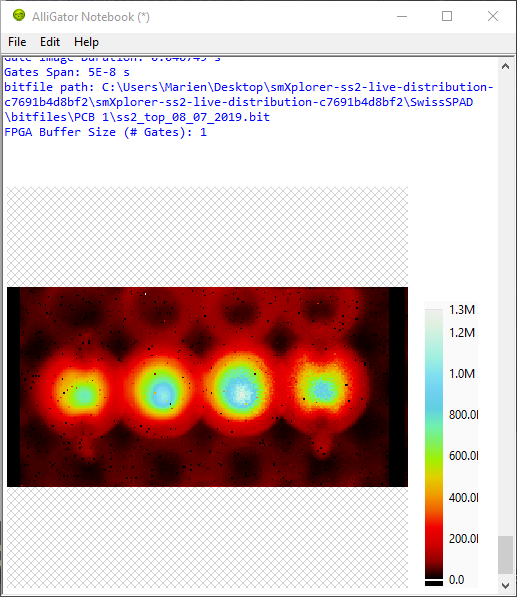

.. _alligator-notebook-window:

Notebook Window
===============

The Notebook window is a separate window receiving text information from 
AlliGator, such as action summary and analysis results. The Notebook window can 
be opened using the ``Windows:Notebook`` menu item or the :kbd:`Ctrl+N` 
keyboard shortcut. Closing the window doesn't lose its content, unless 
AlliGator is closed as well (see below)

The main component of the Notebook is a *Rich Text Box*, which can contain 
images pasted from the clipboard or other similar objects.
Naturally, the user can type text, edit the content of the Notebook with 
standard shortcuts and a few formatting options accessible via the right-click 
menu.

.

A list of available shortcuts can be accessed using the ``Help:Show Notebook 
Shortcuts`` menu of the Notebook window.

When the ``Verbose Mode`` option (**Settings:Miscellaneous** window) is 
checked, individual analysis steps (usually hidden from the user) are reported 
in the Notebook in a specific style (light gray font in the default *Light 
Theme*.

When the ``Verbose Error Mode`` option (**Settings:Miscellaneous** window) is 
checked, error messages (also usually hidden from the user) are reported in red 
font (in both the *Light* and *Dark theme*). While this can generate a lot of 
unwanted information, it is easy to delete afterwards and is useful for 
debugging purposes.

Notebook Styles & Themes
------------------------
AlliGator is using 6 different *styles* to display messages in the Notebook:

- Message
- Result
- Error
- Setting
- Verbose
- Warning

This allows easily identifying the type of messages based on their style in the 
Notebook. *Styles* can be modified within a *Theme*. There are two default
themes, accessible via the ``Styles`` menu:

- Light Theme (white page)
- Dark Theme (black page)

Switching from one style to the other does not update previously output text, so 
it is preferable to choose which theme to use at the beginning of a session.

Editing Themes
""""""""""""""

Styles and Themes can be edited (but the Light and Dark Theme cannot) using the 
``Styles:Edit Text Styles`` menu item, which opens the following dialog window:

.. image:: images/Notebook-Text-Format-Definition-Dialog.png
   :align: center

.

The currently edited Theme is displayed above the text box (*Theme Name*). The 
currently edited Style within that Theme is listed at the top (*Text Style*).
The different characteristics of that style are indicated below:

- Font
- Font Size
- Text Color
- Background Color
- Style
- Alignment

*Page Color* is a Theme characteristic.

The *Copy* button next to each characteristic can be pressed to indicate that 
all Styles should use that same characteristic (for instance the *Font*).

Any change to any of the style characteristics is reflected immediately in the 
*Text Example* box.

Once all the Styles have been updated, the corresponding new Theme can be stored 
by pressing on the *Apply* button. If the edited style is one of the default 
ones (Light or Dark Theme), the dialog will require the user to enter a different 
name for the Theme to be stored under. If the Theme is one of the user-defined 
ones, it will be updated. Newly defined Themes will be listed under the Light 
and Dark Theme in the ``Styles`` menu.

The *Cancel* button will restore the Theme's Styles as they were when opening 
the window (but won't revert the modifications if the Theme was stored with the 
*Apply* button).

The *Close* button will close the Dialog window and return to the Notebook.

To delete an existing (non-default) Theme, edit it with the ``Styles:Edit Text 
Styles`` menu item and check the *Mark for Deletion* checkbox off and close the 
Dialog window.

Saving & Loading Themes
"""""""""""""""""""""""

The defined Themes can be saved and loaded using the ``Save Themes`` and ``Load 
Themes`` menu items of the ``Styles`` menu. This uses *.json* files to store the 
definitions of all themes (including the *Light* and *Dark* Themes).

Saving & Loading the Notebook
-----------------------------

The Notebook is backed-up at regular intervals, as indicated in the bottom 
message box. The backup file can be found in the 
``C:\Users\Username\AppData\Local\Temp`` folder, where ``Username`` is the 
Windows login name. Note that this folder might be set to be invisible by 
default [#f1]_. 

The file name is of the form ``~AlliGator Notebook ProcessID.rtf``, where 
``ProcessID`` is the ID number of the ``AlliGator.exe`` process as found in the 
Task Manager. This means that when two AlliGator copies are running, their 
respective Notebook's backup are identifiable by the ``ProcessID`` suffix. This 
backup can be useful in case the user forgets to save the Notebook before 
quitting, or in case of an application or computer crash.

It is **strongly recommended** to save the Notebook before quitting using the 
``File:Save`` or ``File:Save As...`` menu item. The Notebook contains important 
information about the different analyses that have been performed. If the 
Notebook has already been saved once during a session, using ``Save`` will 
overwrite the previously saved file.

To save the current Notebook content in a different file, use the 
``Save As...`` option instead.

A reminder to save the Notebook is provided when quitting AlliGator, even if the 
Notebook has already been closed. If the Notebook is still open when AlliGator 
is closed, the user can still modify the Notebook and save it **after** 
AlliGator's main window is closed. In other words, quitting AlliGator does *not* 
close the Notebook, but it also doesn't save it.

It is also possible to load a previous Notebook using ``File:Open``. A dialog 
will remind the user that doing so will overwrite the current content of the 
Notebook.

*Tip*
-----

It is recommended to take advantage of the Notebook to insert annotations, 
paste intermediate plots or images and in general keep track of user workflow. 
Saving the Notebook at the end of an analysis session provides a convenient 
record of analysis steps and parameters used during analysis, which goes a 
long way in ensuring reproducibility. It can also be useful to print the 
settings used during analysis using the ``Settings:Export Settings to Notebook`` 
menu.

.. rubric:: Notes

.. [#f1] If it the ``C:\Users\Username\AppData\Local\Temp`` folder is 
   invisible, select the *View* tab at the top of any Windows Explorer window 
   and, after selecting any folder, click on *Options* (to the right of the 
   toolbar). This will open a **Folder Options** window. Select the *View* tab 
   and click the ``Show hidden files, folders and drives`` radio button under 
   ``Hidden files and folders``. Click *Apply to Folders* at the top of the tab 
   (to make this option general).
