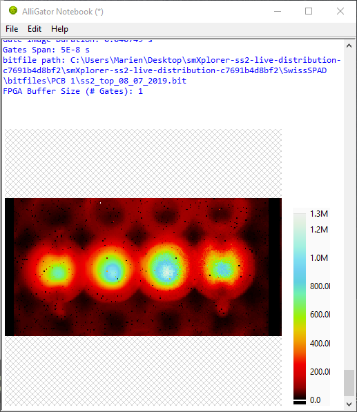

.. _alligator-notebook:

Notebook
========

The Notebook window is a separate window receiving text information from AlliGator, such as action summary and analysis results. The Notebook window can be opened using the ``Windows:Notebook`` menu item or the :kbd:`Ctrl+N` keyboard shortcut. Closing the window doesn't lose its content, unless AlliGator is closed as well (see below)

The main component of the Notebook is a *Rich Text Box*, which can contain images pasted from the clipboard or other similar objects.
Naturally, the user can type text, edit the content of the Notebook with standard shortcuts and a few formatting options accessible via the right-click menu.

A list of available shortcuts can be accessed using the ``Help:Show Notebook Shortcuts`` menu of the Notebook window.

When the ``Verbose Mode`` option (**Settings:Miscellaneous** window) is checked, individual analysis steps (usually hidden from the user) are reported in the Notebook in light gray font.

When the ``Verbose Error Mode`` option (**Settings:Miscellaneous** window) is checked, error messages (also usually hidden from the user) are reported in red font. While this can generate a lot of unwanted information, it is easy to delete afterwards and is useful for debugging purposes.

Saving & Loading the Notebook
-----------------------------

The Notebook is backed-up at regular intervals, as indicated in the bottom message box. The backup file can be found in the ``C:\Users\Username\AppData\Local\Temp`` folder, where ``Username`` is the Windows login. The file name is of the form ``~AlliGator Notebook ProcessID.rtf``, where ``ProcessID`` is the ID number of the ``AlliGator.exe`` process as found in the Task Manager. This means that when two AlliGator copies are running, their respective Notebook's backup are identifiable by the ``ProcessID`` suffix. This backup can be useful in case the user forgets to save the Notebook before quitting, or in case of an application crash.

While the content of the Notebook is automatically backed up, it is recommended to actively save the Notebook before quitting using the ``File:Save`` or ``File:Save As...`` menu item, If the Notebook has already been saved once, using ``Save`` will update the previous saved file.

To save the current Notebook content in a different file, use the ``Save As...`` option instead. A reminder to save the Notebook is provided when quitting AlliGator, if the Notebook has already been closed. If the Notebook is still open when AlliGator is closed, the user can still modify the Notebook and save it.

It is also possible to load a previous Notebook using ``File:Open``. A dialog will remind the user that doign so will overwrite the current content of the Notebook.

*Tip*
-----

It is recommended to take advantage of the Notebook to insert annotations, paste intermediate plots or images and in general keep track of user workflow. Saving the Notebook at the end of an analysis session provides a convenient record of analysis steps used parameters and during analysis, which goes a long way in ensuring reproducibility.