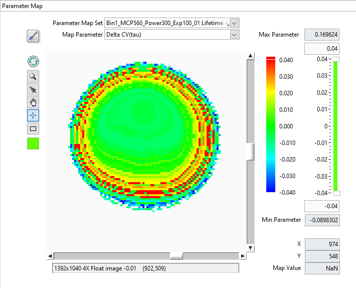
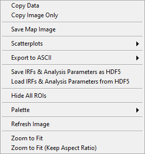

.. _alligator-parameter-map-panel:

Parameter Map Panel
===================

The *Parameter Map* panel is used to display and further process 
multi-ROIs non-NLSF analysis parameters. Its functions are similar to those of 
the *Decay Fit Parameter Map*.

The panel consists of different controls and indicators as illustrated below and 
discussed next.

The main object is the map itself, which represents a color-coded image of the 
selected parameter (*Map Parameter* pull-down list at the top right), 
based on the selected *Parameter Map Color Scale* (next to the map) 
and the values of the *Parameter Map Display Range* (to the right of 
the color scale)

Note that in contrast with the *Decay Fit Parameter Map*, results from 
different analyses can be visualized sequentially by selecting the 
appropriate *Parameter Map Set* from the corresponding pull-down menu.
Unused Parameter Map Sets can be deleted from memory using the right-click menu 
of the *Parameter Map Set* pull-down menu.

The *Max Parameter* and *Min Parameter* indicators provide the actual total 
range of the computed parameters, while the controls immediately above and 
below the slide represent the position of the sliders, which themselves 
specify what are the selected Min and Max of the displayed parameters.

Any parameter above or below these two limits are color-coded with the unique 
color boxes located at the top and bottom of the color scale (by default, the 
bottom color is white, and is therefore not visible in the snapshot above). 
Left-click above or below the color scale to reveal the color picker window and 
select the color highlighting parameters respectively above or below the display 
range minimum).

The *X*,*Y* and *Map Value* indicators at the bottom right provide the location 
of the cursor (also visible in the image information bar below the map), as well 
as the actual map value at that location. if that latter indicator appears 
unresponsive, briefly move the mouse out of the window and back to reactuivate 
mouse tracking (that trick also work to reactivate the 
:ref:`alligator-local-decay-graph-window` mentioned below).

The square Tools buttons on the top left of the *Decay Fit Parameter Map* 
allow zooming, selecting, moving or clicking the image or a ROI. Note that the 
*Rectangle* tool is only used to zoom in on a specific region of the map in 
combination with the ``Alt`` key.

The *Refresh Parameter Map* button forces redrawing the map, while the square 
color selector at the bottom allows defining the color of the ROIs drawn over 
the map.

Finally, the *Overlay Parameter Map* button at the top left (brush tool) enables 
overlaying the current *Decay Fit Parameter Map* on the *Source Image*.

Parameter Map Menu
------------------

The *Parameter Map* context menu is shown below and discussed next.
 

.

+ *Copy Data*: This copies the LabVIEW image object bitmap, including tool 
  palette, scroll bars, and image information.
+ *Copy Image Only*: Only copies the visible image.
+ *Save Map Image*: Saves the whole image as a PNG file (with dialog).
+ *Export to ASCII*:

  + *Export Map Data as ASCII*: This will export the current map image as an 
    ASCII matrix of parameter values. If only a few of the image pixels have 
    actual parameters associated with them, this will result in a mostly 
    ``NaN``-filled file, with a few isolated actual values.
  + *Export All Maps Data as ASCII*: This will export all parameter map images 
    as separate ASCII matrices of parameter values.
  + *Export ROI Data as ASCII*: This function exports all parameters for the 
    selected ROI. Note however that there are 3 different use cases:
    
    + If the the ROIs used to compute the map are all single-pixels and the 
      selected ROI is a single-pixel ROI, this will export a single row of 
      parameters, preceded by the ROI index and pixel coordinates.
    + If the the ROIs used to compute the map are not all single-pixels and 
      the selected ROI is one of the original ROIs used for computing the 
      map, this will export a single row of parameters, preceded by the ROI 
      index and pixel coordinates.
    + Possibly more interesting, if the the ROIs used to compute the map 
      are all single-pixels but the selected ROI is not, this will export 
      multiple rows of parameters corresponding to the different pixels in 
      that ROI, preceded by the ROI index and pixel coordinates.
  + *Export All ROIs Data as ASCII*: Similarly to the previous one, this 
    function exports all parameters for all the ROIs. Again, there are 3 
    different use cases:

    + If the the ROIs used to compute the map are all single-pixels and the 
      ROIs are also single-pixel ROIs, this will export multiple rows of 
      parameters, preceded by the ROI index and pixel coordinates.
    + If the the ROIs used to compute the map are not all single-pixels and 
      the ROIs are the original ROIs used for computing the map, this will 
      export multiple rows of parameters, preceded by the ROI index and 
      pixel coordinates.
    + Possibly more interesting, if the the ROIs used to compute the map 
      are all single-pixels but the ROIs used are not, this will export
      multiple rows of parameters corresponding to the different pixels in 
      these ROI, preceded by the ROI index and pixel coordinates.

+ *Scatterplots*: submenu to select the type of scatterplot to export to the 
  *Lifetime & Other Parameters* Graph. These scatterplots can be limited to 
  pixels verifying a set of constraints on fit parameters and derived quantities 
  

.. image:: images/AlliGator-Decay-Fit-Parameter-Map-Scatterplot-Menu.png
   :align: center

.

  + *Create Selected Parameter Scatterplot*: Sends all parameter values *P_i* 
    in the image as a *(i, P_i)* scatterplot, where *i* is the index of the 
    ROI.
  + *Create Selected Parameter vs Intensity Scatterplot*: Sends all parameter 
    values *P_i*  in the image as a *(I_i, P_i)* scatterplot, where *I_i* is 
    the total ROI decay intensity. This requires the ROIs used during NLSF 
    analysis to be present in order to be able to compute each ROI's total 
    intensity.
  + *Create Parameter 2 vs Parameter 1 Scatterplot*: Opens a dialog window to 
    select the two parameters (P1, P2) to export as pairs.

+ *Change Map Resolution*: when loading a Decay Fit Parameter Map file, the 
  default size of the map is set to that of the loaded dataset. If that dataset 
  does not correspond to the loaded map data (or no dataset is loaded), it is 
  necessary to manually set the map's resolution (*i.e.* image size), which 
  this function allows doing.

The other functions are self-explanatory.

(last updated: 2026-01-29)