.. _alligator-phasor-graph-panel:

Phasor Graph Panel
==================

Introduction
++++++++++++

The **Phasor Graph** panel is the nexus for phasor analysis as implemented in 
AlliGator. This page discusses how to use the many functions associated with 
the *Phasor Graph*, including those related to:

- Phasor Calibration
- Phasor Ratio Analysis & Derived Quantities

The **Phasor Graph** panel represents decay data corresponding to ROIs selected 
in the *Source Image*. This representation is complementary to the mere decay 
plots displayed in the *Decay Graph* of the **Fluorescence Decay** panel. 
Discussion of the phasor representation of fluorescence decay data can 
be found in many places in the literature and will not be repeated here.

The most important parameter in this type of analysis, the *Phasor Frequency*, 
is accessible in different locations (any modification in one of these 
locations is reverberated throughout AlliGator). In the **Phasor Graph** panel, 
it is found at the top right corner of the panel.

A phasor (point) is added to the *Phasor Graph* each time the 
``Analysis:FLI Dataset:Current ROI Analysis`` (Crtl + A) menu item is used, but 
also when phasor-specific actions are performed, as described below. Each new 
phasor can be either added to the last created *Phasor Plot* (a series of 
phasors stored internally as an array and represented as a single scatterplot), 
or added to a new plot. The choice between these two options is left to the user 
via a dialog window:

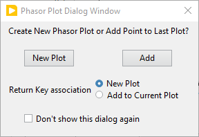

To avoid having to deal with this dialog each time a new phasor is computed, it 
is possible to check the *Don't show this dialog again* box off after having 
selected the appropriate default option using the *Return Key association* 
radio button (``New Plot`` or ``Add to Current Plot``).

The dialog window can be restored at any time by clicking on the *Restore 
Skipped Dialogs* button in the **Miscellaneous** panel of the **Settings** 
window.

The value *(g, s)* of the last or *Current Phasor* is displayed to the right of 
the graph, together with the corresponding modulus and phase (*m*, :math:`\phi`) 
as well as the *Phase Lifetime*, :math:`\tau_{\phi}` and *Modulus Lifetime*, 
:math:`\tau_{m}` defined as:

.. math:: \tau _{\phi} = \frac{1}{2\pi f}\frac{s}{g}
  :label: eq:tau_phi
  
and

.. math:: \tau _m = \frac{1}{{2\pi f}}\sqrt{\frac{1}{g^2+s^2}-1}
  :label: eq:tau_m  

respectively (note that :math:`\tau_{m}` can be undefined (*NaN*) if the phasor 
is outside the universal circle (UC).

The other quantities shown in the snapshot below are discussed in 
the Phasor Ratio Analysis section below.

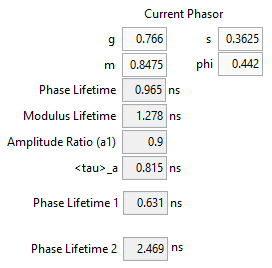

Note that *g*, *s*, *m* and :math:`\phi` are *controls*, *i.e.*, they can be 
modified by typing any desired value. The other quantities are automatically 
updated according to the above relations. However, the last phasor point 
plotted in the *Phasor Graph* is not modified.

Managing plots in the Phasor Graph
++++++++++++++++++++++++++++++++++

The *Phasor Graph* is comprised of one or more plots. The *Universal Circle* 
(UC) is always present and cannot be removed (however, its style and appearance 
can be modified, and in particular, it can be hidden by checking off its 
visibility checkbox in the legend).

Other plots are either created automatically or upon user request, as explained 
next.

When starting a Series Analysis (see the corresponding manual page for details), 
a new plot is created and added to the list, and is used to store all phasors 
computed during the analysis. Aborting the analysis and restarting it will 
preserve the first, incomplete plot and start a new one for the new analyzed 
phasors.

Alternatively, it is possible to group different computed phasors into different 
plots. For instance, this can be useful when manually analyzing a dataset 
comprised of different samples which one may want to group into different series. 
To do so, perform the analysis of the first series of sample in the dataset 
(which will automatically create a new plot) and when done, use the ``New Plot`` 
context menu item. This will add a new (empty) plot to the *Phasor Graph*, to 
which future phasors will be added. An arbitrary number of plots can be added 
in this manner.

Occasionally, it can be necessary to cleanup the *Phasor Graph* by removing all 
or a particular plot from it, or to remove a particular phasor point from a 
specific plot.
This is done using the right-click context menu:

- ``Remove Single Phasor from Plot`` removes the point closest to the 
  right-click location from whichever plot it belongs to.
- ``Delete Plot`` removes the plot pointed at in the *Phasor Graph* legend.

Note that in the first case, it might be necessary to zoom in to be able to 
isolate the point to remove from neighboring ones.

Loading and Saving Phasor Plots
+++++++++++++++++++++++++++++++

The *Phasor Graph* offers standard ASCII file saving/loading functions as in 
other graphs, available via the right-click ``Save Plots (ASCII)`` sub-menu 
(``Save Plot``, ``Save Selected Plots``, ``Save All Plots``). These are the 
functions to use in order to export the curves/plots seen in the graph for 
further analysis in third party software. The only difference with other graphs 
in AlliGator is that there is no ``Load Plot(s)`` function. The reason for this 
is discussed next.

In addition, the *Phasor Graph* has special functions to save the extra 
information necessary to make sense of the underlying data for phasor analysis 
(phasor harmonic frequency, source image location of each phasor). These can be 
found under the ``Save Phasor Plots (.phplot)`` sub-menu. These are the 
functions to use when saving data with the intent to reproduce an analysis in 
AlliGator. These .phplot files (one file per plot) can be loaded using the 
``Load Phasor Plot(s) (.phplot)`` function, which opens a native file dialog 
allowing the selection of more than one .phplot file.

Since most phasor plots are used in conjunction with a phasor calibration, and 
this can be changed at will (see Calibration section below), phasor plots are 
saved as uncalibrated phasors. In other words, when saving a calibrated phasor 
plot, it is a good idea to also save the phasor calibration used in the analysis 
(see below), or alternatively, the phasor plot used to calibrated it, so 
that it can be reloaded later on and reused as calibration.

The *Phasor Graph* specific file functions are:

- ``Save Single Phasor Plot`` saves a file of the uncalibrated phasor plot. The 
  file extension is automatically set to .phplot. The first time a phasor plot 
  is saved, this function asks the user to select the folder in which to save 
  the plot (as well as offers the ability to name the file). Any subsequent 
  phasor plot saved will be saved in that folder and will be named 
  Plot Name_Phasor Plot.phplot, where "Plot Name" is the name of the plot in 
  the *Phasor Graph*. Any already existing file will be overwritten.
- ``Save Selected Phasor Plots``: does the same for several plots. A file dialog 
  box   opens for each of the selected plots.
- ``Save All Phasor Plots``: will accomplish for all plots what 
  ``Save Phasor Plot`` does for an individual plot. The UC plot is not included 
  in this action.
- ``Load Phasor Plot(s)`` allows selecting one or more files (.phplot file 
  extension) and load them as uncalibrated phasor plots in the *Phasor Graph*.

Note: Prior to version 0.17, a XML file format was used, which turned out to be 
a bit verbose and slow to load. From 0.17 onward, the file format was changed 
to JSON to mitigate these issues. Older XML files can still be loaded, but it 
is recommended to save them (e.g. overwriting the older version) in the new 
format.

Phasor Calibration
++++++++++++++++++

1. Introduction
---------------

'Raw' or uncalibrated phasors are not particularly useful in general. AlliGator 
allows calibrating existing phasors using different approaches, including 
defining either of the following:

- *Single Phasor*
- *Phasor Series*
- *Phasor Map*

In all cases, the idea is to provide a raw phasor corresponding to the signal of 
a sample with known single-exponential decay. Typically, a dataset or a decay 
corresponding to the setup's instrument response function (laser light reflected 
off of a piece of white paper or very short lifetime fluorescent sample), or a 
fluorescent sample with known lifetime and acquired in the same experimental 
conditions as the sample of interest.

A *Single Phasor* calibration uses the phasor calculated from a single decay, 
and is used to calibrate all phasors, irrespective of the location of the source 
decay in the image or in the series.

A *Phasor Series* calibration uses a single decay per dataset in the series. It 
requires a calibration series, *i.e.* a calibration plot containing as many 
phasors as there are datasets in the series. This can be created using a 
calibration series and generating one phasor per dataset in the series, making 
sure that the option ``Add to Current Plot`` was selected in the new phasor plot 
dialog window (see above). Note that if the phasor plot to be used as 
calibration series does not contain enough phasors, the last calibration 
phasor will be used for subsequent decays.

Finally, a *Phasor Map* consists in an array of calibration phasors associated 
with individual ROIs. When using a map, the closest ROI location in the map is 
used to pick up the appropriate calibration phasor. The map can consist of 
individual phasors for each pixel of the source image, or only phasors of a grid 
of ROIs covering the whole image, or a series of phasors corresponding to the 
pixels of a user-defined ROI. In general, this is the preferred way to define 
and perform calibration, but in some specific cases, such as for instance when 
dealing with raster-scanned image datasets, a single phasor is sufficient (and 
will save memory and time).

2. Defining a new single calibration phasor
-------------------------------------------

As discussed in the introduction, a calibration phasor is a *raw* or 
*uncalibrated* phasor. The first step in the process of defining a new 
calibration phasor is thus to turn off any previous calibration. This is done 
by selecting *Calibration Type*: ``None`` at the top of the panel. This 
indicates that no calibration will be applied to new computed phasors.

To define a new *single* calibration phasor, the *Current Phasor* displayed in 
the **Phasor Graph** panel need to display that value. It can either be entered 
manually, or updated by computing a new phasor from a selected ROI (``Ctrl+A``).

That phasor will be displayed in the *Current Phasor* control, which is the one 
used next.

Another way to set the *Current Phasor* value is via its contextual menu (aka 
right-click menu) accessed by right-clicking on the *Current Phasor* label:

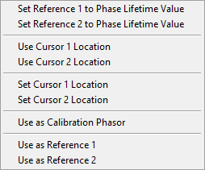

The two menu items ``Use Cursor n Location`` (*n* = 1 or 2) allow using the 
phasor value corresponding to the location of one of the two first cursors in 
the *Phasor Graph* (by default, none is present. They should thus be created for 
this approach to work). This will update the *Current Phasor* value.

Once one of the previous steps has been performed, the next step consists in 
specifying the *Calibration Lifetime* (at the top of the panel). For an IRF 
phasor, this value will typically be set to 0. For a single-lifetime sample, 
that lifetime should be entered.

The final step consists in instructing AlliGator that the *Current Phasor* is 
to be used as calibration phasor. This is done by using the fist *Phasor Graph* 
right-click menu item, ``Use Current Phasor as Calibration``:

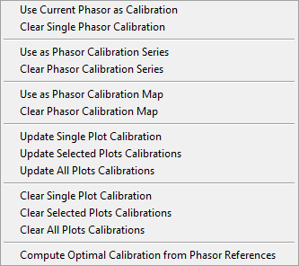

Once the calibration is defined, the corresponding status indicator (second 
green LED at the bottom right of the AlliGator window) will light up.

To use the newly defined calibration, select *Calibration Type*: 
``Single Phasor``. The orange LED next to the status indicator will light up, 
indicating that this calibration is now used (and will be for future 
calculations).

As mentioned, it is possible to enter an arbitrary phasor value in the *Current 
Phasor* control. An alternative way to use this phasor as a calibration is to 
right-click its label and choose ``Use as Calibration Phasor``. 

Once a new calibration is defined, and the *Calibration Type* control is set to 
``Single Phasor``, subsequent phasors will be calibrated using this new 
calibration phasor. However, already computed phasors (potentially calibrated 
with different calibration phasors or methods) will **not** be recalibrated.

To recalibrate a specific phasor plot within the *Phasor Graph*, right-click on 
its name in the *Phasor Graph* legend and select 
``Phasor Calibration:Update Single Plot Calibration``. Selected plots or all 
plots can be recalibrated similarly by using either 
``Phasor Calibration:Update Selected Plots Calibration`` or 
``Phasor Calibration:Update All Plots Calibration``.

As visible on the shortcut menu shown above, it is also possible to clear a 
previously applied calibration (effectively reverting to an uncalibrated plot), 
using ``Phasor Calibration:Clear Single Plot Calibration``. Similar operations 
can be applied to selected or all plots using the corresponding menu items.

It is possible to load or save a single phasor calibration using the following 
(main menu bar) ``Calibration:Single Phasor Calibration`` menu items:

- ``Save Single Phasor Calibration``: saves the current single phasor 
  calibration to a file. The file extension is automatically set to .cal.
- ``Load Single Phasor Calibration``: loads a single phasor calibration from a 
  .cal file.

Note: A phasor calibration file includes the phasor value, the calibration 
lifetime and phasor frequency. Trying to load a single phasor calibration saved 
with a different phasor frequency than the currently defined one will result in
a warning dialog box offering the option to cancel or overwrite the current 
phasor frequency with that stored in the calibration file.

3. Defining a phasor calibration series
---------------------------------------

For dataset series, it is possible to define a series of calibration phasors 
using a phasor plot containing more than one phasor value. Ideally, the number 
of phasors in the phasor plot should be equal to the number of dataset in the 
series, but this is not necessary.

Once the raw (or uncalibrated) phasor plot (computed with the correct frequency) 
is stored in the *Phasor Graph* , make sure that the *Calibration Lifetime* is 
correct, select the plot in the graph's legend and right-click 
``Phasor Calibration:Use as Phasor Calibration Series``. The third top status 
LED (*Phasor Calibration Series Defined*) lights up green.

This calibration series can be saved from the top ``Analysis`` menu using 
``Phasor Calibration Series:Save Phasor Calibration Series``.

As for the single phasor calibration, in order for it to take effect, the 
*Calibration Type* pull-down list needs to be modified to show ``Phasor Series``.

To recalibrate a specific phasor plot within the *Phasor Graph*, right-click on 
its name in the *Phasor Graph* legend and select 
``Phasor Calibration:Update Single Plot Calibration``. Selected plots or all 
plots can be recalibrated similarly by using either 
``Phasor Calibration:Update Selected Plots Calibration`` or 
``Phasor Calibration:Update All Plots Calibration``. This is not different than 
what is done when using a single phasor calibration, except that the different 
phasor plots are treated as series and each phasor is calibrated using the 
corresponding phasor in the phasor calibration series.

As before, it is also possible to clear a previously applied calibration 
(effectively reverting to an uncalibrated plot), using 
``Phasor Calibration:Clear Single Plot Calibration``. Similar operations 
can be applied to selected or all plots using the corresponding menu items.

4. Defining a phasor calibration map
------------------------------------

To account for variability in the response of individual pixels in the image, 
location-dependent phasor calibration must be implemented. AlliGator supports 
"phasor calibration maps", which are arrays of calibration phasors associated 
with their own individual ROIs. At the maximum level of precision, each pixel 
in the image is associated with a calibration phasor, but this is not always 
achievable neither necessary.

A phasor calibration map can consist in phasors calculated over square ROIs 
forming a grid covering the whole image: this enables increased signal-to-noise 
ratio for the individual ROI phasors as well as decreases the memory footprint 
of the map. When using such a coarse-grained phasor calibration map, each pixel's 
phasor is first paired with the closest ROI in the map, and the corresponding 
calibration phasor used.

To generate such a phasor calibration map, simply define a series of ROIs in the 
*Source Image* of a calibration sample and compute their (raw or uncalibrated) 
phasors using the Analysis menu item ``FLI Dataset:Multiple ROIs 
Analysis:All ROIs Phasor Analysis:Non-Interactive (Fast)``.

Making sure that the *Calibration Lifetime* is correct, select the resulting 
phasor plot in the *Phasor Graph* and define it as the phasor calibration map 
using the right-click menu item
``Phasor Calibration:Use as Phasor Calibration Map``. The fourth top status 
LED (*Phasor Calibration Map Defined*) lights up green.

This calibration map can be saved (as a .calM file) from the top ``Analysis`` 
menu using ``Phasor Calibration Map:Save Phasor Calibration Map``.

As for the other calibration types, in order for it to take effect, the 
*Calibration Type* pull-down list needs to be modified to show ``Phasor Map``.

To recalibrate a specific phasor plot within the *Phasor Graph*, right-click on 
its name in the *Phasor Graph* legend and select 
``Phasor Calibration:Update Single Plot Calibration``. Selected plots or all 
plots can be recalibrated similarly by using either 
``Phasor Calibration:Update Selected Plots Calibration`` or 
``Phasor Calibration:Update All Plots Calibration``. This is not different than 
what is done when using a single phasor calibration.

As before, it is also possible to clear a previously applied calibration 
(effectively reverting to an uncalibrated plot), using 
``Phasor Calibration:Clear Single Plot Calibration``. Similar operations 
can be applied to selected or all plots using the corresponding menu items.

Phasor Ratio References
+++++++++++++++++++++++

.. _phasor-ratio-introduction:

1. Introduction
---------------

Phasor ratio analysis consists in measuring the relative distance of a phasor of 
interest to two other so-called *reference* phasors. More details can be found 
in refs. [KC18]_ and [JS22]_. In case these two reference phasors 
correspond to single-exponential decays, the phasor ratio is theoretically 
identical to the intensity fraction of the first reference.

Specifically, if the decay can be written (after deconvolution and baseline 
subtraction) as:

.. math:: F(t) = A_1 \exp{(-\frac{t}{\tau_1})}+A_2 \exp{(-\frac{t}{\tau_2})}
  :label: eq:Ft_Amp

or equivalently:

.. math:: F(t) = \frac{N_1}{\tau_1} \exp{(-\frac{t}{\tau_1})} + 
   \frac{N_2}{\tau_2} \exp{(-\frac{t}{\tau_2})}
  :label: eq:Ft_Int

where :math:`N_i = A_i \tau_i`. The amplitude fractions :math:`\alpha_i = 
\frac{A_i}{A_1+A_2}` are related to the intensity fractions :math:`f_i = 
\frac{N_i}{N_1+N_2}` by:

.. math:: \alpha_i = \frac{f_i/\tau_i}{f_1/\tau_1+f_2/\tau_2}
  :label: eq:alpha_f
  
and:

.. math:: f_i = \frac{\alpha_i\tau_i}{\alpha_1\tau_1+\alpha_2\tau_2}
  :label: eq:f_alpha

The phasor ratio :math:`f_1` requires two reference phasors to be computed. 
Reference phasors will appear as a green dot (reference 1) and a red dot 
(reference 2) in the *Phasor Graph* (and the *Phasor Plot* in the **Phasor 
Plot** panel, as discussed in the corresponding manual page). Their phase 
lifetimes are displayed in the *Phase Lifetime 1* and *Phase Lifetime 2* 
indicators on the right of the *Phasor Graph*. If the reference phasors are on 
the UC, these phase lifetimes are identical to the actual lifetimes of each 
reference.

The corresponding status LEDs will light up (bottom right of the panel):

- *Phasor Ratio Reference 1 Defined*
- *Phasor Ratio Lifetime Reference 1 Defined*
- *Phasor Ratio Reference 2 Defined*
- *Phasor Ratio Lifetime Reference 2 Defined*

The convention used in AlliGator is to convert the phasor ratio into an average 
lifetime based on user-provided lifetimes for phasor references 1 and 2, 
regardless of whether the reference phasors are located on the UC. This allows 
defining reference phasors that are "close to" the UC and making the assumption 
that their average lifetime is close to the that of the nearby single-exponential 
decays. In that case, it can be shown that the convention used in AlliGator 
provides the correct amplitude-averaged lifetime.

To provide a phasor reference lifetime, simply type in a value in the 
*Calibration Lifetime* control in the **Phasor Graph** panel and right-click it 
to select either of the two following menu items:

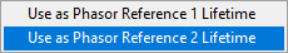

2. Loading/Saving Phasor Ratio References
-----------------------------------------

To load one or two references from a reference XML file (``.ref`` extension), 
use the ``Load Reference(s)`` function of the *Phasor Graph* (or the same menu 
of the *Phasor Plot* in the **Phasor Plot** panel).

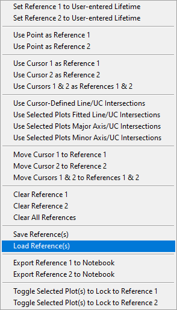

A dialog window will open allowing to select one or both references stored in 
the file. If the references were defined with a different harmonic frequency, 
another dialog window will ask whether to update the references for the new 
harmonic frequency.

Existing references can be saved to disk individually or as a pair using the 
corresponding use ``Save Reference(s)`` function of the ``Phasor Ratio 
References`` contextual menu.

3. User-picked Reference
------------------------

To define *Reference* 1 or 2, based on *existing* phasors represented in the 
*Phasor Graph*, right-click on (or close to) the selected point and use the 
corresponding menu item (``Use Point as Reference 1`` or ``Use Point as 
Reference 2``).

Alternatively, it is possible to define UC-located references using the 
following *Phasor Graph* contextual menu functions:

- ``Set Reference 1 to User-entered Reference Lifetime``
- ``Set Reference 2 to User-entered Reference Lifetime``

These functions will open a dialog window through which to enter the desired 
reference lifetime:

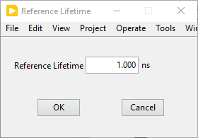

4. Current Phasor as Reference
------------------------------

Another way to define reference phasors is by using the *Current Phasor* 
control's shortcut menu functions (right-click on the *Current Phasor* label):

- ``Use as Reference 1``
- ``Use as Reference 2``

In that case, the reference phasor is not necessarily located on the UC.

Alternatively, it is also possible use the displayed *Phase Lifetime* as the 
reference lifetime using the following functions:

- ``Set Reference 1 to Phase Lifetime Value``
- ``Set Reference 2 to Phase Lifetime Value``

In that case, the reference phasor is the single-exponential decay with lifetime 
equalt to the *Current Phasor*'s phase lifetime. Using these functions *will 
update* the *Current Phasor* to that of the single-exponential decay.

5. Cursor Location as Reference
-------------------------------

To use the current position of one of the cursors as reference, use the 
*Current Phasor* control's shortcut menu functions:

- ``Use Cursor 1 as Reference 1``
- ``Use Cursor 2 as Reference 2``
- ``Use Cursors 1 & 2 as References 1 & 2``

In that case, the reference phasor is not necessarily located on the UC.

6. Cursor-Defined Line/UC Intersection
--------------------------------------

It is possible to use two cursors to define references corresponding to the 
intersection of the line connecting these two cursors and the UC. This is 
achieved using the ``Use Cursor-Defined Line/UC Intersection`` context menu 
function of the *Phasor Graph*.

To show the line connecting the two cursors (as a guide for the eyes), check 
off the *Show Line* checkbox located below the *Phasor Graph*.

7. Selected Plots Fitted Line/UC Intersection
---------------------------------------------

Another way to define references is by fitting a line through the phasors of 
selected plots (for instance corresponding to different samples comprised of 
different mixtures of two single-exponentially decaying species) and using its
intersections with the UC as references. This is achieved with the ``Use 
Selected Plots Fitted Line/UC Intersection`` context menu function of the 
*Phasor Graph*.

8. Selected Plots Major or Minor Axis/UC Intersection
-----------------------------------------------------

The previous approach is fairly sensitive to outliers and give equal weight to 
all phasors in the selected plots. An alternative method that weights phasors 
according to the square of their distance to the final line is using the axes 
of inertia (major and minor) of the phasor scatter plot consisting of all the 
phasors in the selected phasor plots. Use either one of the following two 
context menu functions to achieve this:

- ``Use Selected Plots Major Axis/UC Intersection``
- ``Use Selected Plots Minor Axis/UC Intersection``

9. Clearing References
----------------------

To clear the reference phasors from memory, use the following *Phasor Graph* 
context menu items:

- ``Clear Reference 1``
- ``Clear Reference 2``
- ``Clear All References``

Clearing references result in some calculations being skipped when processing 
datasets (such as phasor ratio or average lifetime calculations).

Phasor Ratio Line
+++++++++++++++++

As mentioned earlier, the *Show Line* checkbox toggles the display of the line
connecting the first two cursors defined in the *Phasor Graph* (their 
coordinates are displayed in the lower right box below the graph).

By setting the references to correspond to these cursors' locations, one can 
get an idea of limiting values of phasors in a series of data points aligned 
along an approximately straight direction, by checking the *Phase Lifetime 1* 
nd *Phase Lifetime 2* indicators. While this does not guarantee that 
the experimental phasors are a linear combination of these two limiting values, 
it might be a valid hypothesis.

Next, it is possible to use one of the different functions discussed above to 
obtain less subjectives reference locations (*e.g.* ``Use Selected Plots Major 
Axis/UC Intersection``).

.. _shot-noise-limited-SDV:

Shot Noise-limited Standard Deviations
++++++++++++++++++++++++++++++++++++++

To estimate the effect of the signal-to-noise ratio (SNR) on phasor-related 
quantities, AlliGator offers the option to simulate decays *similar* to the one 
computed experimentally, by replacing each bin value :math:`F_i` by a random 
number drawn from the Poisson distribution with mean :math:`F_i`. The phasor 
(and related quantities) of the simulated decay replica are then computed, and 
the simulation is repeated a number *R* times before the average and sandard 
deviation of the phasor and derived quantities are computed. These quantities 
are displayed in the *Current Phasor* and sent to the Notebook, and kept in 
memory for future use (see next section).

To turn on this optional calculation (which has a computational cost, due to 
*R* times repetition of the phasor computation, as well as the simulation of 
decay replicas), check off the *Compute Estimated SDV* checkbox of the *Phasor 
SDV Options* cluster in the **Settings:Phasor Graph** panel:

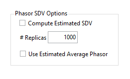

The number of replicas *R* (*# Replicas*) can be adjusted to improve accuracy, 
but increasing it will increase the computational cost. The default value of 
1000 appears to be appropriate in most cases. The final *Use Estimated Average 
Phasor* option, allows chosing between using the experimental phasor (and its 
derived quantities) or the average of the replicas' phasors, when checked off. 
In practice, there appears to be very little difference between the two in most 
cases.

For further information, check the :ref:`alligator-shot-noise-influence-average-lifetime` 
page of the manual.

.. _exporting-additional-phasor-quantities:

Exporting Additional Phasor Quantities
++++++++++++++++++++++++++++++++++++++

Defining phasor ratio references automatically results in the computation of a 
phasor ratio for each new phasor, as well as an average lifetime based on the 
two reference lifetimes and the fraction (aka phasor ratio) of each of the two 
corresponding references the decay is comprised of.

There are two type of ratios: an *amplitude ratio* (equal to 
:math:`\alpha_1` as defined in Section :ref:`phasor-ratio-introduction`) and an 
*intensity ratio* (equal to :math:`f_1`, also defined in Section 
::ref:`phasor-ratio-introduction`).

Associated with these ratios are average lifetimes, corresponding to two 
different definitions of the average lifetime in standard TCSPC analysis. An 
*amplitude-average lifetime* defined by:

.. math:: <\tau>_a = \sum{\alpha_i \tau_i} = \frac{\sum{f_i}}{\sum{f_i/\tau_i}}
  :label: eq:tau_a

and an *intensity-averaged lifetime* defined by:

.. math:: <\tau>_i = \sum{f_i \tau_i} = \frac{\sum{\alpha_i 
   \tau_i^2}}{\sum{\alpha_i \tau_i}}
  :label: eq:tau_i

The selection of one or the other is done in the **Settings:Phasor Graph** 
panel, using the *Phasor Ratio Type* radio button with the following options:

- ``Intensity-weighted``
- ``Amplitude-weighted``

These quantities, as well as their standard deviations if available (see above 
discussion) can be exported as a tabulated list using the ``Export Add'l Phasor 
Plots Data (ASCII)`` menu with the following options:

- ``Export Single Phasor Plot Data``
- ``Export Selected Phasor Plots Data``
- ``Export All Phasor Plots Data``

These functions open the following selection dialog window:

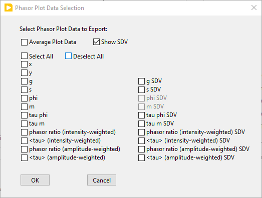

allowing the selection of which parameters to export.

Phasor Math
+++++++++++

The ``Phasor Math`` contextual menu gives access to two distinct type of 
functions:

- ``Compute Average Phasor (Single Plot)``
- ``Compute Average Phasor (Selected Plots)``

one one hand, and:

- ``Phasor Multiplication``

1. Average Phasor
-----------------

The ``Compute Average Phasor...`` functions do what their name indicate and the 
result is displayed in the *Current Phasor* control as well as sent to the 
Notebook.

2. Phasor Multiplication
------------------------

The ``Phasor Multiplication`` function opens the following dialog window:

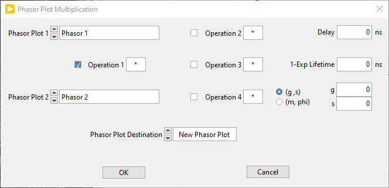

which allows selecting up to two phasor plots from the *Phasor Graph* (*Phasor 
Plot 1* and *Phasor Plot 2*) and define phasors corresponding to:

- a time delay (*Delay* control)
- single-exponential decay (*1-Exp Lifetime*)
- a set of phasor coordinates (either *(g,s)* or *(m,phi)*)

These different phasors can be multiplied or divided by checking off the 
corresponding *Operation n* checkboxes and specifying whether the corresponding 
phasor should be multiplied to (*) or divided from (*/*) the first phasor plot.

The result can be exported to the *Phasor Graph* as a new plot or replace one of 
the two plots involved in the calculation.

This tool can for instance be used to apply a correction to a phasor (including 
a calibration, which amounts to a multiplication by a phasor).

Computing a phasor ratio and its associated average lifetime
++++++++++++++++++++++++++++++++++++++++++++++++++++++++++++

Once phasor references have been defined, it is possible to compute the phasor 
ratio of any point in the *Phasor Graph*. The selected average lifetime is then 
automatically computed, and added to the *Lifetime & Other Parameters* graph of 
the **Lifetime & Other Parameters** panel.

The ``Phasor Ratio Calculation`` right-click menu:

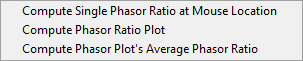

gives access to three functions:

- ``Compute Single Phasor at Mouse Location``: processes the phasor at the 
  selected data point (the phasor is a computed one, closest to the mouse 
  location).
- ``Compute Phasor Ratio Plot``
- ``Compute Phasor Plot's Average Phasor Ratio``

In the interactive mode (``Compute Single Phasor Ratio at Mouse Location``), 
the calculated phasor ratio is added to the last plot created in the *Phasor 
Ratio* graph in the **Phasor Ratio** panel. To create a new (empty) plot in the 
*Phasor Ratio* graph, use the ``New Plot`` function of that graph. A new 
(empty) plot will automatically be added to the *Lifetime & Other Parameters* 
graph of the **Lifetime & Other Parameters** panel. Alternatively, create a new 
plot in the *Lifetime & Other Parameters* graph of the **Lifetime & Other 
Parameters** panel., which will automatically create a new plot in the *Phasor 
Ratio* graph.

The-``Compute Phasor Plot`` computes the phasor ration of each phasoe in the 
plot. A new plot is automatically created in both the *Phasor Ratio* graph and 
the *Lifetime & Other Parameters* graph.

The ``Average Phasor Ratio`` function does what its name indicates.

Parameter 2 vs Parameter 1 Scatterplot
++++++++++++++++++++++++++++++++++++++

The ``Parameter 2 vs Parameter 1 Scatterplot`` menu functions apply to 
a single plot, the selected plots or all plots (excluding the UC) depending on 
which item is selected. Selecting one of them opens up the following window:

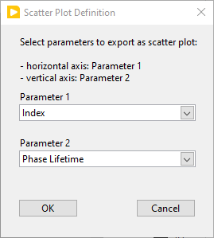

The two *Parameter n* drop-down list contain the following parameters:

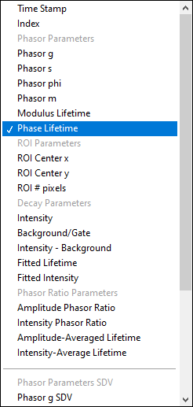

which allows defining which parameter to plot versus the other (Parameter 1: 
abscissa or horizontal, Parameter 2: ordinate or vertical axis). The supported 
parameter list is as follows:

- ``Index``: index of the phasor point in the phasor plot (starting at 0).
- ``Phasor g`` & ``Phasor s``: phasor coordinates.
- ``Phasor phi`` & ``Phasor m``: phasor phase and modulus.
- ``Modulus Lifetime``: :math:`\tau_m`.
- ``Phase Lifetime``: :math:`\tau_{\phi}`.
- ``ROI Center x`` & ``ROI Center y``: ROI center coordinates.
- ``ROI # pixels``: number of pixels in the ROI.
- ``Intensity``: sum of all gates in the decay.
- ``Background/Gate``: when the *Background Subtraction* checkbox in the 
  **Settings:Fluorescence Decay:Decay Pre-Processing** panel is checked off, 
  this corresponds to the user-provided or calculated background per gate.
- ``Intensity - Background``: difference between the ``Intensity`` parameter and 
  the sum over all gates of the ``Background/Gate`` parameter.
- ``Fitted Lifetime``: when the background subtraction method is ``Square-Gated 
  Single Exponential``, this is the fitted lifetime.
- ''Fitted Intensity``: when the background subtraction method is ``Square-Gated 
  Single Exponential``, this is the fitted intensity.
- ``Amplitude Phasor Ratio``: :math:`\alpha_1` defined in Section 
  :ref:`phasor-ratio-introduction`
- ''Intensity Phasor Ratio``: :math:`f_1` defined in Section 
  :ref:`phasor-ratio-introduction`
- ``Amplitude-Averaged Lifetime``: :math:`<\tau>_a`.
- ``Intensity-Averaged Lifetime``: :math:`<\tau>_i`.

If the ``Selected Plots`` or ``All Plots`` items are selected, there are as many 
such scatter plots generated as (selected) phasor plots.

Compute Multiple Average Phasors & Derived Quantities
+++++++++++++++++++++++++++++++++++++++++++++++++++++

This menu's scripts are intented to be used in combination with the ``Multi-ROIs 
Single-Pixel Phasor Analysis`` script (``Analysis:FLI Dataset:Multi ROIs 
Single-Pixel Analysis Scripts`` menu). That latter script indeed generates *N* 
phasor plots (where *N* is the number of ROIs), each comprised of :math:`n_i` 
phasors each, where :math:`n_i` is the number of pixels in ROI *i*.

The scripts computes the average phasor (g, s) (which is only used internally), 
amplitude (:math:`a_1`) and intensity (:math:`f_1`) phasor ratios, phase 
(:math:`\tau_{\phi}`) and modulus (:math:`\tau_{m}`) lifetimes, 
amplitude-average (:math:`<\tau>_a`) and intensity-averaged (:math:`<\tau>_i`) 
lifetimes and the standard deviations of all these quantities, which are sent 
to the *Lifetime & Other Parameters* graph of the **Lifetime & Other 
Parameters** panel as scatterplots vs the ROI number. This applies to a single 
plot, the selected plots or all plots (excluding the UC) depending on which 
item is selected in the menu.

Note on the Phase Lifetime vs Total Intensity/Background-Subtracted Intensity/Background/Fitted Lifetime/Amplitude functions
++++++++++++++++++++++++++++++++++++++++++++++++++++++++++++++++++++++++++++++++++++++++++++++++++++++++++++++++++++++++++++

As discussed in the **Background Subtraction** section of the **Decay 
Pre-Processing** page of the manual, background subtraction from decays results 
in a number of derived parameters (depending on the method used):

- Background per Gate (B)
- Amplitude (A) also equal to the theoretical Background-Subtracted Intensity
- Lifetime (:math:`\tau_{fit}`)

Additionally, each decay is associated with the total intensity (I) in the 
corresponding ROI.

The ``Phase Lifetime vs Total Intensity`` menu item used to allow plotting the 
:math:`(\tau, I)` pairs for all phasor points in a phasor plot. The resulting 
scatter plot was represented in the *Lifetime & Other Parameters* graph of the 
**Lifetime & Other Parameters** panel.

Similarly, the ``Phase Lifetime vs Background-Subtracted Intensity`` menu item 
allowed plotting the :math:`(\tau, I-B \times G)` pairs for all phasor points 
in a phasor plot (G: number of gates), while the ``Phase Lifetime vs Background`` 
menu item allowed plotting the :math:`(\tau, B)` pairs.

These menu items are now superseded by the ``Parameter 2 vs Parameter 1 
Scatterplot`` function.