.. _alligator-phasor-plot-panel:

Phasor Plot Panel
=================

The *Phasor Plot* image of the **Phasor Plot** panel represents the phasors of 
all valid pixels as a color-coded map (a 2-dimensional histogram) as ahown 
below. Valid pixels are those whose decay meet the conditions defined in the 
**Settings:Source Image* panel, as well as belong to allowed ROIs as defined in 
the **Settings:Phasor Plot** panel.

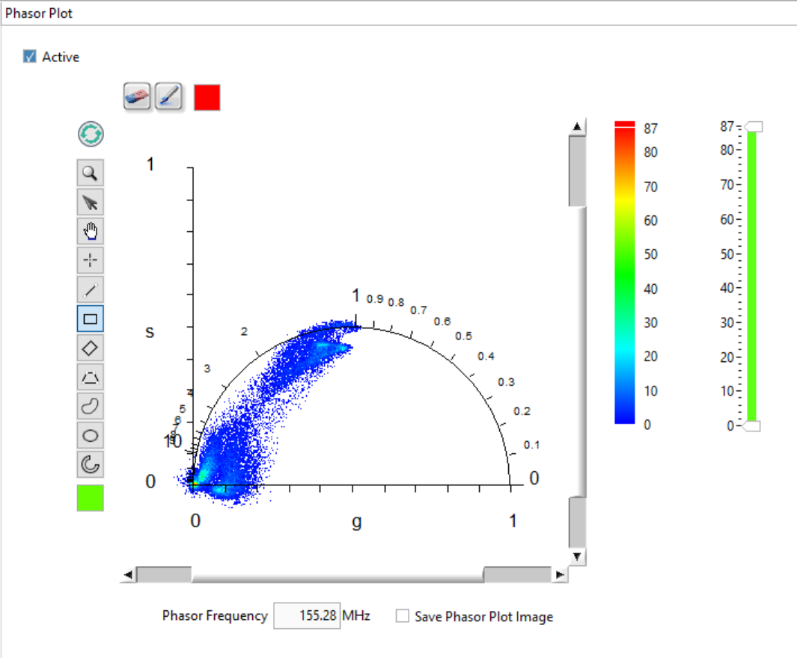

The *Phasor Frequency* control, located below 
the *Phasor Plot*, allows selecting which phasor frequency is used when 
computing the phasor plot. This value is common to all panels in AlliGator and 
can be also set on the **Phasor Graph** panel or in the **Settings** window. 
The right-click menu for the *Phasor Frequency* control allows choosing a 
"natural" phasor frequency (or harmonic) based on the laser period T or the 
decay span D:

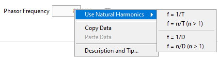

The first item using the base frequency f = 1/T, while the second allows 
selecting a different multiple. The other two options use D instead of T.

The phasor plot is calculated from the loaded dataset and is controlled by a 
number of dataset-independent parameters (described below), some of which are 
found in the **Settings:Phasor Plot** panel, but some others in the 
**Settings:Fluorescence Decay:Decay Pre-Processing** panel or the 
**Settings:Phasor Graph** panel.

Each time a new dataset is loaded, or the same dataset is reloaded with 
different settings, or a parameter is modified that would affect the phasor 
plot, the *Phasor Plot Update Needed* red LED at the bottom right of AlliGator's 
main window lights up. If the parameters are restored to their original values 
used to compute the phasor plot (or when the phasor plot has just been 
computed), this :LED will turn off.

Phasor Plot Image Size, Aspect Ratio and Binning
++++++++++++++++++++++++++++++++++++++++++++++++

The *Phasor Plot* image features the g and s axis of a standard phasor plot, as 
well as the universal semicircle (UC, in blue in the image above).

It is possible to specify the size of the image (H and V in pixels) in the 
**Phasor Plot** panel of the **Settings** window (see the corresponding manual 
page) as well as the extra space represented on the left and right of the UC 
(the *Margin*, expressed in fraction of the size of the UC). Changing these 
parameters will require refreshing the plot using the *Refresh Phasor Plot* 
button on the top left of the *Phasor Plot*:

(Note that in newer versions of AlliGator, the GUI might look slightly 
different).

The image size has an effect on the resolution of the phasor plot. Given a 
*Margin* parameter m, a pixel represents (1 + 2m)/H units horizontally, and 
(1 + 2m)/V vertically. Therefore, in order to build a phasor plot with bin 
resolution b, given a margin m, a number of pixels H = (1 + 2m)/b should be 
chosen. For instance, with m = 0.2 and b = 0.005, H = 280.

Other options (shown below) include line style and colors, UC ticks and labels, 
etc.:

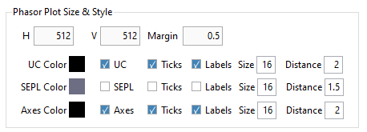

Finally, it is also possible to compute a smoothed phasor plot by defining a 
Phasor Plot *Bin* value b different from 1 (and odd) in the **Settings:Phasor 
Plot** panel:

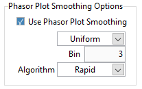

Each pixel's phasor is replaced by the average phasor obtained using b x b 
pixels centered around that pixel, using weights defined by the kernel type.

- ``Uniform`` kernel: the weight of all pixels is equal to 1.
- ``Bilinear`` kernel: the weight of each pixel decreases linearly from 1 at 
  the center down to zero for pixels outside the kernel, proportionally to its 
  distance from the center.
- ``Gaussian`` kernel: the weight of each pixels is proportional to a normal 
  distribution with standard deviation = b/3.

Smoothing the phasor plot is not recommended for data sets with good 
signal-to-noise ratio (SNR) or for in vivo datasets, as this operation 
artificially couples regions with potentially different lifetime 
characteristics and therefore creates artifacts ("bridges") in the phasor plot.

For instance, the phasor plot represented above will look as shown below when 
using a *Phasor Plot Bin* value of 3 (and a bilinear kernel).

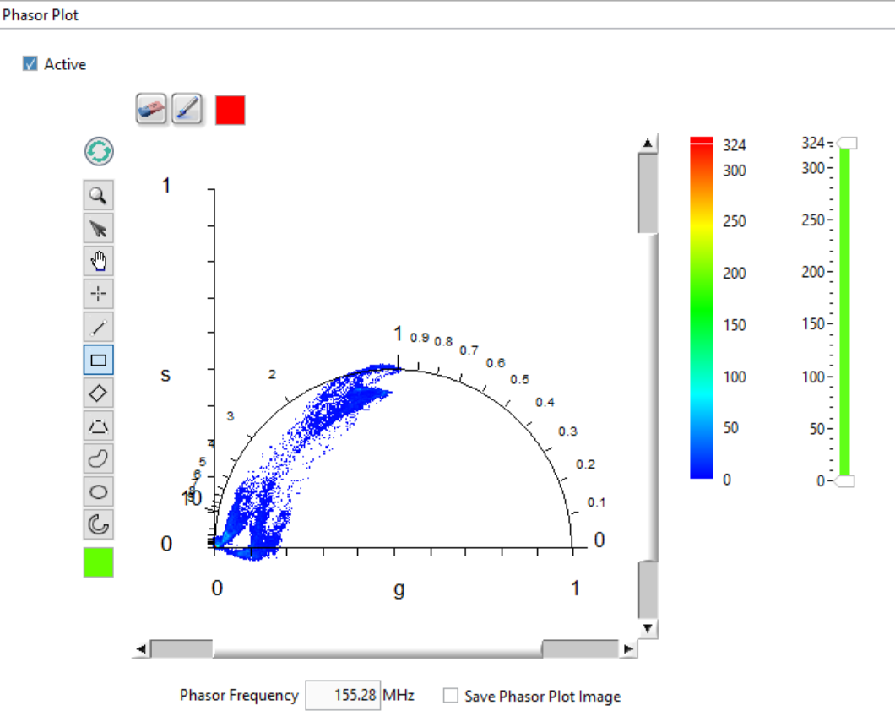

Remember to press the *Refresh Phasor Plot* button (top left corner of the 
image) to apply this new setting.

Note that the phasor plot image calculation takes some computational time and 
might not be useful during series analysis. In order to speed up analysis, 
it is therefore possible to skip this process by unchecking the *Active* 
checkbox at the top left corner of the panel.

Phasor Plot Settings and Controls
+++++++++++++++++++++++++++++++++

The *Phasor Plot* image uses the same settings used by the *Phasor Plot* graph 
(**Phasor Graph** panel). In particular, phasors are corrected by the same 
calibration phasor (or calibration phasor map), if one is defined and selected 
(``Single Phasor``/``Phasor  Series``/``Phasor Map`` options of the 
*Calibration Type* pull-down list in the **Phasor Graph** panel or in the 
**Settings:Phasor Calibration** panel).

For series analysis, each image's phasor plot image uses the corresponding 
calibration point of the calibration plot, if one has been defined and selected.

The controls on the right-hand side of the panel (*Phasor Plot Color Scale*, 
*Phasor Plot Display Range*) are used to control the appearance of the phasor 
plot image. The actual palette used for the phasor plot is selected via the 
image right-click menu, as explained in the :ref:`image-color-palette` section 
of the manual. Pixels with value outside the indicated range will be displayed 
with the *Low Color* or *High Color* shown at the bottom and top of the color 
scale, respectively.

The *Refresh Phasor Plot* button (recycle icon) at the top left corner of the 
image is used to refresh the *Phasor Plot* if one of the controlling parameters 
mentioned above has been modified. Note that the phasor plot will not be 
recalculated if none of the parameters influencing it have been modified.

Other settings can be found in the :ref:`alligator-settings-phasor-plot` of the 
**Settings** panel.

Phasor Indicator
++++++++++++++++

When the cursor is located in the image part of the *Phasor Plot*, and the 
``Shift`` key is pressed down, a *Phasor at Cursor* indicator is shown, 
indicating the phasor components at this location, as well as the phase and 
modulus lifetime, and when phasor ratio references are defined, the phasor ratio 
and average lifetime. This indicator is hidden when the cursor is not within the 
image display and the ``Shift`` key is not pressed down.

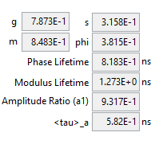

This is also true when the cursor is in the *Source Image* and the ``Shift`` key 
is pressed down. In this case, the phasor at the cursor location in the source 
image is indicated.

Highlighting Phasor ROIs in the Source Image
++++++++++++++++++++++++++++++++++++++++++++

The *Highlight Phasor ROI* button on the top left (pencil icon) is used in 
conjunction with the *Image Overlay Color* box to its right to highlight pixels 
in the *Source Image* corresponding to the selected region in the *Phasor Plot* 
and to show the selected ROI in the same color in the *Phasor Plot*.

To select a ROI in the *Phasor Plot*, use one of selection tools on the left 
hand side tool palette. The ROI will be overlayed in the selected color on the 
Phasor Plot and the corresponding pixels will be highlighted (painted) with the 
same color on the original image. Choosing a ``transparent color`` (T) will 
result in no overlay being added to the *Source Image*.

The image below shows an example where two different ROIs were selected 
successively and highlighted with different colors (pink and blue):

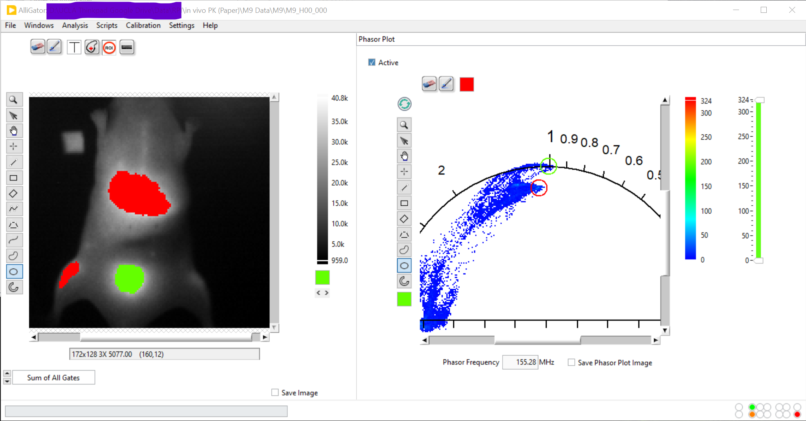

Note 1: The picture above corresponds to an older version of AlliGator.

Note 2: For best contrast, it is recommended to choose a ``Grayscale`` or 
``Temperature`` palette for the *Source Image*.

Pressing the *Refresh Phasor Plot* or the *Clear Phasor Overlay* (eraser icon) 
buttons clears the overayed ROI(s) in the *Phasor Plot*. The similar buttons in 
the *Source image* will erase its overlays.

Phasor Plot Context Menu
++++++++++++++++++++++++

The context menu of the Phasor Plot image is shown below:

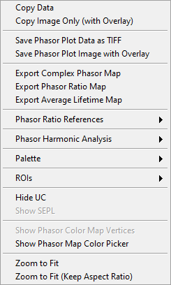

This menu functions in the same manner as that of the *Source Image*.
See the :ref:`source-image-context-menu` section of the manual for further 
details.

Some functions are specific to the *Phasor Plot* and are described below.

Saving the Phasor Plot Image
----------------------------

- Save Phasor Plot Data as TIFF: This will save the 2-dimensional histogram 
  shown in the *Phasor Plot* image as a TIFF image in the same way as the 
  *Source Image* context menu function does.

- Save Phasor Image with Overlay: While it is possible to right-click on the 
  *Phasor Plot* and use the ``Copy Data`` menu item to copy the phasor plot 
  image object to the clipboard, this includes the object's frame and tool 
  palette, which are of little use. The context menu offers an alternative in 
  the form of the ``Save Phasor Image with Overlay`` function. This function 
  saves the visible part of the phasor plot (e.g. if the plot was zoomed in), 
  including overlays, as a file with format specified by the *Saved Image File 
  Format* control in the **Settings:Miscellaenous** panel. The file can be of 
  type PNG, JPEG or BMP. The name of the file is *Phasor Plot Name.XXX* where 
  "XXX" is the file format and "Name" is the folder containing the current data 
  set folder (for Gate Image Folder) or current data set name.

  In addition, it is possible to automatically save the *Phasor Plot* image 
  after it has been computed, by checking the *Save Phasor Plot* checkbox. This 
  is particularly useful during a series analysis, and an animated sequence 
  needs to be created for presentation purposes.

Export Complex Phasor Map
-------------------------

The complex phasor data (H x V matrix) calculated to form the phasor plot can 
be saved using the right-click menu ``Export Complex Phasor Map``.
This will save an ASCII file (comma separated values) with H columns and V 
lines of complex g + i s phasor values, where H x V is the image dimension.
Phasors that were not computed (due the selected settings are replaced by 
NaN + i NaN.

Export Phasor Ratio Map
-----------------------

When phasor ratio references are provided *and* the phasor ratio has been 
overlayed on the *Source Image*, the corresponding phasor ratio map can be 
exported to an ASCII file using the ``Export Phasor Ratio Map`` shortcut menu.

Export Complex Phasor Map
-------------------------

When phasor ratio references are provided *and* the average lifetime has been 
overlayed on the *Source Image*, the corresponding average lifetime map can be 
exported to an ASCII file using the ``Export Average Lifetime Map`` shortcut 
menu.

Defining Phasor Ratio References in the Phasor Plot
---------------------------------------------------

To define phasor ratio references, the *Phasor Plot* offers similar 
functionalities to those of the *Phasor Graph* (see the **Phasor Graph** panel
manual page for details), with the difference that the analysis involves all 
the phasors contributing to the phasor plot, which can potentially include all 
pixels of the source image. This can in particular result in outliers 
contributing excessively to the calculation of a fitted line or the major/minor 
axes of the phasor plot. In short, it is not recommended to use the phasor plot 
tools to define references, if it can be done within the *Phasor Graph*.

When the two references are defined and the ``Show References`` item of the 
``Phasor Ratio References`` menu is checked, the two references are shown on 
the *Phasor Plot* (and *Phasor Graph*), as well as an oval region around them 
encompassing the region of the phasor plot used for subsequent analyses. The 
characteristics of the references dots and the oval region can be set in the 
**Settings:Phasor Plot** panel.

There are two *Phasor Plot*-specific approaches to define references:

- Manual Definition: One of the potentially useful tool present in the *Phasor 
  Plot* is the ability to use the mouse to define the location of both 
  reference 1 and reference 2. To do so, simply press the ``1`` or ``2`` key 
  while left-clicking the mouse. As long as the mouse right button is pressed 
  and the numerical key is held down, the mouse position will define the 
  corresponding reference's location. Releasing the mouse button or numerical 
  key "drops" the reference at that location.

  While one of the two numerical keys is pressed, a button with the 
  corresponding number shows up at the bottom of the *Phasor Plot* is shown.

- Segment Extremities: The ``Use Segment Extremities`` function of the 
  ``Phasor Ratio References`` menu allows using the line tool of the *Phasor 
  Plot* image to define the location of the two references. In that case, the 
  references are set to the segment's extremities.

Representing Phasor Ratio/Average Lifetime/User-defined Quantities as a Color Map in the Source Image
+++++++++++++++++++++++++++++++++++++++++++++++++++++++++++++++++++++++++++++++++++++++++++++++++++++

The phasor ratio can be used to color-code pixels in the *Source Image*, 
creating a "Phasor Ratio Map". This requires switching the *Overlay Mode* 
pull-down icon list to ``Phasor Ratio``.

Derived quantities such as the average 
lifetime or even unrelated quantities such as user-defined quantities can also 
be used instead of the phasor ratio. Which quantity is mapped and how it is 
mapped is defined in the **Phasor Plot** panel of the Settings window described 
next.

To hide the phasor ratio overlay in the *Source Image*, simply refresh the 
*Source Image*.

Note: Highlighting ROIs defined in the Phasor Plot in the Source Image doesn't 
work when the Phasor Ratio Map is shown.

Color Map Style Options
-----------------------

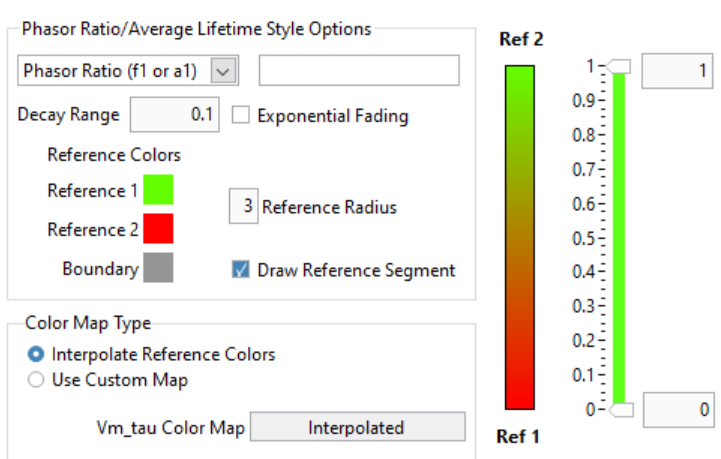

- *Displayed Quantity*: it is a pull-down list at the top left with 3 options:

  + ``Phasor Ratio (f1 or a1)``
  + ``Average Lifetime (<tau>_i or <tau>_a)``
  + ``User-Defined Quantity``

The nature of the phasor ratio (and hence of the average lifetime), *i.e.* 
intensity- or amplitude-averaged is specified by the *Phasor Ratio Type** radio 
button in the **Phasor Graph** panel of the **Settings** window.

- *User-Defined Quantity*: it is specified in the box next to the *Displayed 
  Quantity* pull-down list. Enter a valid quantity name, which can be either 
  an internal variable (f1, a1, tau_m, tau_phi, <tau>_i, <tau>_a) or a 
  user-defined quantity as found in the **Aliases Definitions** window (see below 
  for a description of this window).

- *Decay Range*: This sets the range of phasors around the phasor ratio references
  that are used to compute the color overlay. If the *Exponential Fading* 
  checkbox is not checked, the phasors kept for the color map are those within 
  *Decay Range* the segment connecting the two references. 
  If *Exponential Fading* is checked off, the intensity of the overlayed pixel 
  is multiplied by :math:`e^{-d/range}` where ``range`` is the value of *Decay 
  Range* and ``d`` is the  distance of the phasor to the segment connecting both 
  references.
  Any phasor beyond 3* *Decay Range* are ignored.

- *Reference Colors/Radius* and *Draw Reference Segment* are self-explanatory

- *Color Map Type* is a radio button allowing switching between:

  + ``Interpolate Reference Colors``: the *Reference Colors* are defined above
    and the resulting color map is shown on the right.
  + ``Use Custom Map``: used in conjunction with the *Color Map* pull-down list 
    below.

- *Color Map*: right-click on the indicator to reveal a list that offers 
  standard palettes as well as the option to select a Brewer palette. Once 
  selected, the resulting color scale is show to the right.

- *Color Scale*: reflects the user choices discussed previously.

- *Display Range*: used to limit the range of values over which the mapping is 
  effective. Values in between these the two sliders are those to which the 
  color scale is mapped.

Alias Definitions Window
------------------------

This window can be opened when right-clicking in the *User-Defined Quantity* 
box and selecting ``User-Defined Quantities List``:

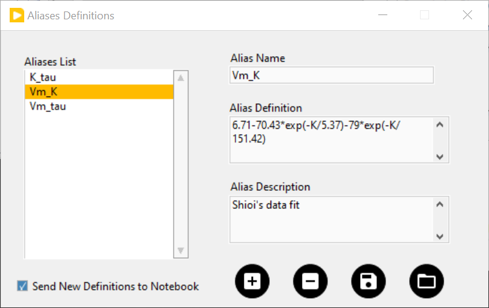

- The *Aliases List`` contains the user-defined quantities' names that can be 
  entered in the ``User-Defined Quantity`` box. The selected quantity's name is 
  reproduced in the *Alias Name* indicator to the right, which is also used to 
  enter the name of new quantities.

- The *Alias Definition* box contains the mathematical formula allowing 
  AlliGator to compute the user-defined quantity using any supported AlliGator 
  variable. The formula displayed in the above snapshot is therefore not usable 
  since the variable it uses (``K``) has no meaning in AlliGator.
  
- The *Alias Description* box is used to enter a short explanation of what the 
  formula is used for.
  
To **add** a new definition to the *Aliases List*, enter a *Name* (not already 
used and not an AlliGator variable), *Definition* and *Description* and click 
on the *Add/Modify Alias* ("+") button at the bottom right. The new name will 
appear at the bottom of the *Aliases List* (or replace an existing one if the 
name was already in the list). If the *Send New Definitions to Notebook* 
checkbox is checked, the corresponding name, definition and description will be 
sent to the Notebook.

To **remove** a definition, select it in the *Aliases List* and click in the 
*Remove Alias* ("-") button.

To *Save* the *Aliases List* (As an ASCII file), click on the *Save Aliases* 
(floppy disk) button. To **Load** an aliases list into the *Aliases List* 
control, click on the *Loas Aliases* (folder) button.

The window can be kept opened (or hidden) if needed. It won't prevent from using 
AlliGator.

Color-coding Phasors with a user-defined Color Map
++++++++++++++++++++++++++++++++++++++++++++++++++

The phasor plot can sometimes be complex to interpret. A additional tool to 
explore the location in the sample, of pixels characterized by different phasor 
values, is provided by the ``Phasor Color Map`` option of the *Source Image*'s 
*Overlay Mode* pull-down list:

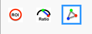

This option uses a color map defined by the user in the Phasor Color Map Picker window opened by right-clicking in the Phasor Plot and selecting the Phasor Color Map Picker menu item:

This opens the **Phasor Color Map Picker** window:

Phasor Color Map Picker window
------------------------------

This window shows an empty phasor plot with the universal circle, in which a 
polygon can be defined by adding or deleting cursors in the right-hand table 
(minimum number of vertices: 3, no maximum number). The polygon's interior is 
colored according to the vertices colors (defined by the cursors' colors) and 
the Decay Range Exponent parameter. A large exponent will tend to result in 
sharp boundaries between colored zones, while a small value will tend to blur 
these boundaries. Negative values of the exponent can also be used for 
interesting effects.

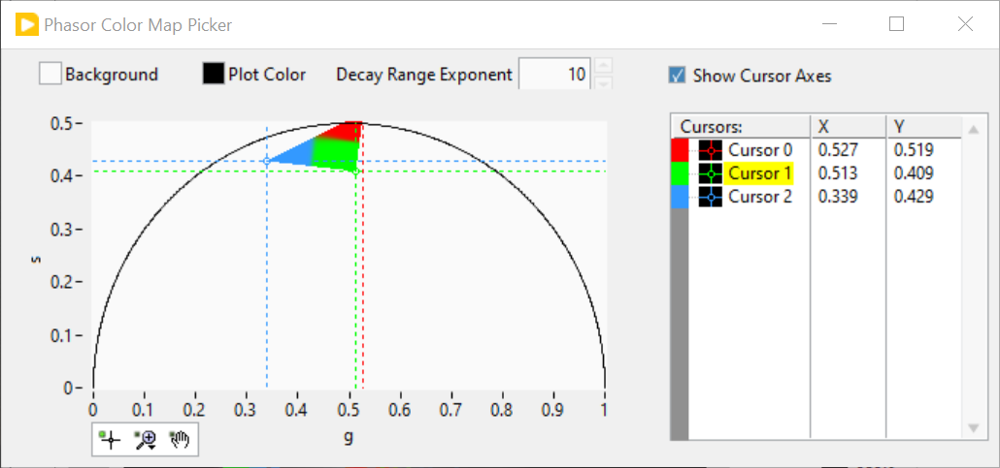

By checking the ``Show Phasor Color Map Vertices`` in the *Phasor Plot* context 
menu, the same polygon is represented as an overlay (without the color map) in 
the Phasor Plot:

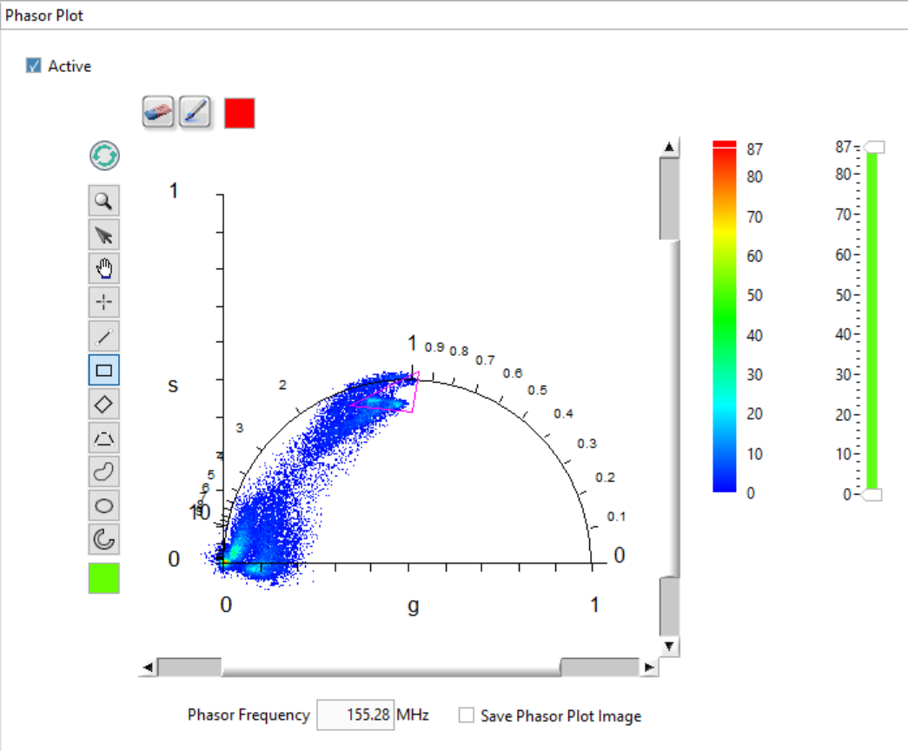

This allows positioning the polygon's vertices in the **Phasor Color Map Picker** 
window where needed in the *Phasor Plot*.

As the user adjusts the polygon (vertices number, colors and locations), the 
color map is overlayed on the *Source Image*:

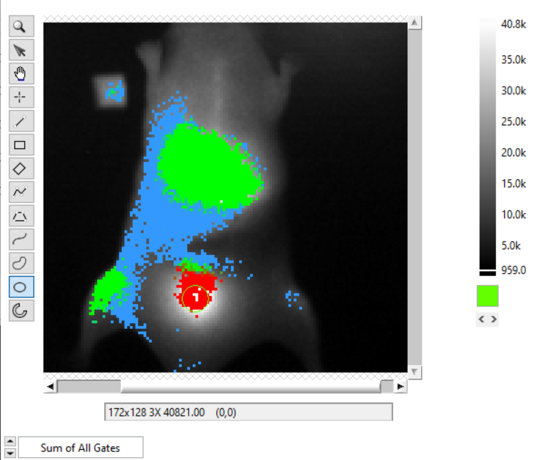

The *Phasor Color Map Picker* window can be resized, and the color map saved and 
reloaded for future use using the right-click menu:

- ``Save Color Map``
- ``Load Color Map``

The file extension is automatically set to ``.col``. 