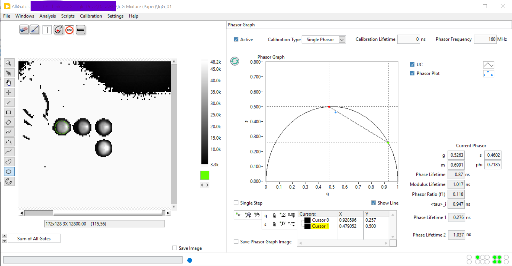
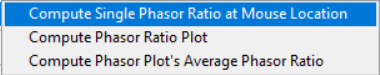
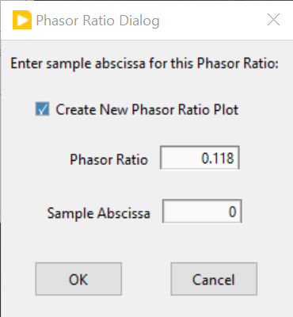

.. _alligator-phasor-ratio-panel:

Phasor Ratio Panel
==================

Introduction
++++++++++++

Phasor ratio analysis is a simple way to quantify the respective contribution 
of two species to a fluorescence signal, *which is known to be a mixture of 
these two species*. The last, emphasized part of this sentence is critical: 
while it is always possible to compute a phasor ratio given two references, 
there is no guarantee that the underlying decay is a linear combination of the 
two decays the references are the phasors of.

It involves defining two "reference" phasor points (check the 
:ref:`alligator-phasor-graph-panel` manual page or the 
:ref:`alligator-phasor-plot-panel` manual page to learn how to define phasor 
ratio references) and computing the fractional distance of the phasor of 
interest to one of these two references.

Loosely speaking, a phasor ratio equal to 0 corresponds to a sample identical 
to *Reference 1* and a phasor ratio equal to 1 corresponds to a sample 
identical to *Reference 2*. More precisely, the phasor ratio is computed after 
orthogonal projection of the phasor to the segment connecting the two references. 
In this sense, a phasor ratio of 0 is obtained for all phasors on the line 
passing through reference 1 and perpendicular  to the segment connecting both 
references. More details on the definition of the phasor ratio can be found in 
the literature [RC12]_ , [KC18]_.

In favorable cases, the standard phasor ratio :math:`f_1` is identical to the 
corresponding intensity fraction of the decay reference 1 is the phasor of, and 
can be related to the corresponding amplitude fraction :math:`\alpha_1` of that 
decay, as discussed in the :ref:`introduction <phasor-ratio-introduction>` to 
phasor references in the **Phasor Graph** panel manual page. The 
**Settings:Phasor Graph** panel has a checkbox (*Phasor Ratio Type*) allowing 
to choose which ratio (:math:`f_1` or :math:`\alpha_1`) to compute.

Phasor Ratio Graph
++++++++++++++++++

The *Phasor Ratio* graph of the **Phasor Ratio** panel receives the ouput of 3 
right-click menu functions of the *Phasor Graph* described next. Simultaneously, 
the corresponding average lifetime value(s) is/are sent to the *Lifetime & Other 
Parameters* graph of the **Lifetime & Other Parameters** panel.

Computation of a single phasor ratio
------------------------------------

An example of a typical situation is shown in the figure below.

In this example, two phasor ratio references have been defined (green and red 
dot), corresponding to the intersections of the line connecting the first two 
cursors with the universal semicircle (UC). 

The new (calibrated) phasor (blue dot) is located in between these two 
references. To compute its phasor ratio, right-click on (or close to) the 
phasor and select ``Compute Single Phasor Ratio``:

This opens a dialog window in which the user is invited to associate an 
horizontal coordinate (*Sample Abscissa*) to the computed phasor ratio:

   
This value is user-defined and could for instance represent the known fraction 
of one component of a mixture.

The corresponding point is then added to the last plot in the *Phasor Ratio* 
graph of the **Phasor Ratio** panel.

Note that it is possible to create new plots in the *Phasor Ratio* graph by 
right-clicking in it and select ``New Plot``. This will create a new empty plot 
in the graph, to which subsequent phasor ratios will be added. Alternatively, 
check off the *Create New Phasor Ratio Plot* checkbox in the previous dialog 
window.

This feature is useful to group phasor ratios from different data points into 
different groups (or plots).

Computation of a series of phasor ratios
----------------------------------------

Instead of manually computing the phasor ratios of individual data points, it 
is possible to select a phasor plot in the *Phasor Graph* and use the 
right-click menu function ``Compute Phasor Ratio Plot``. The abscissa of 
successive points in the corresponding phasor ratio plot will be 0, 1, etc. and 
can easily be modified in the **Plot Editor** accessible via the context menu.

Another way to compute phasor ratios is by using the 
``Analysis:FLI Dataset Series:Series Phasor Analysis:Current ROI`` function. 
When phasor references have been defined, this script automatically computes 
the phasor ratio (and lifetime) of each data point, and add them to a new plot 
in the respective graphs.

Computing the average phasor ratio of a phasor plot
---------------------------------------------------

It is possible to compute the average phasor ratio of a phasor plot in the 
*Phasor Graph* (more precisely, compute the phasor ratio of the average phasor 
of a series of phasors within a plot), by selecting the ``Compute Phasor Plot's 
Average Phasor Ratio`` function in the ``Phasor Ratio Calculation`` right-click 
menu of the *Phasor Graph*. As for the single phasor ratio calculation discussed 
above, this opens up a dialog window.

Fitting a phasor ratio series to a line
+++++++++++++++++++++++++++++++++++++++

The ``Linear Fit`` right-click shortcut menu can be called by clicking on the 
desired plot's legend. This will fit a line to the series of data point in this 
graph and send the *Slope* and *Intercept* parameters of the fit to the 
Notebook (as well as the *Residue* and number of data points *n* used in the fit).