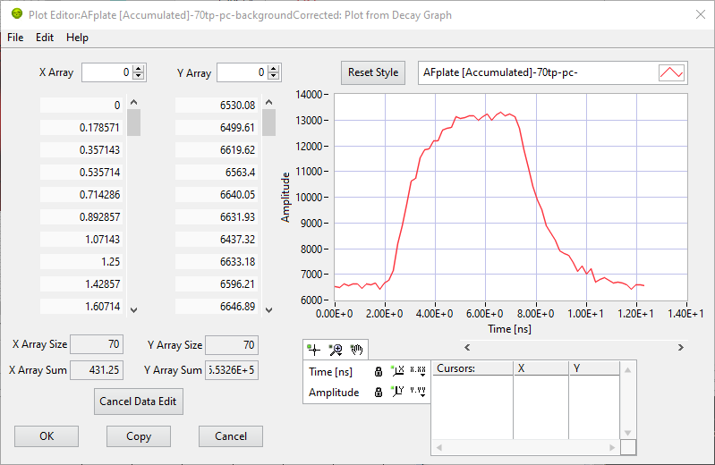
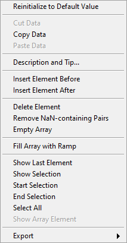
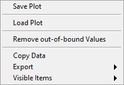

.. _alligator-plot-editor-window:

Plot Editor Window
==================

The Plot Editor can be accessed by right-clicking on the name of a plot in most 
graph objects in AlliGator. It allows basic plot modifications, including style 
and data changes.

The picture below provides an overview of the editor:

   
The graph on the right shows the plot as it appears in the original graph. Its 
style can be changed using the plot legend functions. Any such changes can be 
reverted while in the editor by pressing the *Reset Style* button.

The two arrays on the left (*X Array* and *Y Array*) display the plot data (X 
and Y coordinates of each points). Both arrays are linked, therefore moving the 
scrollbar on one array also moves the scrollbar on the other, guaranteeing that 
each X value is matched by the correct Y value and reciprocally. However, this 
is only true if both arrays have the same size. This can be checked by looking 
at the *X Array Size* and *Y Array Size* indicators below each array.

The arrays can be modified in different ways (each array is modified 
independently).

1. Array modification

Right-clicking any of the array shows the following menu:

   
which allows performing different array manipulations. Note that if one array 
size is modified, the other is automatically resized to match the new size.

2. Plot modification

Right-clicking the graph shows the following menu:

   
which allows loading a plot (datac column ASCII file with or without header 
lines) or saving the current plot, but also enables data cropping (``Remove 
out-of-bound Values``) by eliminating any point not within the visible range of 
the graph.

Once modifications to the plot have been completed, 3 different actions can be 
performed:

  + *OK*: accepts all changes and returns to AlliGator. The original plot will 
    be replaced by the modified one. 
  + *Cancel* (`Esc` keyboard shortcut or window close box): returns to 
    AlliGator without applying any of the changes.
  + *Copy*: accepts all changes and returns to AlliGator. The original plot 
    will not be modified, and the modified one will be added to the graph, with 
    ``(dup., edit.)`` added to the plot name. 

Warning
-------

While the **Plot Editor** window is opened, most of the calling application's 
GUI elements are unresponsive. It is possible to open another window or switch 
to a different panel, but selecting any action in these or the main menu will 
not be followed by any actual action until after the **Plot Editor** window is 
closed.
