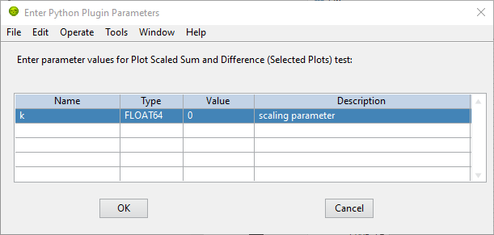

.. _alligator-python-plugin:

Python Plugins
==============

AlliGator supports user-provided Python functions which appear as right-click 
menu items for the corresponding object or menu.

Currently, only two objects support plugins: the *Decay Graph* and the 
*Source Image*. In addition, *FLI Dataset* plugins are supported as sub-menus of
the ``Analysis:FLI Dataset`` menu.
Since objects have associated menus (sometimes empty) in the ``Analysis`` menu,
plugins can also be inserted in the ``Analysis:Decay Graph`` and 
``Analysis:Source Image`` menus.

This page does **not** describe how to develop Python plugins for AlliGator, 
but provides an overview of the design principle, followed by a description of 
the mandatory features for a plugin. The last section show an example of plugin 
for the *Decay Graph* graph. Example of plugins for the different supported 
objects can be found in the example scripts provided by default with AlliGator.

Details on how to implement an AlliGator Python plugin can be found in the 
:ref:`AlliGator Python Plugins API page <alligator-python-plugins-API>`.

Design Principle
++++++++++++++++

LabVIEW has some basic built-in support for communication with Python in the 
form of the *Python Node*. The *Python Node* requires spawning an instance of
Python (the path and version of which can be specified by the user in the
**Settings:Plugins** window), which is done when AlliGator starts, and passing
it a script path and function name within that script, together with parameters.
The functions then returns a result or possibly an error code and message, in
which case this is displayed in the **Notebook** window.

The type of data that is passed to a plugin function is in part specified in the 
function's body using AlliGator plugin 'statements' (described in subsequent 
sections), but some of the data also depends on the target of that plugin and 
does not need to be specified within the function (in other words, it is handled 
automatically).

For instance, a plugin for the *Decay Graph* will always pass a list of plots 
to the function (the so-called ``graph_data_in``), the content of which depends 
on whether the plugin acts on all  plots, selected plots or only the plot from 
which the function was invoked.

The exact nature of the default data passed to a function is described in the 
:ref:`AlliGator Python Plugins API page <alligator-python-plugins-API>`.

The non-default data passed to the function is specified by the 
developer in the *Input Parameters Definition* section, and is passed to the 
Plugin function as a dictionary (see below and 
:ref:`AlliGator Python Plugins API page <alligator-python-plugins-API>` 
for details). Some of this data is provided by the user in a dialog window, 
which is automatically opened by AlliGator before executing the plugin function.
The rest is specifically requested internal AlliGator data and does not require 
user input.

The data returned by the function is, as the input data, separated into two 
parts: the default data type for the function's target, and the plugin-specific 
data, specified by the user in an *AlliGator Output Value Type & Destination* 
section. As the input parameters specidied in the *Input Parameters Definition* 
section, it is passed as a dictionary (see below and 
:ref:`AlliGator Python Plugins API page <alligator-python-plugins-API>` 
for details).

As for the default input data, the default output data depends on the function's
target and is described in the 
:ref:`AlliGator Python Plugins API page <alligator-python-plugins-API>`.

Both input and output definition sections are discussed below.

Plugins Folder
++++++++++++++

Plugins consists of functions saved within Python script files (.py extension).

These script files need to be saved within the ``Python Plugins`` folder
located in the AlliGator installation folder (generally in 
``C:Users\User_Name\AppData\Local]AlliGator``, unless specified otherwise during
installation.

Each file can be saved within a subfolder hierarchy within the 
``Plugins Folder``.

Plugin Files
++++++++++++

Each .py plugin file will give its name to a submenu in the right-click menu of 
the object it is targeting (see below to learn how to specify a plugin's target)
or the ``Analysis`` submenu it is added to (same remark). For instance, if a 
script file name ``UCLA_Plot_Functions.py`` is added and targeted to the 
**Decay Graph**, the functions within will be added to the *Decay Graph* 
context menu in a submenu named ``UCLA Plot Functions``.

For instance, if there are two files in Plugins folder named ``plugins 1.py`` 
and ``plugins 2.py``, both targeted to the **Decay Graph**, two submenus will be 
added to the right-click menu of the **Decay Graph**, respectively called 
``plugins 1`` and ``plugins 2``.

If a submenu already exists, the plugin functions within the .py file will be
added to it.

If a function with the same name already exists within the submenu, it will be 
added with the same name, but will be recognized as distinct by AlliGator.
Because that could be confusing for a user, it is recommended to name .py files
(and thus plugin submenus) in a way that is fairly unique, for instance by 
including a lab name in it (as in the example above).

Each plugin submenu is separated from the previous one by an horizontal divider 
line.

Each plugin file can contain an arbitrary number of Python functions, 
with valid names for Python, say function_1, function_2,..., function_n. The 
resulting submenu will contain as many items as there are functions, 
their names being the names of the functions. For instance, if plugins_1.py 
contains n functions: function_1, function_2,..., function_n, the corresponding
submenu will look like:

+ plugins 1

  - function 1
  
  - function 2
  
  - ...
  
  - function n

The next section will describe naming conventions for plugin functions, and how
to distinguish them from helper functions.

Plugin Function Names
+++++++++++++++++++++

Plugin functions appear in their corresponding submenus as they are named in the
script file, with the following transformations:

+ a single underscore at the beginning of the function name is interpreted as 
meaning that an horizontal separator will precede that function in the menu.

+ double underscores are altertnatively replaced by a left and right parenthesis
  , respectively preceded and followed by a space.

+ single underscores are replaced by single spaces

For instance, a function named ``this_is_a_simple_function(*args, **kparams)``
will appear as ``this is a simple function`` in the submenu.

Likewise, a function named ``simple_operation__selected_plots__(*args,**kparams)``
will appear as ``simple operation (selected plots)`` in the submenu.

Plugin Functions Special Syntax
+++++++++++++++++++++++++++++++

Plugin functions need to contain some simple additional syntax to be usable by 
AlliGator. The additional elements appear within comments bracketed between 
triple hash tags (``###``) and should therefore not interfere with any 
Python-specific syntax.

These syntaxic elements are as follows:

+ ``import`` statements
+ Destination
+ Plugin Flag
+ Input Parameters Definition
+ Output Value Type & Destination

A plugin function may require special modules to perform its operations. These 
are typically imported at the beginning of the script. In addition to any 
plugin-specific module import statement, any AlliGator Python Plugin script 
requires the following additional two import statements:

.. code-block::

    import json
    import alligator

The first is used to convert the input parameters string from JSON to a 
dictionary, and the output parameters dictionary to a JSON string, while the 
second refers to the ``alligoator.py`` script provided in the Python Plugins 
folder, and contains type definitions that are useful to format input and 
output data for a plugin.

In addition to these two import statements, the other 4 elements to include are 
briefly reviewed next.

The first element (*Destination*) tells AlliGator where the plugin functions 
need to be inserted (in which menu or object's context menu). This is common to 
*all* functions in the script, therefore if plugins for different targets are 
developed (e.g. one  function for the **Decay Graph**, and another for the 
**Source Image**), they will need to be in different script files.

The second element (*Plugin Flag*) specifies whether the function is actually a 
plugin  function or an helper function (in other words, helper functions are 
unmodified Python functions and do not need any of the modifications 
discussed here).

The third  element (*Input Parameters Definition*) is used to inform AlliGator 
about the parameters needed by the function (some parameters are passed by 
default, depending on the function's target, as discussed below). If no 
parameter is needed, this section can be ignored.

The last element (*Output Value Type & Destination*) is used by AlliGator to 
decide where to send the function's output. If no output is returned, this 
section can be ignored.

The syntax of these different elements is discussed in the following sections.

**Note**: In addition to these 4 mandatory elements, it is recommended to 
include a Python doc string to provide a description of that the function is 
doing, as well as information on whether or not and what user-provided 
parameters may be required. This doc string will indeed be sent to the 
**Notebook** window by holding the ``H`` key pressed down while selecting the 
Python plugin function in the corresponding menu.

Destination
-----------
To instruct AlliGator to insert a script's functions into a specific menu, the
following statement needs to be inserted before the different functions:

.. code-block::

    ### AlliGatorTarget = AlliGator/Object/Object_Name ###

and/or

.. code-block::

    ### AlliGatorTarget = AlliGator/Menu/Object_Name ###

where ``Object_Name`` is the name of the target (e.g. ``Decay Graph``, 
``Source Image`` or ``FLI Dataset``).

For instance, to insert the plugin functions within a script under the 
``Analysis:Decay Graph`` menu, the following statement will be needed:

.. code-block::

    ### AlliGatorTarget = AlliGator/Menu/Decay_Graph ###

Plugin Flag
-----------

To tell AlliGator that the function is a Plugin function, the following 
statement needs to be included after the doc string (if a doc string is 
provided) and before the *Input Parameters Definition* statement:

.. code-block::

    ### IsAlliGatorPythonPlugin ###

Input Parameters Definition
---------------------------

Some plugins do not require any input parameters. For instance, if a *Decay 
Graph* plugin computes the mean of a plot, the only required input is the plot 
itself, which would be passed automatically as default data for a Graph plugin 
(see :ref:`Python Plugins API <alligator-python-plugins-API>`). In that case, 
the remainder of this section can be ignored.

Other plugins will require either user input parameters (e.g. a scaling factor) 
or AlliGator parameters (e.g. the phasor frequency). Both types of parameters 
are declared at the beginning of the function in a custom comment section with 
the general structure shown below.

.. code-block::

    ### AlliGator Input Parameters Definitions ###
    ### parameter_1:type_1 # description 1
    ...
    ### parameter_n:type_n # description n
    ### End of AlliGator Input Parameters Definitions ###

The first and last line of this (triple) commented section are used by AlliGator 
to find it and should be reproduced as shown above.

Single (or double) commented lines (or empty lines) in between these two lines 
will be ignored.

Input parameter declarations follow the model indicated above, that is, a triple 
comment symbol (``###``) followed a single parameter declaration per line.

A parameter declaration consists of a unique name (at least in a given function)
, followed by a semicolon, followed by the parameter type (from the limited 
list of supported types (see :ref:`Python Plugins API 
<alligator-python-plugins-API>` for details), including ``AlliGator``, which 
indicates an internal AlliGator parameter. For a user-provided input parameter, 
a short *description* is recommended and should be provided as a single 
commented string (``# description n`` being a **bad** description!). It will 
appear next to the name and value of the parameter in a dialog box when the 
plugin is called. An example of such a dialog box (corresponding to the example 
shown at the bottom of this page) is provided below.

   AlliGator Python Pugin Input Parameters Dialog

To expose which internal AlliGator parameters can be passed as input parameters, 
use the *Send* button in the  **Settings:Plugins** panel. This will copy a list 
of these parameters in the clipboard.

Check the *Parameter Names only* checkbox in the  **Settings:Plugins** panel to 
get a JSON-formatted list of exposed internal AlliGator parameters without their 
current value.

As mentioned before, if no input parameter is needed by the function, this 
section can be omitted.

Output Value Type & Destination
-------------------------------

Python plugins ouputs are of four general kinds (for details, see 
:ref:`Python Plugins API <alligator-python-plugins-API>`):

+ error code
+ output message
+ output sent to internal AlliGator variables
+ output sent to objects

*Error codes* are internal to LabVIEW and will be formatted and sent to the 
**Notebook** if the ``Verbose Error Mode`` setting is on 
(**Settings:Miscellaneous**). Errors are generated by the Python script and are 
in general useful to debug a plugin. For this reason, it is recommended to turn 
on ``Verbose Error Mode`` when developing and testing a plugin.

The *output message* is an optional string generated by the plugin function. It 
is sent to the **Notebook**, and can therefore be used to display formatted 
results or information about the plugin's action (including a non-Python error 
message).

Output sent to internal AlliGator variables are a way to modify the internal 
state of AlliGator as a result of executing a Plugin. For instance, a plugin 
could be change a **Settings** flag, or the *phasor frequency*.

All previous three types of output do not require any special syntax to be added 
to the plugin.

The only type of output parameter that requires inclusion of an *Output Value 
Type & Destination* comment section are values destined to one of AlliGator's 
displayed objects (Graph and Image). The syntax of this section, which should 
follow the *Input Parameters Definition* comment section is as follows:

.. code-block::

    ### AlliGator Output Value Type & Destination ###
    ### value_type:destination
    ### End of AlliGator Output Value Type & Destination ###

The first and last line of this (triple) commented section are used by AlliGator 
to find it and should be reproduced as shown above.

Single (or double) commented lines (or empty lines) in between these two lines 
will be ignored.

Output value and destination statements follow the model indicated above, that 
is, a triple comment symbol (``###``) followed a single declaration per line.

Valid *value_type* are specified in the :ref:`Python Plugins API 
<alligator-python-plugins-API>` page.

Valid *destination* statements depend on the *value_type* and the plugin's 
declared destination (so for instance, a ``plots`` value type cannot be sent to 
an  image destination such as ``Mask Image`` but could be sent to 
``Decay Graph``).

If no output needs to be sent to a displayed object, this section can be 
omitted.

To better understand these different syntactic elements and how they fit into a 
Python function used as a plugin, it is easiest to look at the (not very useful) 
example installed with AlliGator and appearing as submenu item of 
``Analysis:Decay Graph`` and as a context menu item of the *Decay Graph".

Decay Graph example
+++++++++++++++++++

The following example illustrates the principles outlined above.
The same example with additional comments is installed in the Plugins Folder 
by default.

.. code-block::

    # Decay_Graph_Plugin_Example.py
    # Example AlliGator Decay Graph Python Plugin

    ### AlliGatorTarget = AlliGator/Object/Decay Graph ###
    ### AlliGatorTarget = AlliGator/Menu/Decay Graph ###

    import json
    import alligator

    def Plot_Scaled_Sum_and_Difference__Selected_Plots__test(
            graph_data_in, params_in_json, addtl_params_out_json_list):
        
        """Scaled Sum & Difference:
        
        Acts on the first two selected plots
        Expects one float parameter (k: float64)
        The resulting k*Sum and k*Difference plots are added to the Decay Graph
        """
        
        ### IsAlliGatorPythonPlugin ###

        ### AlliGator Input Parameters Definitions ###
        ### k:float64 # scaling parameter
        
        ### Phasor Frequency:AlliGator
        ### Reference Decay:AlliGator
        ### End of AlliGator Input Parameters Definitions ###

        ### AlliGator Output Value Type & Destination ###
        ### Plots:Decay Graph
        ### End of AlliGator Output Value Type & Destination ###

        message = 'Scaled Sum of Selected Plots and Phasor Frequency Update'
        exception_type = "None"
        exception_message = ""

        # decode the parameter string
       
        params = json.loads(params_in_json)
        k = params['k']
        f = params['Phasor Frequency']

        # decode the graph data named tuple
        
        graph_name = graph_data_in.Graph_Name
        plots = graph_data_in.Plots
        nplots = len(plots)
        
        # Adds and subtracts the first 2 plots if they have the same length
        # otherwise returns an error

        if nplots < 2:
            exception_type = "Error"
            exception_message = "Not enough selected plots!"
            graph_data_out = alligator.graph_plugin_data(
                Graph_Name = graph_name,
                Plots = [],
                Reference_Decay = alligator.empty_plot)
        else:
            plot_data1 = plots[0]
            name1 = plot_data1.Plot_Name
            x1 = plot_data1.X_Array
            y1 = plot_data1.Y_Array
            plot_data2 = plots[1]
            name2 = plot_data2.Plot_Name
            x2 = plot_data2.X_Array
            y2 = plot_data2.Y_Array
            
            ref_decay_data = graph_data_in.Reference_Decay
            ref_decay_name = ref_decay_data.Plot_Name
            ref_decay_x = ref_decay_data.X_Array
            ref_decay_y = ref_decay_data.Y_Array

            # processing of the incoming data
            
            if (len(x1) != len(x2)):
                exception_type = "Error"
                exception_message = "Plots do not have the same length!"
                plots_out = []
            else:
                sumy = []
                for i in range(len(y1)):
                    sumy.append(y2[i] + y1[i])    
                diffy = []
                for i in range(len(y1)):
                    diffy.append(y2[i] - y1[i])
                    
                # we need to repackage those plots into a list of named tuples
                # (same structure as the input)

                plot_data1_out = alligator.plot_plugin_data(
                    Plot_Name = 'Scaled Sum of Plots',
                    X_Array = x1,
                    Y_Array = sumy
                )
                plot_data2_out = alligator.plot_plugin_data(
                    Plot_Name = 'Scaled Difference of Plots',
                    X_Array = x1,
                    Y_Array = diffy
                )
                plots_out = [plot_data1_out, plot_data2_out]
                message = 'Scaled Sum of Selected Plots (scaling factor: ' +\
                    str(k) + ', '+name1 + ', '+name2+') and Phasor Frequency Update'
            graph_data_out = alligator.graph_plugin_data(
                Graph_Name = graph_name,
                Plots = plots_out,
                Reference_Decay = alligator.empty_plot)
            
            # Finally, we can send back information on the function outcome
            # and can also set AlliGator Parameters
            # all this packaged in a dictionary, converted to json and
            # appended to the (generally) empty string list
            # addtl_params_out_json_list
        
        info_out_dict = {
        "Notebook Message" : message,
        "Exception Type" : exception_type,
        "Exception Message" : exception_message,
        "AlliGator:Phasor Frequency" : f
        }
        
        # conversion to JSON string and string is appended to the incoming
        # addtl_params_out_json_list
        
        addtl_params_out_json_list.append(json.dumps(info_out_dict))
        
        # return results to AlliGator

        return(graph_data_out)