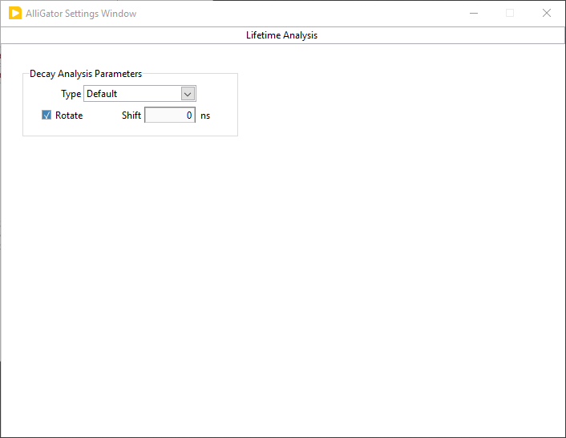

.. _alligator-settings-window:

Settings Window
===============

The **Settings** window can be opened via the ``Windows:Show Settings`` menu 
item (:kbd:`Ctrl+E` shortcut) in the main AlliGator window.
It is comprised of multiple pages and sub-pages, which can be accessed via the 
top page selector:

.. image:: images/AlliGator-Settings-Pages.png
   :align: center

The different pages are described in the sections below.
Note that any value change done in the **Settings** window immediately takes 
effect and is reflected in the corresponding AlliGator window *control* (if 
there is one).

Inversely, any change to a control in the **AlliGator** window is immediately 
reflected in the **Settings** window.

The value of the Settings controls are saved when AlliGator quits, and reloaded 
when it is restarted.

.. _alligator-settings-source-image:

Source Image
------------

The **Source Image** panel is comprised of 3 sub-panels:

- *Use Image Histogram for Contrast*: if checked, uses the location of the *Min* 
  and *Max* cursors in the *Image Histogram* to adjust the correspondence 
  between pixel intensity and color scale. Namely, any pixel with intensity 
  smaller than *Min* will be colored with the *Low Color* shown below the color 
  scale, while any pixel with intensity larger than *Max* will be colored with 
  the *High Color* shown above the color scale. Pixels with intensity between 
  Min* and *Max* will be colored according to the color scale.

  A side effect of this selection is that, when hovering over the image, the 
  indicated intensity will show clipped values, any pixel with intensity smaller 
  than *Min* will be indicated as *equal to Min*, while any pixel with intensity 
  larger than *Max* will be indicated as *equal to Max*. However, internally, 
  the correct intensity value is preserved. To read the actual intensity of a 
  pixel, simply unchecked this option before hovering over the pixel again.

- *Low Count Pixels Rejection Options*: defines which rejection criteria to use 
  for the dimmest pixels in the image. The minimum of all criteria, 
  :math:`m = Min(Min_B, Min_T, Min_P)`, is used.

    * *Reject Low Count Pixels*: when checked off, combine the following 
      criteria to define a minimum value :math:`m`.the pixel intensity :math:`I` 
      needs to reach in order to be included in subsequent analyses: :math:`I 
      \ge m`.
    * *Background Low Threshold Factor*: this factor (:math:`b`) is multiplied 
      by the *mode* :math:`M` of the image histogram (computed with 256 bins) 
      to obtain :math:`Min_B = b M`.
    * *Fixed Low Background Threshold*: fixed quantity :math:`Min_T`, for 
      instance estimated using the *Min* cursor of the Image Histogram to 
      highlight pixels in the image below that value.
    * *Low Percentile*: value :math:`P_{min}` defining :math:`Min_P` such that 
      :math:`P_{min}` percent of all pixels have intensity :math:`I \ge Min_P`.

- *High Count Pixels Rejection Options*: defines which rejection criteria to use 
  for the brightest pixels in the image. The maximum of all criteria, 
  :math:`M = Max(Max_B, Max_T, Max_P)`, is used.

    * *Reject High Count Pixels*: when checked off, combine the following 
      criteria to define a maximum value :math:`M`.the pixel intensity :math:`I` 
      needs to reach in order to be included in subsequent analyses: :math:`I 
      \le M`.
    * *Background High Threshold Factor*: this factor (:math:`B`) is multiplied 
      by the *mode* :math:`M` of the image histogram (computed with 256 bins) 
      to obtain :math:`Max_B = B M`.
    * *Fixed High Background Threshold*: fixed quantity :math:`Max_T`, for 
      instance estimated using the *Max* cursor of the Image Histogram to 
      highlight pixels in the image above that value.
    * *High Percentile*: value :math:`P_{max}` defining :math:`MaxP` such that 
      :math:`P_{max}` percent of all pixels have intensity :math:`I \le Max_P`.

- *Hot Pixel Removal*: options used to replace "screamers" in SPAD arrays by 
  the median value of neighboring pixels (requires reloading the dataset to 
  take effect).

    * *Remove Hot Pixels*: when checked off, applied hot pixel removal algorithm.
    * *Percentile*: percentaile of high intensity pixels to consider as hot 
      pixels.
    * *Use Hot Pixel Mask*: when checked off, ignores the *Percentile* parameter 
      and used the *Hot Pixel Mask Image* instead.
    * *Hot Pixel Mask Image*: path of the mask (binary) image identifying hot 
      pixels.

.. image:: images/AlliGator-Settings-Source-Image-Processing.png
   :align: center

- *Image ROI* options

    * *Use Fixed ROI Diameter*: when checked off, forces circular ROIs to adopt 
      the specified diameter (see next).
    * *ROI Diameter* (in pixel): used in conjunction with the previous option.
    * *ROI Center Color*: used to locate the center of the last ROI whose decay 
      was processed (interactive mode only).
    * *Overlay Analyzed ROI Center*: if checked off, the center of the analyzed 
      ROI is highlighted using the 

- *ROI Creation*

    * *Invert Binary Mask*: check off this box to use binary mask images with 
      regions of interest labeled with a value larger than the background.
    * *Peak Threshold*: *Min* parameter used in the "Create ROI(s) from Pixels 
      with Peak above Min" right-click menu function of the *Source Image*.
    * *Intensity Threshold*: *Min* parameter used in the "Create ROI(s) from 
      Pixels with Intensity above Min" right-click menu function of the *Source 
      Image*.
      
- *Image Pre-Processing Operations Order*: ordered drop-down list of operations 
  (optionally) applied to each gate image. Right-click on the list to access the 
  *Reorder Operations* dialog window.

- *Image Binning Options*: requires reloading the current dataset to be applied.

    * *Use Image Binning*: check off this box to apply binning to gate images.
    * X/Y Bin*: binning parameter for each dimension.

- *Image Smoothing Options*: requires reloading the current dataset to be 
  applied.

    * *Use Image Smoothing*: check off this box to apply smoothing to gate 
      images.
    * *Type*:

      + *Uniform*: each pixel is replaced by an average of itself and its 
        neighbors.
      + *Bilinear*: each pixel is replaced by a weighted average of itself and 
        its neighbors, the weights decreasing linearly from 1 away from the 
        center (to zero for the pixels outside the kernel dimension).
      + *Gaussian*: each pixel is replaced by a weighted average of itself and 
        its neighbors, the weights decreasing according to a Gaussian width 
        :math:`\sigma = Bin/6` from 1 away from the center.

    * *Bin*: kernel dimension used in the smoothing operation.
    * *Algorithm*:

      + *Rapid*: ignores image border subtleties.
      + *Thorough*: treats borders properly but can be significantly slower for 
        large datasets.

- *Save Image*: check off this box to save the displayed image with its overlay 
  each time a new dataset is loaded. The file is saved in the *Saved Displayed 
  Image Format* specified in the **Miscellaneous** Settings panel, in the same 
  folder as the current dataset, with the dataset name to which the image type 
  (Gate n, White Light or Total Intensity) is appended.

.. image:: images/AlliGator-Settings-Source-Image-Cosmetics.png
   :align: center

- *Use Image Brightness for Overlay*: when used, this option scales the pixel 
  overlay color by the factor :math:`\lambda = (I - range_{min})/(range_{max} 
  - range_{min})`, where *I* is the pixel's intensity.

- *Blend Overlay with Background*: when used, this option replaces the pixel 
  overlay color by :math:`\lambda O + (1-\lambda) B`, where *O* is the 
  unscaled overlay color and *B* the underlying pixel color according to the 
  source image color scale.

- *Image Resolution (Pixel Size)*: information used to overlay a scale bar on 
  the image (see *Scale Bar Options* below).

- *Scale Bar Options*: requires reloading the image or clicking the *Scale Bar 
  Overlay* button on the **Source Image** panel.

    * *Show Scale Bar Overlay*: check this off to automaticxally show the scale 
      bar when loading a new dataset.
    * *Scale Bar X/Y*: location of the scale bar in pixel unit. X = 0 
      corresponds 
      to the left of the image. Y = 0 corresponds to the top of the image.
    * *Scale Bar Lenght/Height*: dimension of the displayed scale bar in 
      physical units.

.. _alligator-settings-data-information:

Data Information
----------------

The options in this panel are discussed in the 
:ref:`alligator-loading-saving-fli-dataset-data-information` section of the 
:ref:`alligator-loading-saving-fli-dataset` page.

.. image:: images/AlliGator-Settings-Data-Information.png
   :align: center

- *Gate Characteristics*: loaded with the dataset file, although in some cases 
  (e.g. raw *.ptu* files), the *# Gates* can be specified before loading. These 
  parameers can be overwritten after loading, for instance to correct for a 
  known bogus parameter value.

    * *Gate Width*: for a square gate (or bin), defines the nominal full width 
      at half maximum (FWHM). For binned data, it is the bin size.
    * *Gate Separation* (or gate shift): temporal offset of two consecutive 
      gates. In the case of binned data, this parameter is equal to the *Gate 
      Width* parameter. 
    * *Gate Step*: integer parameter specifying by how much the index of 
      successive gates is incremented when loading a new dataset. The default is 
      1, which corresponds to all gates being loaded. A value of 2 would result 
      in every other gate being loaded.
    * *# Gates*: number of gates in the dataset (or number of gates to bin the 
      data into in the case of a time-tagged dataset such as *.ptu* files). For 
      fual-gate datasets, this corresponds to the number of channel pairs.
    * *Gate Image Exposure*: time during which the detector is actually capable 
      of detecting photons (= *n x W*, where *n* is the number of laser periods 
      and *W* the gate width).
    * *Gate Image Integration*: total time taken to acquire the gate image (= 
      *n x T*, where *n* is the number of laser periods during acquisition and 
      *T* is the laser period).

- *Define Gates to*: *Skip* or *Keep*, whose corresponding parameter are 
  displayed below, allows to reject gates when loading a dataset, providing two 
  alternative ways to do so:

    * *Gates to Skip*: *from Start/End* are the number of gates to ignore at 
      the beginning/end of the series when loading the dataset.
    * Gates to Keep*: *First/Last* are the indices of the first (default: 0) and 
      last gate (default: 4294,967,295) to keep when loading the dataset. The 
      indice of the first gate in the dataset is 0, while the indice of the 
      last gate is *G-1*, where *G* is the total number of gates in the dataset.

- *Channel Name*: List showing the root name of available gates in the loaded 
  dataset. For standard single channel datasets, this will be limited to a 
  single name (generally *Gate*), while in the case of dual-channel datasets, 
  the name of both channels will be shown. Use this drop-down list to switch 
  from one to the other and update the displayed *Source Image*.
- *Channel Arithmetic*: *"None"/"INT-G2"/"G2/INT*<INT>"/"(1-G2/INT)*<INT>"* is 
  a list allowing to process and display arithmetic combinations of dual-channel 
  gates. It is necessary to reload the dataset to apply this change. Note that, 
  unless *None* is selected, changing the *Channel Name* parameter will have no 
  effect on the displayed *Source Image*.
- *Laser Period*: generally loaded from the dataset when available. Can be 
  user-modified
- *Natural Frequency*: indicator representing *1/D*, where *D* is the duration 
  covered by the loaded gates. It is the recommended frequency for phasor 
  analysis.
- *SYNC Period*: in general it is identical to the laser period (or undefined). 
  It is the trigger frequency used during gate acquisition. When *SYNC Period > 
  Laser Period*, multiple decay periods can be expected in the data.
  
- *Dataset Pile-up Correction* options: the type of corrected pile-up is that 
  experienced in photon-counting detectors with finite counting capabilities.
  The correction is applied on each loaded dataset as part of a series of 
  operations whose order is defined in the **Source Image:Image Processing** 
  panel *Image Pre-Processing Operations Order* list.
  
    * *Pile-up Correction*: check off this box to apply pile-up correction.
    * *Max Value*: maximum value obtainable in each pixel.

- *Scaling Factor*: optional dataset gate image intensity scaling factor 
  (default: 1).
  
- *Background File Subtraction* options:

    * *Background File Subtraction*: check off this box to apply background 
      file subtraction when loading a dataset.
    * *Background Dataset*: path of the dataset used as background file.
    * *Pile-up Correction*: whether or not to apply pile-up correction as part 
      of the background dataset loading steps.
    * *Max Value*: maximum value obtainable in each pixel.
    * *Scaling Factor*: optional dataset gate image intensity scaling factor 
      (default: 1).
 
.. _alligator-settings-fluorescence-decay:

Fluorescence Decay
------------------

The **Fluorescence Decay** tab is divided into 5 sub-panels:

- **Decay Pre-Processing**
- **Advanced Analysis**
- **Fit Options**
- **Fit Parameters**
- **Styles**

described below.

.. _alligator-settings-fluorescence-decay-preprocessing:

Decay Pre-Processing
++++++++++++++++++++

The options exposed in this panel are discussed in the 
:ref:`alligator-decay-preprocessing` page of the manual.

.. image:: images/AlliGator-Settings-Decay-Preprocessing.png
   :align: center

.. _alligator-settings-fluorescence-decay-advanced-analysis:

Advanced Analysis
+++++++++++++++++

.. image:: images/AlliGator-Settings-Decay-Advanced-Analysis.png
   :align: center

- *Extract IRF instead of Decay*: in interactive mode, follows the 
  ``Analysis:FLI Dataset:Current ROI Analysis`` step with a deconvolution 
  step using the *IRF Extraction Options*, and outputs the resulting computed 
  IRF instead of the decay.

IRF Extraction Options
^^^^^^^^^^^^^^^^^^^^^^

- *Time Constant*: single-exponential time constant used for deconvolution.

- *Smoothing*: applies one or more iterations of a Savitzky-Golay filter (6 
  side points, polynomial order 3) to the deconvolved IRF.

- *Smoothing Order*: number of iterations of the Savitzky-Golay filter.

IRF Optimization Options
^^^^^^^^^^^^^^^^^^^^^^^^

Parameters for the optimal IRF extraction algorithm. The center lifetime 
:math:`\tau_0` used in the search is the *Time Constant* parameter of the *IRF 
Extraction Options*.

- *Search Range*: :math:`\Delta \tau` defines the half search interval in which 
  the optimal time constant is searched for.

- *Search Step*: :math:`\delta \tau` is the step size by which the trial time 
  constant is incremented at each step of the search.

- *Tail Threshold (%)*: percentage of the deconvolved IRF tail used to compute 
  the metrics.

- *Metrics*: quantity used to determine the optimal time constant for 
  deconvolution.

- *Smooth Metrics*: if checked, a Savitzky-Golay filtered metrics is used to 
  find the optimum time constant for IRF deconvolution 

- *S-G Side Points*: number of side points used to compute the 
  Savitzky-Golay filtered metrics.

- *S-G Polynomial Order*: polynomial order used to compute the 
  Savitzky-Golay filtered metrics.

- *Export Plot*: if checked, sends the metrics plots (raw and filtered) to the 
  Notebook.

- *Export Data*: if checked, sends the metrics values to the Notebook

Wavelet Analysis Options
^^^^^^^^^^^^^^^^^^^^^^^^

The *Wavelet Analysis Options* are used to denoise decays (*Decay Graph*'s 
``Process Plot(s):Denoising`` right-click menu). The parameters and their 
interpretation are described in the online LabVIEW Advanced Signal Processing 
Toolkit manual (https://www.ni.com/docs/en-US/bundle/lvaspt-api-ref/page/vi-lib/addons/wavelet-analysis/application-llb/wa-denoise-vi.html)

Specifically, the *Wavelet Transform Type* parameter allows selecting between a 
*Discrete Wavelet Transform* (https://www.ni.com/docs/en-US/bundle/lvaspt-api-ref/page/vi-lib/addons/wavelet-analysis/application-llb/wa-denoise-dwt-real-array-vi.html) and a "Undecimated Wavelet Transform* (https://www.ni.com/docs/en-US/bundle/lvaspt-api-ref/page/vi-lib/addons/wavelet-analysis/application-llb/wa-denoise-uwt-real-array-vi.html).

Square Pulse Options
^^^^^^^^^^^^^^^^^^^^

These options are used for fits of the decay to a square pulse or its variants 
(logistic square pulse and tilted logistic square pulse).

- *Method*: `Mean` or `Median`, refers to the algorithm used to determine the 
  baseline (low level) and plateau (high level) values used to define the square 
  wave.
  
- *# Bins*: number of bins used to compute the level histogram used to determine 
  the low and high level of the square pulse.

- *Threshold %*: percentage of the low-to-high level height used to define the 
  rising and falling edges start and stop.
  
- *Center on Midpoint*: defines whether the rising and falling edges of the 
  "square" pulse pass through the rising and falling edges midpoints.
  
- Smoothen Plot*: defines whether the decay is smoothened before bing fitted to 
  a square pulse.

Average Lifetime Options
^^^^^^^^^^^^^^^^^^^^^^^^

These options define the way an estimate of the average lifetime is computed 
based on the measured decay and the IRF.

- *Use Local IRF*: used only for multi-ROI analysis.

- *Use IRF Offset*: define the decay offset as that deduced from the IRF 
  according to the:
  
- *Baseline %*: define a threshold *th = (1 + %) x baseline* and find its 
  intersection with the rising edge of the IRF as illustrated below.
  

.. image:: images/AlliGator-IRF-Offset.png
   :align: center

- *Use Fixed Offset*: ignoring the IRF, define a fixed offset to define time 0 
  of the decay.

.. _alligator-settings-fluorescence-decay-fit-options:

Fit Options
+++++++++++

The parameters accessible on this panel are discussed in the 
:ref:`alligator-fit-parameters` section of the :ref:`alligator-decay-fitting` 
page of the manual.

.. image:: images/AlliGator-Settings-Decay-Fit-Options.png
   :align: center

.. _alligator-settings-fluorescence-decay-fit-parameters:

Fit Parameters
++++++++++++++

The parameters accessible on this panel are discussed in the 
:ref:`alligator-fit-parameters` section of the :ref:`alligator-decay-fitting` 
page of the manual.

.. image:: images/AlliGator-Settings-Decay-Fit-Parameters.png
   :align: center

.. _alligator-settings-fluorescence-decay-styles:

Styles
++++++

.. image:: images/AlliGator-Settings-Decay-Styles.png
   :align: center

- *Show Last Decay Only*: if checked off, hides all other plots in the *Decay 
  Graph* when adding a new plot.
- *Decay Graph Color Array*: colors used for the decay itself, its fit and its 
  residuals.

.. _alligator-settings-fluorescence-decay-statistics:

Fluorescence Decay Statistics
-----------------------------

The **Fluorescence Decay Statistics** panel of AlliGator provides information 
on the max and min intensities in each pixel, displaying an histogram of both. 
The parameters in the corresponding panel of the **Settings** window allow using 
this information to reject pixels based on their min and max intensity, 
similarly to what the *Low/High Count Pixels Rejection Options* of the 
:ref:`alligator-settings-source-image` panel allow doing based on the total 
pixel intensities.

.. image:: images/AlliGator-Settings-Decay-Statistics.png
   :align: center

- *Reject Low Decay Peak Pixels*: if checked off, rejects decays whose peak 
  values are strictly smaller than *Min Peak Value*.
- *Min Peak Value*: peak value lower rejection threshold.
- *Reject High Decay Peak Pixels*: if checked off, rejects decays whose peak 
  values are strictly larger than *Max Peak Value*.
- *Max Peak Value*: peak value upper rejection threshold.

These criteria are applied after the min and max total intensity constraints 
defined in the **Settings:Pixel Processing** panel.

.. _alligator-settings-time-traces:

Intensity Time Trace
--------------------

Parameters in this panel affect the way intensity time traces, discussed in the 
:ref:`alligator-intensity-time-trace-panel` are computed.

- *Use File Timestamp*: check off  this box to use the timestamp saved with 
  each dataset in a series, when building the intensity time trace.

- *Time Step*: increment used to compute the timestamp of each dataset in a 
  series, absent a timestamp saved with the dataset.

- *Use Intensity Correction File*: Check off this box to renormalize the 
  intensity time with the information contained in the *Intensity Correction 
  File*.

- *Intensity Correction File*: path of the intensity correction file to be used 
  renormalize the intensity time trace.

.. _alligator-settings-phasor-plot:

Phasor Plot
-----------

The **Phasor Plot** panel is subdivided into 3 subpanels:

- **Phasor Plot Calculation**

- **Phasor Plot Information Overlay**

- **Phasor Plot Appearance**

Phasor Plot Calculation
+++++++++++++++++++++++

The parameters in this panel are used to control the way the phasor plot is 
computed and represented in the **Phasor Plot** panel of AlliGator, discussed 
in the :ref:`alligator-phasor-plot-panel` page of the manual.

.. image:: images/AlliGator-Settings-Phasor-Plot-Calculation.png
   :align: center
   
- *Phasor Frequency*: sets the frequency used to compute phasors. This value is 
  synchronized throughout AlliGator different windows and panels.

- *Cumulative Phasor Plot*: check off this box to preserved phasor plot data 
  when loading new datasets. When checked off, the current phasor plot is not 
  preserved. The first phasor plot to be accumulated is the subsequent one.

- *Phasor Plot Smoothing Options*:

    * *Use Phasor Plot Smoothing*: check off this box to apply smoothing to the 
      phasor plot
    * *Type*:

      + *Uniform*: each phasor is replaced by an average of the phasor of its 
        pixel and those of its neighbors.
      + *Bilinear*: each phasor is replaced by a weighted average of the phasor 
        of its pixel and those of its neighbors., the weights decreasing 
        linearly from 1 away from the center (to zero for the pixels outside 
        the kernel dimension).
      + *Gaussian*: each phasor is replaced by a weighted average ofthe phasor 
        of its pixel and those of its neighbors., the weights decreasing 
        according to a Gaussian width :math:`\sigma = Bin/6` from 1 away from 
        the center.

    * *Bin*: kernel dimension used in the smoothing operation.
    * *Algorithm*:

      + *Rapid*: ignores image border subtleties.
      + *Thorough*: treats borders properly but can be significantly slower for 
        large datasets.
        
- *Limit Phasor Plot Calculation to*: 

    * *Selected Image ROI(s)*: currently limited to a single ROI. All pixels 
      outside the ROI are excluded from the phasor plot calculation.
    * *All Image ROIs*: All pixels outside the image ROIs are excluded from the 
      phasor plot calculation.

- *Limit Phasor Plot Analysis to*: 

    * *Selected Phasor Plot ROI(s)*: currently limited to a single ROI. When 
      performing an analysis involving the phasor plot data, limits this 
      analysis to the phasors within the selected phasor plot ROI.

    * *All Phasor Plot ROIs*: When performing an analysis involving the phasor 
      plot data, limits this analysis to the phasors within any of the phasor 
      plot ROIs.

Phasor Plot Information Overlay
+++++++++++++++++++++++++++++++

- *Phasor Ratio/Average Lifetime Style Options*:

    + *Color Map Type*:

        * *Phasor Ratio (f1 or a1)*: standard phasor ratio (either intensity or 
          amplitude weighted, depending on the *Phasor Ratio Type* parameter in 
          the **Phasor Graph** panel of the **Settings** window).
        * *Average Lifetime (<tau>_i or <tau>_a)*: amplitude- or 
          intensity-weighted average lifetime, depending on the *Phasor Ratio 
          Type* parameter in the **Phasor Graph** panel of the **Settings** 
          window).
        * *User-Defined Quantity*: elementary quantity or alias for a definition 
          based on elementary quantities.

    + *User-Defined Quantity*: Use the context menu of this control 
      to open the **Aliases Definitions** window and define a quantity 
      based on one of the following elementary quantities:

        * *f1*: phasor ratio
        * *a1*: amplitude phasor ratio
        * *tau_phi*: phase lifetime
        * *tau_m*: modulus lifetime
        * *<tau>_i*: intensity-weighted average lifetime
        * *<tau>_a*: amplitude-weighted average lifetime
        * *tau_1*: lifetime of phasor ratio reference 1
        * *tau_2*: lifetime of phasor ratio reference 2

    + *Decay Range*: range of the exponential fading factor used in the phasor 
      ratio (or other derived quantity) color map. This range is shown as a 
      boundary surrounding the two reference phasors in the *Phasor Plot*. If 
      the *Exponential Fading* checkbox is not selected, phasors outside the 
      range (i.e. whose distance to the segment connecting the two references 
      is larger than the range) are not taken into account in subsequent 
      analyses.
    + *Exponential Fading*: if checked off, applies an exponentially decaying 
      fading factor to the phasor ratio (or other derived quantity) color map 
      intensity.
    + *Reference Colors*:

        * *Reference 1*: color used for phasor reference 1.
        * *Reference 2*: color used for phasor reference 2.
        * *Boundary*: color used for the boundary of the region of the phasor 
          plot located *Decay Range* away from the segment connecting 
          phasor references 1 & 2.

    + *Reference Radius*: size of the dots representing references 1 & 2 on the 
      phasor plot.
    + *Draw Reference Segment*: whether or not ro connect both references by a 
      (dashed) line.
    + *Color Map Type*: ``Interpolate Reference Colors`` or ``Use Custom Map``.
    + *Average Lifetime Color Map*: right-click on the box to select predefined 
      color scales.

- *Color Scale*: represents the selected *Color Map*.

- *Display Range*: slide used to define the min and max Phasor Ratio/Average 
  Lifetime/User-Defined Quantity encoded by the *Color Scale*. The sliders and 
  the corresponding values displayed in the respective numeric controls to the 
  right correspond to the max and min values encoded by the color scale. The max 
  and min values displayed on the left scale have no meaning for the color 
  coding.

- *Use Phasor Brightness for Overlay*: when color-coding the pixels of a ROI in 
  the *Source Image*, this option allows adjusting the color intensity to the 
  underlying phasor plot bin value.

- *Blend Overlay with Background*: if checked off, this  option replaces the 
  black color corresponding to 0-valued bins in the option above by the phasor 
  plot current color.
  
Phasor Plot Appearance
++++++++++++++++++++++

- *Phasor Plot Size & Style*

    * *H*: horizontal size (in pixels) of the phasor plot image.
    * *V*: vertical size (in pixels) of the phasor plot image.
    * *Margin*: fractional size of the regions to the left and right of the 
      unit square in which the universal circle is encompassed.
    * *UC Style*: universal circle style settings.
    
        + *UC Color*: color used for the UC.
        + *UC*: whether or not to display the UC.
        + *Ticks*: whether or not to display the phase lifetime ticks.
        + *Labels*: whether or not to display the tick labels.
        + *Size*: label size in pixels.
        + *Distance*: distance of the labels from the UC in pixels.
        
    * *SEPL Style*: single-exponential phasor locus style settings.
    
        + *SEPL Color*: color used for the SEPL.
        + *SEPL*: whether or not to display the SEPL.
        + *Ticks*: whether or not to display the phase lifetime ticks.
        + *Labels*: whether or not to display the tick labels.
        + *Size*: label size in pixels.
        + *Distance*: distance of the labels from the SEPL in pixels.
    
    * *Axes Style*: axes style settings.
    
        + *Axes Color*: color used for the axes.
        + *Axes*: whether or not to display the axes.
        + *Ticks*: whether or not to display the axes ticks.
        + *Labels*: whether or not to display the tick labels.
        + *Size*: label size in pixels.
        + *Distance*: distance of the labels from the axess in pixels.
        

.. _alligator-settings-phasor-graph:

Phasor Graph
------------

The **Phasor Graph** panel of the **Settings** window contains options and 
parameters that have an effect beyond the **Phasor Graph** panel of AlliGator.

.. image:: images/AlliGator-Settings-Phasor-Gaph.png
   :align: center

- *Phasor Frequency*: sets the frequency used for phasor computation throughout 
  AlliGator.
- *Save Phasor Graph Image*: if checked off, every change to the *Phasor Graph* 
  generates a file named "Phasor Graph Current Dataset (n).xxx" in the current 
  dataset folder, where *Current Dataset* is the file name of the current 
  dataset and *n* is an integer incremented to avoid overwriting previous files.
  *xxx* is the file extension corresponding to the *Saved Displayed Image File 
  Format* defined in the :ref:`alligator-settings-miscellaneous` Settings panel.
- *Phasor SDV Options*: used in case an estimate of the shotnoise contribution 
  to the phasor (and average lifetime) standard deviation needs to be estimated.

    + *Compute Estimated SDV*: turns the option on or off.
    + *# Replicas*: number of replicas of the decay simulated to estimate the 
      phasor SDV.
    + *Use Estimated Average Phasor*: if checked off, returns the average of all 
      replicas instead of the original phasor.

- *Define Shortest Lifetime as*: ``Reference 1``/``Reference 2``: when computing 
  phasor references, defines the shortest lifetime as the selected reference.
- *Phasor Ratio Type*: ``Intensity-Weighted``/``Amplitude-weighted``: specifies 
  which phasor ratio (or derived quantity such as the average lifetime) to 
  compute.

.. _alligator-settings-SEPL:

Single-Exponential Phasor Locus (SEPL)
--------------------------------------

The options and parameters in this panel control the aspect of the SEPL as 
displayed in the *Phasor Plot* image or the *Phasor Graph*. For a detailed 
explanation of the role of these different parameters, check ref. [XM2021]_
in the :ref:`Bibliography page <alligator-bibliography>`.

.. _alligator-settings-SEPL-display:

Display
+++++++

.. image:: images/AlliGator-Settings-SEPL-Display.png
   :align: center

- *Display Parameters*:

    + *# Points*: number of points used to draw the SEPL.
    + *Ramp Type*: ``Linear``/``Logarithmic``.
    + *Min tau*: lower :math:`\tau` value used in the ramp.
    + *Include 0*: whether or not to add the phasor for :math:`\tau = 0`
    + *Max tau*:upper :math:`\tau` value used in the ramp.
    + *Include Inf*: whether or not to add the phasor for :math:`\tau = \inf`
    
.. _alligator-settings-SEPL-phasor:

Phasor
+++++++

.. image:: images/AlliGator-Settings-SEPL-Phasor.png
   :align: center
   
- *Phasor Parameters*:

    + *Phasor Calculation*: ``Direct Sum``/``Analytical Formula``
    + *Harmonic Frequency*: frequency used to compute the SEPL. This is **not** 
      linked to the *Phasor Frequency* parameters visible in the **Phasor Plot** 
      and **Phasor Graph** panels of the **Settings** and **AlliGator** windows.
    + *Calibrated Phasor*: if checked off, calibrate the SEPL using the 
      remaining parameters.
    + *SEPL Type*: ``UC``/``L_N``/``L_N(W)``/``L_X``
    + *Calibration Lifetime*: self-explanatory.
    + *# Gates*: number of gates used to compute the calibration phasor.
    + *Show Ticks*: shows ticks on the computed SEPL

.. _alligator-settings-SEPL-IRF:

IRF
+++

.. image:: images/AlliGator-Settings-SEPL-IRF.png
   :align: center

- *IRF Parameters*:

    + *IRF Period*: self-explanatory.
    + *IRF Model*: ``Dirac``/``Exponential``
    + *IRF Offset*: time shift of the IRF.

.. _alligator-settings-SEPL-gates:

Gates
+++++

.. image:: images/AlliGator-Settings-SEPL-Gates.png
   :align: center

.. image:: images/AlliGator-Settings-SEPL-Gates2.png
   :align: center

- *Use Current Dataset Parameters*: if checked off, use the gate parameters of 
  the current loaded dataset, as defined in the **Data Information** panel.
  
- *Gate Parameters*:

  + *Gate Type*: select what type of gate shape is used.

    .. image:: images/AlliGator-Settings-SEPL-Gates-Gate-Type.png
       :align: center

  + *Type of User-defined Function*: ``Gate``/``IRF``
  + *Edit User-defined Function*: button used to open the **Plot Editor** 
    window in which to load or define the function to use.
  + *First Gate Start*: location of first timestamp.
  + *Use Gate Center*: if checked off, timestamps indicate the center of the 
    gate rather than its start.
  + *Gate Width*: self-explanatory.
  + *Use Gate Step*: if checked, the width is equal to the gate step.
  + *Gate Step*: separation between consecutive gates
  + *Match Laser Period*: if checked, indicates that the series of gates 
    covers the whole laser period.
  + *Adjust*: ``Gate Step``/``# Gates``. Shown when *Match Laser Period* is 
    selected.
  + *# Gates*: number of gates comprising the waveform.
  + *Integration*: ``Fixed``/``Adaptive``. shown when ``User-defined`` *Gate 
    Type* is selected. Specifies how the resolution used for convolution is 
    defined.
  + *Tolerance*: shown when ``Adaptive`` *Integration* is selected.
  + *# Steps*: shown when ``Fixed`` *Integration* (step number) is selected.

    
.. _alligator-settings-phasor-calibration:

Phasor Calibration
------------------

.. image:: images/AlliGator-Settings-Phasor-Calibration.png
   :align: center

.. _alligator-settings-lifetime-analysis:

Lifetime Analysis
-----------------

- *Decay Analysis Parameters*

  + *Type*: ``Default``/``CDF``/``Threshold``/``Cross-Correlation`` selects 
    which lifetime-related quantity is computed when using the ``Compute Single 
    Phasor Ratio at Mouse Location`` menu item in the *Phasor Graph*. 
    ``Default`` corresponds to the average lifetime, while the other three 
    options correspond to the decay offset with respect to the stored 
    IRF/Reference Decay.
  + *Shift*: used in the ``CFD`` case (Constant Fraction Discrimination), where 
    a shifted inverted decay is used.

.. _alligator-settings-plugins:

Plugins
-------

.. image:: images/AlliGator-Settings-Plugins.png
   :align: center

.. _alligator-settings-miscellaneous:

Miscellaneous
-------------

.. image:: images/AlliGator-Settings-Miscellaneous.png
   :align: center

