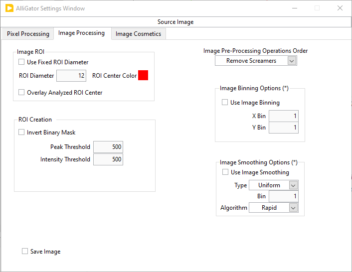
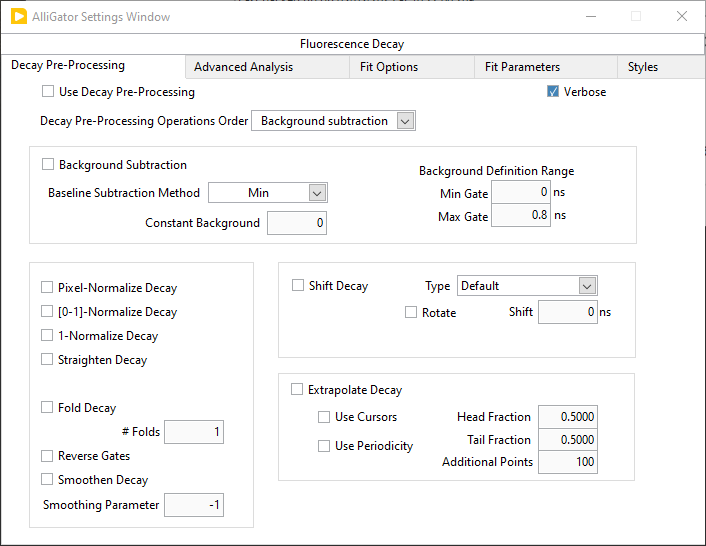
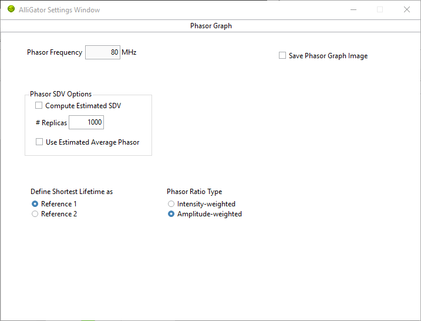
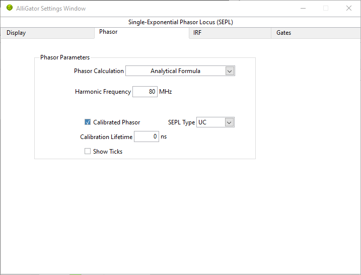

.. _alligator-settings-window:

Settings Window
===============

The **Settings** window can be opened via the ``Windows:Show Settings`` menu 
item (:kbd:`Ctrl+E` shortcut) in the main AlliGator window.
It is comprised of multiple pages and sub-pages, which can be accessed via the 
top page selector:

The different pages are described in the sections below.
Note that any value change done in the **Settings** window immediately takes 
effect and is reflected in the corresponding AlliGator window *control* (if 
there is one).

Inversely, any change to a control in the **AlliGator** window is immediately 
reflected in the **Settings** window.

The value of the Settings controls are saved when AlliGator quits, and reloaded 
when it is restarted.

.. _alligator-settings-source-image:

Source Image
------------

The **Source Image** panel is comprised of 3 sub-panels:

.. image:: images/AlliGator-Settings-Source-Image-Pixel-Processing.png
   :align: center

- *Use Image Histogram for Contrast*: if checked, uses the location of the *Min* 
  and *Max* cursors in the *Image Histogram* to adjust the correspondence between 
  pixel intensity and color scale. Namely, any pixel with intensity smaller than 
  *Min* will be colored with the *Low Color* shown below the color scale, while 
  any pixel with intensity larger than *Max* will be colored with the *High Color*
  shown above the color scale. Pixels with intensity between *Min* and *Max* will 
  be colored according to the color scale.

  A side effect of this selection is that, when hovering over the image, the 
  indicated intensity will show clipped values, any pixel with intensity smaller 
  than *Min* will be indicated as *equal to Min*, while any pixel with intensity 
  larger than *Max* will be indicated as *equal to Max*. However, internally, the 
  correct intensity value is preserved. To read the actual intensity of a pixel, 
  simply unchecked this option before hovering over the pixel again.

- *Low Count Pixels Rejection Options*: defines which rejection criteria to use 
  for the dimmest pixels in the image. The minimum of all criteria, 
  :math:`m = Min(Min_B, Min_T, Min_P)`, is used.

    * *Reject Low Count Pixels*: when checked off, combine the following 
      criteria to define a minimum value :math:`m`.the pixel intensity :math:`I` 
      needs to reach in order to be included in subsequent analyses: :math:`I \ge m`.
    * *Background Low Threshold Factor*: this factor (:math:`b`) is multiplied 
      by the *mode* :math:`M` of the image histogram (computed with 256 bins) 
      to obtain :math:`Min_B = b M`.
    * *Fixed Low Background Threshold*: fixed quantity :math:`Min_T`, for instance 
      estimated using the *Min* cursor of the Image Histogram to highlight 
      pixels in the image below that value.
    * *Low Percentile*: value :math:`P_{min}` defining :math:`Min_P` such that 
      :math:`P_{min}` percent of all pixels have intensity :math:`I \ge Min_P`.

- *High Count Pixels Rejection Options*: defines which rejection criteria to use 
  for the brightest pixels in the image. The maximum of all criteria, 
  :math:`M = Max(Max_B, Max_T, Max_P)`, is used.

    * *Reject High Count Pixels*: when checked off, combine the following 
      criteria to define a maximum value :math:`M`.the pixel intensity :math:`I` 
      needs to reach in order to be included in subsequent analyses: :math:`I \le M`.
    * *Background High Threshold Factor*: this factor (:math:`B`) is multiplied 
      by the *mode* :math:`M` of the image histogram (computed with 256 bins) 
      to obtain :math:`Max_B = B M`.
    * *Fixed High Background Threshold*: fixed quantity :math:`Max_T`, for 
      instance estimated using the *Max* cursor of the Image Histogram to 
      highlight pixels in the image above that value.
    * *High Percentile*: value :math:`P_{max}` defining :math:`MaxP` such that 
      :math:`P_{max}` percent of all pixels have intensity :math:`I \le Max_P`.

- *Hot Pixel Removal*: options used to replace "screamers" in SPAD arrays by 
  the median value of neighboring pixels (requires reloading the dataset to 
  take effect).

    * *Remove Hot Pixels*: when checked off, applied hot pixel removal algorithm.
    * *Percentile*: percentaile of high intensity pixels to consider as hot 
      pixels.
    * *Use Hot Pixel Mask*: when checked off, ignores the *Percentile* parameter 
      and used the *Hot Pixel Mask Image* instead.
    * *Hot Pixel Mask Image*: path of the mask (binary) image identifying hot 
      pixels.

- *Image ROI* options

    * *Use Fixed ROI Diameter*: when checked off, forces circular ROIs to adopt 
      the specified diameter (see next).
    * *ROI Diameter* (in pixel): used in conjunction with the previous option.
    * *ROI Center Color*: used to locate the center of the last ROI whose decay 
      was processed (interactive mode only).
    * *Overlay Analyzed ROI Center*: if checked off, the center of the analyzed 
      ROI is highlighted using the 

- *ROI Creation*

    * *Invert Binary Mask*: check off this box to use binary mask images with 
      regions of interest labeled with a value larger than the background.
    * *Peak Threshold*: *Min* parameter used in the "Create ROI(s) from Pixels 
      with Peak above Min" right-click menu function of the *Source Image*.
    * *Intensity Threshold*: *Min* parameter used in the "Create ROI(s) from 
      Pixels with Intensity above Min" right-click menu function of the *Source 
      Image*.
      
- *Image Pre-Processing Operations Order*: ordered drop-down list of operations 
  (optionally) applied to each gate image. Right-click on the list to access the 
  *Reorder Operations* dialog window.

- *Image Binning Options*: requires reloading the current dataset to be applied.

    * *Use Image Binning*: check off this box to apply binning to gate images.
    * X/Y Bin*: binning parameter for each dimension.

- *Image Smoothing Options*: requires reloading the current dataset to be 
  applied.

    * *Use Image Smoothing*: check off this box to apply smoothing to gate 
      images.
    * *Type*:

      + *Uniform*: each pixel is replaced by an average of itself and its 
        neighbors.
      + *Bilinear*: each pixel is replaced by a weighted average of itself and 
        its neighbors, the weights decreasing linearly from 1 away from the 
        center (to zero for the pixels outside the kernel dimension).
      + *Gaussian*: each pixel is replaced by a weighted average of itself and 
        its neighbors, the weights decreasing according to a Gaussian with 
        :math:`\sigma = Bin/6` from 1 away from the center.

    * *Bin*: kernel dimension used in the smoothing operation.
    * *Algorithm*:

      + *Rapid*: ignores image border subtleties.
      + *Thorough*: treats borders properly but can be significantly slower for 
        large datasets.

- *Save Image*: check off this box to save the displayed image with its overlay 
  each time a new dataset is loaded. The file is saved in the *Saved Displayed 
  Image Format* specified in the **Miscellaneous** Settings panel, in the same 
  folder as the current dataset, with the dataset name to which the image type 
  (Gate n, White Light or Total Intensity) is appended.

- *Use Image Brightness for Overlay*: when used, this option scales the pixel 
  overlay color by the factor :math:`\lambda = (I - range_{min})/(range_{max} 
  - range_{min})`, where *I* is the pixel's intensity.

- *Blend Overlay with Background*: when used, this option replaces the pixel 
  overlay color by :math:`\lambda O + (1-\lambda) B`, where *O* is the 
  unscaled overlay color and *B* the underlying pixel color according to the 
  source image color scale.

- *Image Resolution (Pixel Size)*: information used to overlay a scale bar on 
  the image (see *Scale Bar Options* below).

- *Scale Bar Options*: requires reloading the image or clicking the *Scale Bar 
  Overlay* button on the **Source Image** panel.

    * *Show Scale Bar Overlay*: check this off to automaticxally show the scale 
      bar when loading a new dataset.
    * *Scale Bar X/Y*: location of the scale bar in pixel unit. X = 0 
      corresponds 
      to the left of the image. Y = 0 corresponds to the top of the image.
    * *Scale Bar Lenght/Height*: dimension of the displayed scale bar in 
      physical units.

.. _alligator-settings-data-information:

Data Information
----------------

.. image:: images/AlliGator-Settings-Data-Information.png
   :align: center

- *Gate Characteristics*: loaded with the dataset file, although in some cases 
  (e.g. raw *.ptu* files), the *# Gates* can be specified before loading. These 
  parameers can be overwritten after loading, for instance to correct for a 
  known bogus parameter value.

    * *Gate Width*: for a square gate (or bin), defines the nominal full width 
      at half maximum (FWHM). For binned data, it is the bin size.
    * *Gate Separation* (or gate shift): temporal offset of two consecutive 
      gates. In the case of binned data, this parameter is equal to the *Gate 
      Width* parameter. 
    * *Gate Step*: integer parameter specifying by how much the index of 
      successive gates is incremented when loading a new dataset. The default is 
      1, which corresponds to all gates being loaded. A value of 2 would result 
      in every other gate being loaded.
    * *# Gates*: number of gates in the dataset (or number of gates to bin the 
      data into in the case of a time-tagged dataset such as *.ptu* files). For 
      fual-gate datasets, this corresponds to the number of channel pairs.
    * *Gate Image Exposure*: time during which the detector is actually capable 
      of detecting photons (= *n x W*, where *n* is the number of laser periods 
      and *W* the gate width).
    * *Gate Image Integration*: total time taken to acquire the gate image (= 
      *n x T*, where *n* is the number of laser periods during acquisition and 
      *T* is the laser period).

- *Define Gates to*: *Skip* or *Keep*, whose corresponding parameter are 
  displayed below, allows to reject gates when loading a dataset, providing two 
  alternative ways to do so:

    * *Gates to Skip*: *from Start/End* are the number of gates to ignore at 
      the beginning/end of the series when loading the dataset.
    * Gates to Keep*: *First/Last* are the indices of the first (default: 0) and 
      last gate (default: 4294,967,295) to keep when loading the dataset. The 
      indice of the first gate in the dataset is 0, while the indice of the 
      last gate is *G-1*, where *G* is the total number of gates in the dataset.

- *Channel Name*: List showing the root name of available gates in the loaded 
  dataset. For standard single channel datasets, this will be limited to a 
  single name (generally *Gate*), while in the case of dual-channel datasets, 
  the name of both channels will be shown. Use this drop-down list to switch 
  from one to the other and update the displayed *Source Image*.
- *Channel Arithmetic*: *"None"/"INT-G2"/"G2/INT*<INT>"/"(1-G2/INT)*<INT>"* is 
  a list allowing to process and display arithmetic combinations of dual-channel 
  gates. It is necessary to reload the dataset to apply this change. Note that, 
  unless *None* is selected, changing the *Channel Name* parameter will have no 
  effect on the displayed *Source Image*.
- *Laser Period*: generally loaded from the dataset when available. Can be 
  user-modified
- *Natural Frequency*: indicator representing *1/D*, where *D* is the duration 
  covered by the loaded gates. It is the recommended frequency for phasor 
  analysis.
- *SYNC Period*: in general it is identical to the laser period (or undefined). 
  It is the trigger frequency used during gate acquisition. When *SYNC Period > 
  Laser Period*, multiple decay periods can be expected in the data.
  
- *Dataset Pile-up Correction* options: the type of corrected pile-up is that 
  experienced in photon-counting detectors with finite counting capabilities.
  The correction is applied on each loaded dataset as part of a series of 
  operations whose order is defined in the **Source Image:Image Processing** 
  panel *Image Pre-Processing Operations Order* list.
  
    * *Pile-up Correction*: check off this box to apply pile-up correction.
    * *Max Value*: maximum value obtainable in each pixel.

- *Scaling Factor*: optional dataset gate image intensity scaling factor 
  (default: 1).
  
- *Background File Subtraction* options:

    * *Background File Subtraction*: check off this box to apply background 
      file subtraction when loading a dataset.
    * *Background Dataset*: path of the dataset used as background file.
    * *Pile-up Correction*: whether or not to apply pile-up correction as part of 
      the background dataset loading steps.
    * *Max Value*: maximum value obtainable in each pixel.
    * *Scaling Factor*: optional dataset gate image intensity scaling factor 
      (default: 1).
 
.. _alligator-settings-fluorescence-decay:

Fluorescence Decay
------------------

.. _alligator-settings-fluorescence-decay-preprocessing:

Decay Pre-Processing
++++++++++++++++++++

.. _alligator-settings-fluorescence-decay-advanced-analysis:

Advanced Analysis
+++++++++++++++++

.. image:: images/AlliGator-Settings-Decay-Advanced-Analysis.png
   :align: center

.. _alligator-settings-fluorescence-decay-fit-options:

Fit Options
+++++++++++

.. _alligator-settings-fluorescence-decay-fit-parameters:

Fit Parameters
++++++++++++++

.. image:: images/AlliGator-Settings-Decay-Fit-Parameters.png
   :align: center

.. _alligator-settings-fluorescence-decay-styles:

Styles
++++++

.. _alligator-settings-fluorescence-decay-statistics:

Fluorescence Decay Statistics
-----------------------------

.. image:: images/AlliGator-Settings-Decay-Statistics.png
   :align: center

.. _alligator-settings-time-traces:

Time Traces
-----------

.. image:: images/AlliGator-Settings-Time-Traces.png
   :align: center

.. _alligator-settings-phasor-plot:

Phasor Plot
-----------

.. image:: images/AlliGator-Settings-Phasor-Plot.png
   :align: center

.. _alligator-settings-phasor-graph:

Phasor Graph
------------

.. _alligator-settings-SEPL:

Single-Exponential Phasor Locus (SEPL)
--------------------------------------

.. _alligator-settings-SEPL-display:

Display
+++++++

.. _alligator-settings-SEPL-phasor:

Phasor
+++++++

.. _alligator-settings-SEPL-IRF:

IRF
+++

.. image:: images/AlliGator-Settings-SEPL-IRF.png
   :align: center

.. _alligator-settings-SEPL-gates:

Gates
+++++

.. image:: images/AlliGator-Settings-SEPL-Gates.png
   :align: center

.. _alligator-settings-phasor-calibration:

Phasor Calibration
------------------

.. image:: images/AlliGator-Settings-Phasor-Calibration.png
   :align: center

.. _alligator-settings-lifetime-analysis:

Lifetime Analysis
-----------------

.. image:: images/AlliGator-Settings-Lifetime-Analysis.png
   :align: center

.. _alligator-settings-plugins:

Plugins
-------

.. _alligator-settings-miscellaneous:

Miscellaneous
-------------

.. image:: images/AlliGator-Settings-Miscellaneous.png
   :align: center

