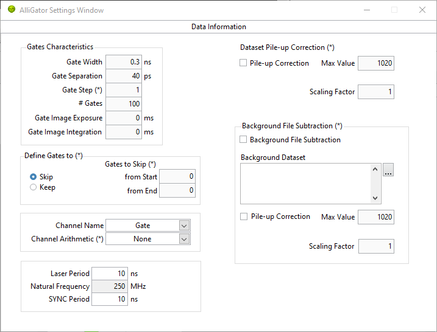
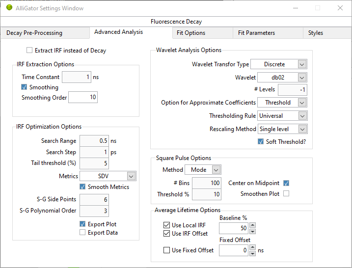
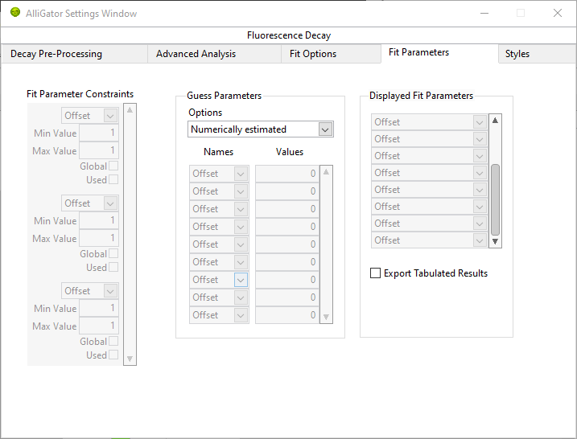
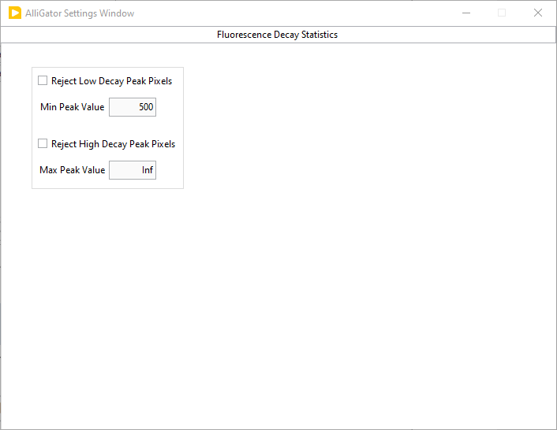
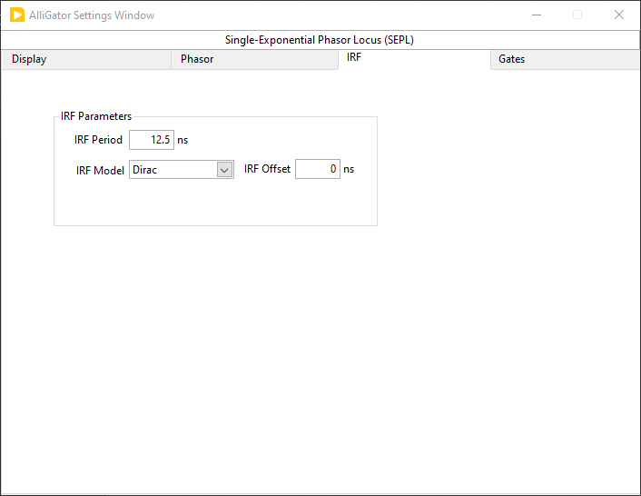
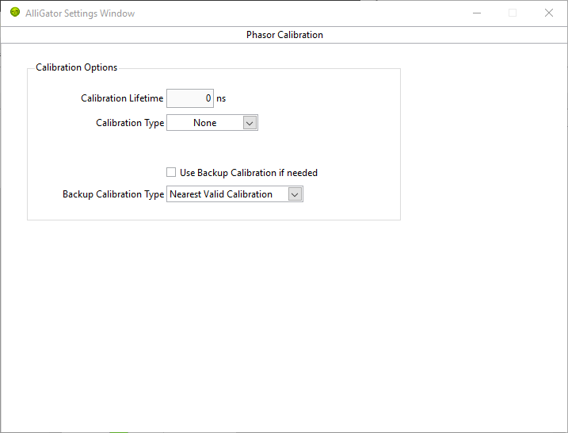
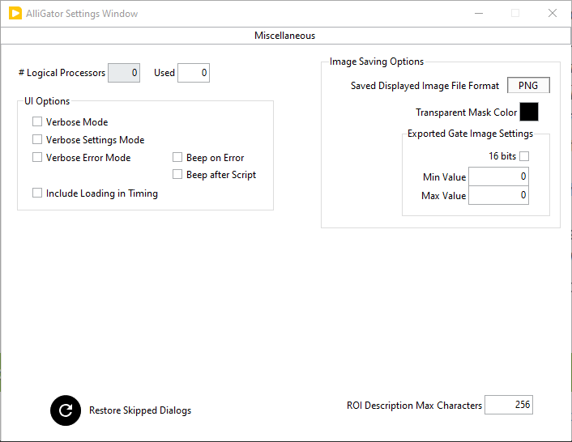

.. _alligator-settings:

Settings
========

The **Settings** window can be opened via the ``Windows:Show Settings`` menu item (:kbd:`Ctrl+E` shortcut) in the main AlliGator window.
It is comprised of multiple pages and sub-pages, which can be accessed via the top page selector:

.. image:: images/AlliGator-Settings-Pages.png
   :align: center

The different pages are described in the sections below.
Note that any value change done in the **Settings** window immediately takes effect and is reflected in the corresponding AlliGator window *control* (if there is one).

Inversely, any change to a control in the **AlliGator** window is immediately reflected in the **Settings** window.

The value of the Settings controls are saved when AlliGator quits, and reloaded when it is restarted.

.. _alligator-settings-source-image:

Source Image
------------

   
.. _alligator-settings-data-information:

Data Information
----------------

.. _alligator-settings-fluorescence-decay:

Fluorescence Decay
------------------

.. _alligator-settings-fluorescence-decay-preprocessing:

Decay Pre-Processing
++++++++++++++++++++

.. image:: images/AlliGator-Settings-Decay-Preprocessing.png
   :align: center

.. _alligator-settings-fluorescence-decay-advanced-analysis:

Advanced Analysis
+++++++++++++++++

.. _alligator-settings-fluorescence-decay-fit-options:

Fit Options
+++++++++++

.. image:: images/AlliGator-Settings-Decay-Fit-Options.png
   :align: center

.. _alligator-settings-fluorescence-decay-fit-parameters:

Fit Parameters
++++++++++++++

.. _alligator-settings-fluorescence-decay-styles:

Styles
++++++

.. image:: images/AlliGator-Settings-Decay-Styles.png
   :align: center

.. _alligator-settings-fluorescence-decay-statistics:

Fluorescence Decay Statistics
-----------------------------

.. _alligator-settings-time-traces:

Time Traces
-----------

.. image:: images/AlliGator-Settings-Time-Traces.png
   :align: center

.. _alligator-settings-phasor-plot:

Phasor Plot
-----------

.. image:: images/AlliGator-Settings-Phasor-Plot.png
   :align: center

.. _alligator-settings-phasor-graph:

Phasor Graph
------------

.. image:: images/AlliGator-Settings-Phasor-Gaph.png
   :align: center

.. _alligator-settings-SEPL:

Single-Exponential Phasor Locus (SEPL)
--------------------------------------

.. _alligator-settings-SEPL-display:

Display
+++++++

.. image:: images/AlliGator-Settings-SEPL-Display.png
   :align: center

.. _alligator-settings-SEPL-phasor:

Phasor
+++++++

.. image:: images/AlliGator-Settings-SEPL-Phasor.png
   :align: center

.. _alligator-settings-SEPL-IRF:

IRF
+++

.. _alligator-settings-SEPL-gates:

Gates
+++++

.. image:: images/AlliGator-Settings-SEPL-Gates.png
   :align: center

.. _alligator-settings-phasor-calibration:

Phasor Calibration
------------------

.. _alligator-settings-lifetime-analysis:

Lifetime Analysis
-----------------

.. image:: images/AlliGator-Settings-Lifetime-Analysis.png
   :align: center

.. _alligator-settings-miscellaneous:

Miscellaneous
-------------

