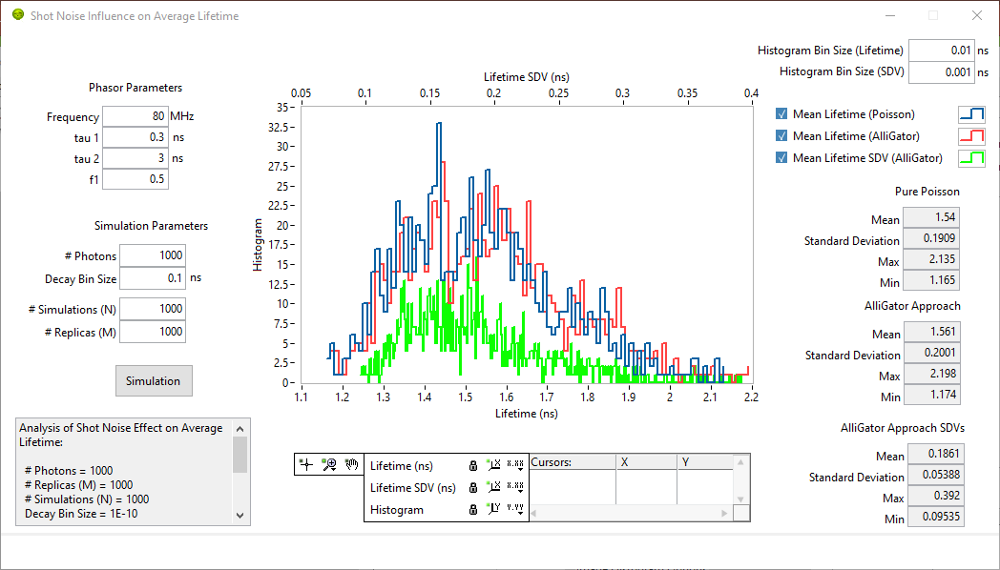

.. _alligator-shot-noise-influence-average-lifetime:

Shot Noise Influence on Average Lifetime
========================================

This tool allows simulating the effect of a finite signal on the 
amplitude-averaged lifetime uncertainty (for a definition of this quantity, see 
the Exporting Additional Phasor Quantities section of the 
:ref:`alligator-phasor-graph-panel` page of the manual.

The controls visible in this window are described next.

*Phasor Parameters* comprise:

- *Frequency*: harmonic frequency used for the calculations
- *tau 1*: first phasor ratio reference
- *tau 2*: second phasor ratio reference
- *f1*: amplitude fraction of the first reference in the decay

*Simulation Parameters* comprise:

- *# Photons*: number of photons simulated for each decay
- *Decay Bin Size*: size of the bins used to convert raw photon arrival times 
  into an hisotgram (decay)
- *# Simulations (N)*: number of simulations used to estimate the average 
  lifetime standard deviation
- *# Replicas (M)*: number of replicas of each decay used to emulate the 
  analysis performed in AlliGator.

*Histogram Parameters* (top right):

- *Histogram Bin Size (Lifetime)*: size of the bin used to build the average 
  lifetime histogram.
- *Histogram Bin Size (SDV)*: size of the bin used to build the average lifetime 
  standard deviation histogram.
  
A simulation, run by clicking on the *Simulation* button, consists in 
simulating *N* decays comprised of *# photons* photons each, distributed 
according to a bi-exponential probability distribution function specified by 
the *Phasor Parameters* and calculating the amplitude-average lifetime for each 
of them. A *Mean Lifetime (Poisson)* histogram is created and plotted, and the 
corresponding statistics displayed in the *Pure Poisson* indicator to the right.

Simultaneously, for each simulated decay, *M* replicas are generated in the same 
way they are simulated in AlliGator (see the :ref:`shot-noise-limited-SDV` 
section of the:ref:`alligator-phasor-graph-panel` page of the manual). From 
these replicas, the mean average lifetime and its standard deviation are 
calculated. The *N* corresponding mean average lifetimes and standard deviations 
are histogrammed (*AlliGator Approach* and *AlliGator Approach SDVs*) and the 
corresponding statistics displayed.

.. note::
   The lifetime histograms are associated with the bottom horizontal scale 
   while the standard deviation histogram is associated with the top horizontal 
   scale. All histograms share the same vertical scale.

These results are also ouput in a text format in the text box no the bottom left 
of the panel and sent to the Notebook. Standard graph functions can be used via 
the right-click menu.

The purpose of these simulations is twofold. On one hand, estimate the standard 
deviation of the calculated amplitude-averaged lifetime when dealing with decays 
with a given number of photons (the first output). On the other hand, compare 
this result to the AlliGator estimate of the shot noise-related amplitude-averaged 
lifetime uncertainty obtained by "replicating" the experimental decay to obtain 
similar decays but with similar photon counts (the second output).

In general, the two histograms are very similar, justifying the approach used in 
AlliGator to estimate the influence of shot noise on the calculated 
amplitude-averaged lifetime.