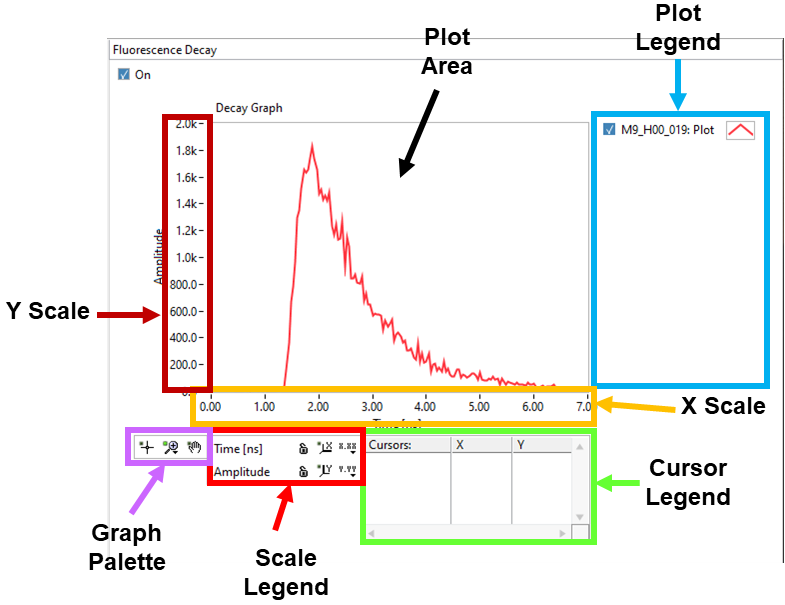
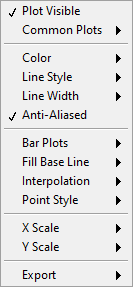
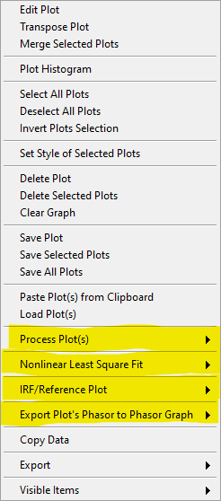
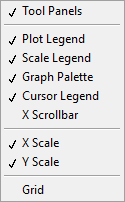
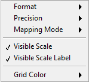
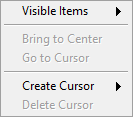

.. _graph-object:

Graph Object
============

Multiplot graph objects are ubiquitous in AlliGator and are packed with many 
functionalities. Not all functions are available in al graphs (it wouldn't make 
sense to fit a decay model to an intensity histogram, for instance), therefore 
custom function descriptions will be found in page manuals dealing with each 
specific graph object. The following will hold for most graphs, with some 
exceptions.

.. _graph-object-anatomy:

Graph Object Anatomy
--------------------

A graph oject is comprised of:

+ a :ref:`plot area <plot-area>`
+ a :ref:`plot legend <plot-legend>`
+ two or more :ref:`graph scales <graph-scales>`
+ a :ref:`graph palette <graph-palette>`
+ a :ref:`scale legend <scale-legend>`
+ a :ref:`cursor legend <cursor-legend>`

.. _plot-area:

Plot Area
---------

The *plot area* is the rectangular region in which plots are displayed. In the 
example shown above, a single plot is displayed, but in general, more than one 
plot will be present. The list of available plots is found on the right in the 
*plot legend*.

The apparence of the plot area can be modified in the following manner:

+ by modifying the range of displayed values (using the X and Y *scales* 
  directly, or using the *graph palette*)
+ by showing or hiding grid lines (using the graph *custom menu* or the *scale 
  legend*)

The different actions will be discussed in the respective object's subsections 
below.

.. _plot-legend:

Plot Legend
-----------

The *plot legend* lists the plots stored in memory. Plot names do not need to 
be different, but it is easier to distinguish them if they are, especially when 
the list is long. In that case, a scrollbar will appear on the righthand side 
of the legend. Move the scrollbar up and down using the mouse wheel to show the 
name of all plots.

Long plot names will not show up fully in the legend, but hovering over a plot 
name with the mouse will reveal a 'tooltip' with the full name of the plot.

Plot names can be edited by clicking in them.

Each plot's name is preceded by a checkbox, which defines whether or not the 
plot is actually displayed in the plot area. These checkboxes are also used as 
'selection' checkboxes to perform custom actions on multiple plots at once, 
such as for instance saving the selected plots or changing their style. In 
other words, when performing an action on selected plots, the unselected plots 
are not visible in the graph.

The small image on the right of each plot name (*plot icon*) can be clicked on 
(right or left button) to give access to the standard plot menu.

.. _plot-menu:

Standard Plot Menu
------------------

This menu allows specifying (among other things):

+ the plot type (symbols only, line, line + symbols, etc.)
+ its color, line style, thickness and anti-aliasing
+ the color and style of the symbols (if used)
+ the scales (X and Y) associated with the plot (when there is more than one 
  scale available per axis)

The ``Export`` options of this menu are less extended than those available 
through the *custom graph menu* described next.

.. _custom-graph-menu:

Custom Graph Menu
-----------------

The following custom menu (accessible by right-clicking anywhere in the graph 
except for the plot icons and the *cursor table*) is specific of the *Decay 
Graph* in AlliGator, but many of its items are common to most graphs.

The most common (NOT highlighted in yellow in the figure below) are described 
next.

  
+ ``Edit Plot``: opens the :ref:`Plot Editor <alligator-plot-editor-window>`
  window.
+ ``Transpose Plot``: swaps X- and Y-arrays.
+ ``Merge Selected Plots``: appends the X- and Y-arrays of all selected plots. 
  This can be used to build a single scatterplot from many smaller ones, or to 
  stitch together decays covering different parts of the time axis.
+ ``Plot Histogram``: selecting this item opens up a dialog window 
  allowing specifying options to define the way the histogram of the 
  selected decay's values is computed. The computed histogram is displayed 
  in the separate **Histogram Window**.
+ ``Select All Plots`` does as it says.
+ ``Deselect All Plots`` as well.
+ ``Invert Plots Selection`` allows rapidly inverting the selected and 
  deselected plots.
+ ``Set Style of Selected Plots`` opens a :ref:`dialog window 
  <selected-plot-style-window>` to change the style of all selected plots at 
  once.
+ ``Delete``, ``Delete Selected Plots`` and ``Delete All Plots`` or ``Clear 
  Graph`` are self-explanatory (and irreversible).
+ ``Save Plot``, ``Save Selected Plots`` and ``Save All Plots`` allow saving 
  plots as ASCII files (:kbd:`TAB` separated columns of floating point numbers).
  The first line of the saved file consists in the plot names and their 
  associated scales.
  When all plots have the same X-array, a dialog offers to save only one copy of 
  it as the first column. Otherwise, the columns represent the X-array and 
  Y-array for each plot, potentially resulting in columns of different lengths.
+ ``Paste Plot(s) from Clipboard``: 
+ ``Load Plot(s)`` opens a file dialog window with which one or more such ASCII 
  files can be selected and loaded.
+ ``Copy Data`` copies the Graph's image to the clipboard.
+ ``Export``: does the same thing as the ``Export`` submenu of the plot menu, 
  that is, either export the selected plot data to the clipboard or to Excel
+ ``Visible Items``

The ``Visible Items`` menu allows rapidly hiding/showing all objects except for 
the *Plot Area* and *Plot Legend* using the ``Tool Panels`` item (useful for 
instance to copy/paste the graph image to the Notebook without the *Graph 
Palette*, *Scale Legend* and *Cursor Legend*), or different objects of the 
graph individually.

The ``Grid`` item of that menu allows rapidly showing/hiding a grid in the 
*Plot Area*, rather than using the individual axes menu in the *Scale Legend*.

.. _graph-scales:

Graph Scales
------------

Most graphs have a single X (horizontal) and Y (vertical) scale, but some may 
have two or more, on either side of the graph (top or bottom for the X scales 
and left or right for the Y scales).

The visible bounds (min and max) of each scale can be edited by clicking on 
their respective values. Likewise, the scale title can be modified by clicking 
on it and editing it.

Further modification can be performed using the *Scale Legend*.

.. _scale-legend:

Scale Legend
------------

The *Scale Legend* comprises the scale title (editable), an autoscale lock 
button, a single-autoscale button and a scale options menu.

The autoscale lock enables the graph to adjust its range automatically when a 
plot is added, so that all selected plots are visible. If this is not 
desirable, click the button to disable the autoscale option.

The single-autoscale button allows applying autoscale once only.

Finally, the scale options menu shown below provides option to format the scale 
tick labels, set the displayed precision, and choose between linear and 
logarithmic scaling. It also enables hiding a scale or only its labels and 
select the grid color.

   
.. _graph-palette:

Graph Palette
-------------

The *Graph Palette* allows switching between tools to interact with the plot 
area:

+ cross: cursor manipulation
+ magnifying glass: zoom tools to adjust the plot area range(s)
+ hand: panning of the plot area

.. _cursor-legend:

Cursor Legend
-------------

The *Cursor Legend* (or *Cursor Table*) shows the list of available cursors, to 
which individual cursors can be added (``Create Cursor``) or can be removed 
from (``Delete Cursor``).

The table also gives access to individual cursor properties (style, color, 
etc.) as well as associated plots, coordinates and plot value(s).

Finally, ``Bring to Center`` and ``Go to Cursor`` move the selected cursor to 
the center of the *Plot Area* or recenter the *Plot Area* on the selected 
cursor. The former provides a convenient way to locate a cursor and then 
fine-tune its location.