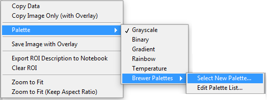
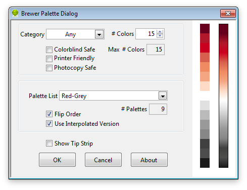
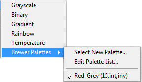
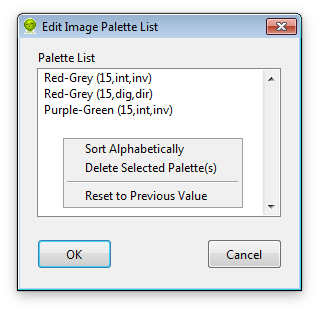

.. _image-color-palette:

Image Color Palette
===================

Images can be displayed with different color palettes accessible via the 
right-click menu of these images:

   
In addition to the built-in ``Grayscale``, ``Binary``, ``Gradient``, ``Rainbow`
` and ``Temperature`` palettes, the user has access to the palettes created by
 Cynthia Brewer (https://colorbrewer2.org), by choosing the :kbd:`Select New 
 Palette...` option.
This opens up a dialog box offering a choice of palettes sorted by category 
(``Any``, ``Sequential``, ``Diverging``, ``Qualitative``), which can be further
 constrained by selecting options such as ``Colorblind Safe``, 
 ``Printer Friendly`` or ``Photocopy Safe`` or number of colors (*# Colors*, 
 from 3 to 15):

Note that when categories or options are selected, the maximum number of colors 
available for the remaining palettes might be reduced. In this case, the number 
of colors requested by the user will be limited by this maximum.
The palette itself is chosen using the Palette List pull-down menu. The list is 
adjusted depending on the chosen category and options, as well as number of 
requested colors.
The colors comprising the palette are displayed on the left side of the dialog
 box (squares stacked on top of each other), the first color being the bottom 
 one (*).
To inverse the order of the list, check the Flip Order checkbox.
To use a color palette with 256 colors, check the Use Interpolated Version
 checkbox. The interpolated color palette appears to the left.

When you are satisfied with your choice, press the OK button. The selected 
palette is applied to the image and is added to the list of palettes in the 
right-click menu:

The palette name includes the number of colors and whether it is interpolated 
(int or dig) or inverted (inv or dir).

The list of Brewer palettes accessible via the right-click menu can be modified 
using the Edit Palette List... menu item.
This menu opens a dialog box indicating the current palettes in the list:

Items in this list can be manipulated by selecting and dragging them or by using
 the right-click menu items: Sort Alphabetically, Delete Selected Palette(s) and
 Reset to Previous Value.
To confirm these modification, press OK, or Cancel to leave the list untouched.

(*) to change the background color, click next to the palettes to show a color 
picker.
