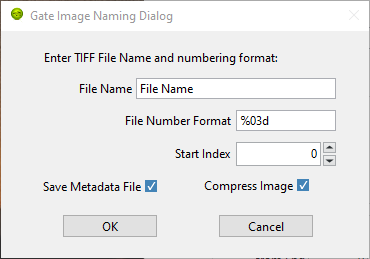
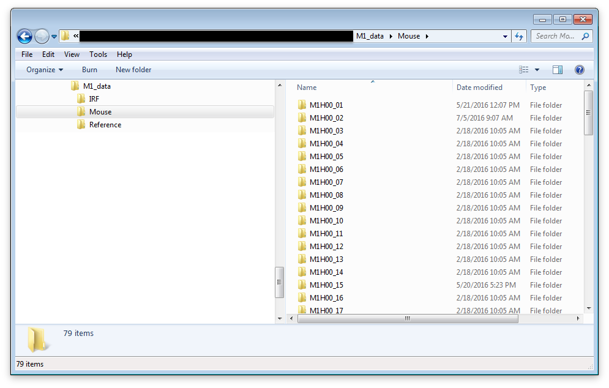
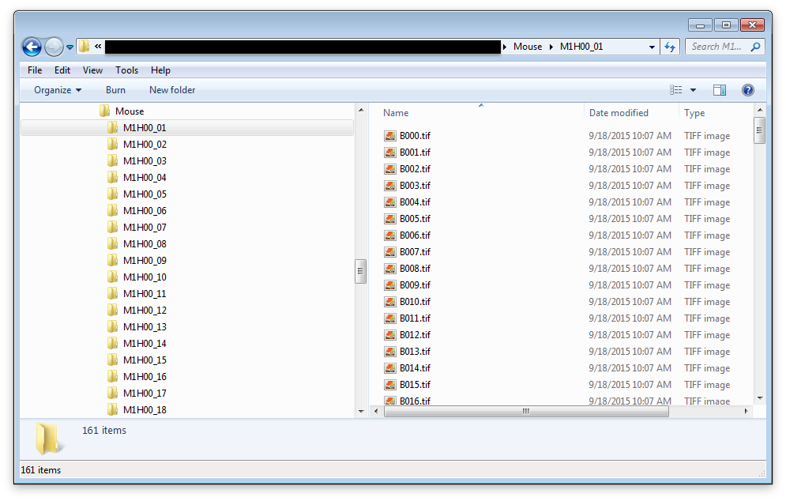

.. _loading-saving-fli-dataset:

Loading & Saving FLI Datasets
=============================

The following sections detail the different ways fluorescence lifetime imaging (FLI) data can be loaded in, or saved from AlliGator.

Loading (as well as saving) functions are accessible via the ``File`` menu as shown in the :ref:`alligator-menus` page.

Alternatively, individual files (or file folders for time series) can be dragged-and-dropped in the main AlliGator window. 

The ``Load`` sub-menu is divided into three sub-menus: FLI Dataset, FLI Dataset Series, and Other Files.
The ``Save`` menu only support saving a single dataset in either of two formats: Image series, or HDF5 FLI dataset.

Dataset Series are discussed in more details in the :ref:`time-series-analysis` pages of the manual.

Introduction
------------

AlliGator was initially developed to analyze data from time-gated ICCD cameras. Since this type of data is similar to that of FLI performed with time-correlated single-photon counting (TCSPC) hardware, support was added for this kind of data as well (both time-stamped and binned data are supported).

Data in time-gated or binned decay analysis generally consists in a series of *N* images.

Each image in the series represents a "gate" image. A gate is an image acquired with the image intensifier (or more generally detector) rapidly turned on at a specific time after the laser pulse (gate offset *t_i*, where *i* is the gate image index in the series) and rapidly turned off after a constant duration (gate duration *W*). This processs is repeated over many laser periods and the data accumulated in the gate image. Subsequently, the delay of the on/off gating process is changed, and a new gate image is acquired. In this proces, each gate is separated from the next by a constant step (gate separation *dt*).

Time-stamped TCSPC data consists by contrast in individual photon information (position (*X*, *Y*) in the image, nanotime *t* representing the arrival time with respect to the laser (generally an additional macrotime is provided, which will not be discussed here for the sake of simplicity). This type of data is generally transformed into *binned* data by collecting all photons in each pixels and histogramming their arrival times in a predetermined number *N* of adjacent *bins* (of duration *W* equal to their separation *S*). This data in turn can be looked at as a series of "binned decay" images, which are similar to the gate images discussed previously in the case of gates acquisition.

Although each gate image takes some time to acquire, and a series of images takes about *N* times this amount, we will refer to such a series of images as a `time point`.

AlliGator allows the analysis of individual time points, or a series of such time points (*i.e.* a time series). Loading a single time-point or a time-series is done differently as described next.

single HDF5 FLI Dataset
-----------------------

A simple open source file format in which to save a variety of different files from different sources was introduced with version 0.16 of AlliGator. It simplifies data storage (single file instead of a folder of images) and loading (for instance, in the case of SwissSPAD 2 data, pre-processing of raw data is not necessary anymore, once saved as an AlliGator HDF5 file). In addition, this format supports floating point values for gate image pixel intensity, which allows saving processed datasets without loss (*e.g.* background-subtracted or pile-up corrected datasets will be comprised of non-integer pixel values). Finally, the format includes a lot of metadata which helps with traceability and reproducibility.

Details about the format itself can be found in the :ref:`alligator-hdf5-file-format` page of this manual.

To load an AlliGator HDF5 file, use ``File->Load->FLI Dataset->HDF5 File`` (``Ctrl+O``). The path to the dataset will be displayed in the title bar.

To save a dataset (irrespective of its source), use ``File->Save->Dataset->Save as HDF5 FLI Dataset`` (``Ctrl+Shift+S``).

Folder of Gate Images
---------------------

To load a single time point (consisting of *N* gate images), use ``File->Load->FLI Dataset->Gate Image Folder`` (``Ctrl+L``). The path to the dataset folder will be displayed in the title bar.

Supported gate image file formats are: BMP, TIFF, JPEG, JPEG2000, PNG. The files can be 8 or 16 bits gray scale images.

To save a FLI dataset as a series of gate images, use ``File->Save->Dataset->Save as TIFF Gate Image Folder``. This will first open a ``Gate Image Naming Dialog`` window where the user can define the name (prefix) of individual gate images, as well as define additional parameters:

Next, a file dialog window allows selecting where to save the gate images.

Note that no additional information is saved, therefore is is recommended to include additional information needed to reload (or at least make sense of) these images in an auxiliary readable file.

Becker & Hickl .sdt FLI Dataset
-------------------------------

To load a .sdt file saved by a Becker & Hickl FLIM setup, use ``File->Load->FLI Dataset->.sdt File``. The path to the dataset will be displayed in the title bar.

PicoQuant .ptu Dataset
----------------------

PicoQuant FLIM setups can save data as individual photon time stamps with spatial information (.ptu files) or as histogrammed data (.bin files).

To load a .ptu file, use ``File->Load->FLI Dataset->.ptu File``. The path to the dataset will be displayed in the title bar. Note that the user needs to specify how to interpret the photon time stamps by providing a number of bins *N* in which to sort out the photons via the ``# Gates`` parameter defined in the *Settings* Window, *Data Information* panel [*]_.

PicoQuant .bin Dataset
----------------------

To load a .bin file, use ``File->Load->FLI Dataset->.bin File``. The path to the dataset will be displayed in the title bar.

Loading & Saving FLI Dataset Series
===================================

Folder of HDF5, .sdt or .ptu Datasets
-------------------------------------

In order to load a time series (or any succession of data sets to be analyzed as a series) consisting of individual FLI datasets of a single kind (.hdf5 or .sdt or .bin or .ptu), make sure that they are grouped in a single folder. This folder can contain other file types, which will be ignored when loading the series.

In order to load a time series (or any succession of data sets to be analyzed as a series) consisting of gate images, use ``File->Load->FLI Dataset Series->xxx File Series``, where ``xxx`` stands for Hdf5 or .sdt or .bin or .ptu. The HDF5 File Series loading option can be invoked with the ``Ctrl+Shift+O`` keyboard shortcut.

Folder of Folders of Gate Images
--------------------------------

In order to load a time series (or any succession of data sets to be analyzed as a series) consisting of gate images, use ``File->Load->FLI Dataset Series->Gate Image Folder Series`` (``Ctrl+Shift+L``). In the case of LaVision ICCD data, it is possible to use the time stamp of each dataset saved in the associated .set files. To enable this, check the ``Use File Timestamp`` chekbox in the **Time Trace** panel of either the **Settings** or **AlliGator** windows, before loading the time series.

After the folder containing the time series has been selected, the first data set in the series will be loaded and displayed in the Source Image indicator as described earlier.

In addition, a vertical slider (``Time Point`` slider) will be displayed on the right-hand side of the image, allowing to explore the time series. The name of the data set currently displayed will be indicated in the ``Current Data`` text box below the image.

Note that to avoid slowing down the software, there is no update of the image as the vertical slide is moved around: only the name of the ``Current Data`` is updated. As soon as the slide is released, the corresponding data set is loaded.

Each time point is a folder identified by a name specifying its order in the time series. In other words, a time series with *P* time points will look something like this on disk:

or, more generally: 

time series/time point 1/image 1
time series/time point 1/image 2
...
time series/time point 1/image N

time series/time point 2/image 1
time series/time point 2/image 2
...
time series/time point 2/image N
...

time series/time point P/image 1
time series/time point P/image 2
...
time series/time point P/image N

time series is the name of the folder (*Mouse* in the figure above) in which all time point subfolders are located (*M1H00_nn* in the figure above). These subfolders should be named using a common root name followed by an increasing number suffix.
For instance, folders named TimePoint_001, TimePoint_002.tif, ..., TimePoint_100.tif constitute a valid series of names, but TimePoint1 , TimePoint2, ..., TimePoint10,... etc. is also an appropriate naming convention [*]_.

The naming convention for images in each folder should follow a similar convention [*]_: root name followed by a numeric suffix.The software will assume that the files, ordered numerically (using their suffix) are also ordered temporally, i.e. correspond to successive gates, starting at offset 0 and incremented by a constant step equal to the specified *Gate Separation* parameter (see the ::ref::`fluorescence-decay-panel` page of the manual).

For instance, files named Image000.tif, Image001.tif, ..., Image100.tif constitute a valid series of names, but other naming conventions can be used. For instance,  Image1.tif, Image2.tif, ..., Image10.tif,... etc., is also an appropriate naming convention.

An example of image folder is shown below:

Notes
-----

.. [*] It is recommended to check that decays computed with the user-specified ``# Gates`` parameter do not suffer from binning artefacts. If that is the cases, adjust the number of bins (i.e. ``# Gates``) until these artefacts disappear.

.. [*] The LaVision acquisition software seems to name folders in a time series in the following manner:

Folder
Folder_1
Folder_2
etc.
This unfortunately is not compatible with the algorithm used to figure out the common root name of all folders as well as their order. Fortunately, the fix is simple and consists in renaming the folder corresponding to time point 0 (Folder in the example above) as Folder_0.

.. [*] The LaVision camera recently (2017) decided to output gate files with names of the kind: root_nameXXXXX_Delay=YYYps.tif, where XXXXX is the gate number and YYY is the gate delay with respect to the laser trigger. Versions of AlliGator above 0.9.13 support this unconventional file name format.
No newline at end of file
