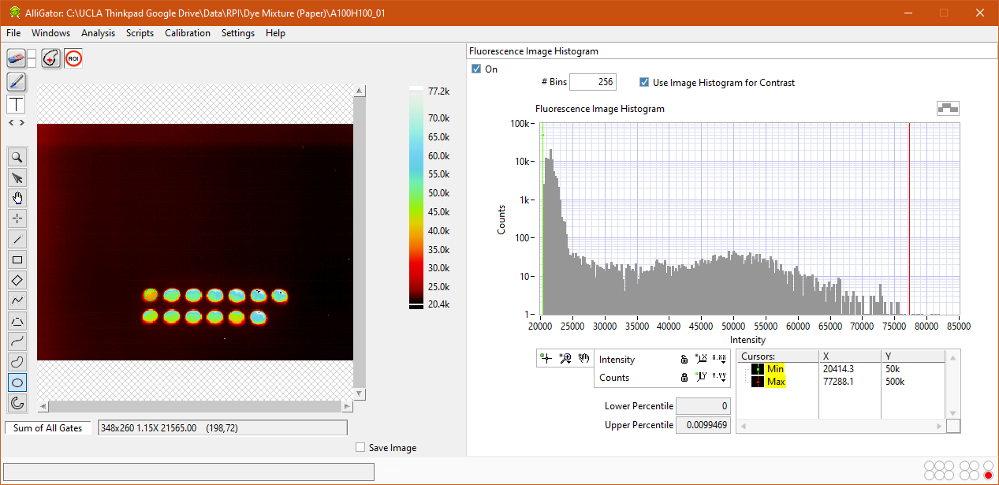

AlliGator Overview
==================

AlliGator is a software for time-gated data analysis using the phasor approach (and much more). It was developed as part of a collaborative project described in ref. 1 listed on the :ref:`Bibliography page <bibliography>`. If you are using AlliGator in a publication or otherwise, please consider citing this reference.

AlliGator's main window (figure below) shows the source dataset *intensity image* on the left-hand side, and one of many different *analysis panels* on the right-hand side (the Fluorescence Image Histogram is shown in the figure). The *pull-down list* on the top right (or panel selector) allows selecting which analysis panel is displayed. The following panels are available:

- Fluorescence Image Histogram
- White Light Image Histogram
- Fluorescence Decay
- Fluorescence Decay Statistics
- Intensity Time Trace
- Phasor Plot
- Phasor Graph
- Phasor Ratio Analysis
- Lifetime Analysis

Each panel's function is discussed in a separate manual page (see the table of content on the left).

A standard *menu bar* on the top left gives access to different functions, which are sometimes associated with a :ref:`keyboard shortcut <keyboard-shortcuts>`. The different menus are discussed in separate sections of the manual.

*Accessory windows* (:ref:`Notebook <notebook-window>`, :ref:`Dataset Information <dataset-information-window>`, :ref:`Settings <settings-window>`, etc.) are discussed in their own sections of the manual.

Analysis Status Indicator LEDs
------------------------------

LEDs located on the bottom right of the panel indicate at a glance which parameters or options have been defined, or some user action is required. To see which option they correspond to, hover over each of them and wait for a tip strip to show up.

From left to right, they are:

- Top row

  + Phasor Calibration Defined
  + Phasor Calibration Series Defined
  + Phasor Calibration Map Defined
  + Phasor Ratio Reference 1 Defined
  + Phasor Ratio Reference 2 Defined
  + Datase Update Needed
  
- Bottom row

  + Phasor Calibration Used
  + Phasor Calibration Series Used
  + Phasor Calibration Map Used
  + Phasor Ratio Lifetime Reference 1 Defined
  + Phasor Ratio Lifetime Reference 2 Defined
  + Phasor Plot Update Needed (this is the one lit in red in the figure above)

More information about the functions and use of the software can be found in the manual pages.